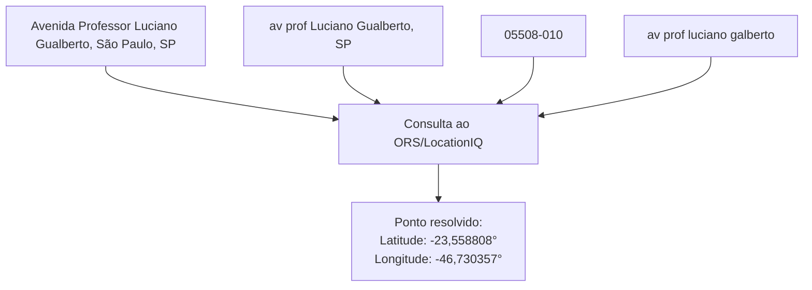
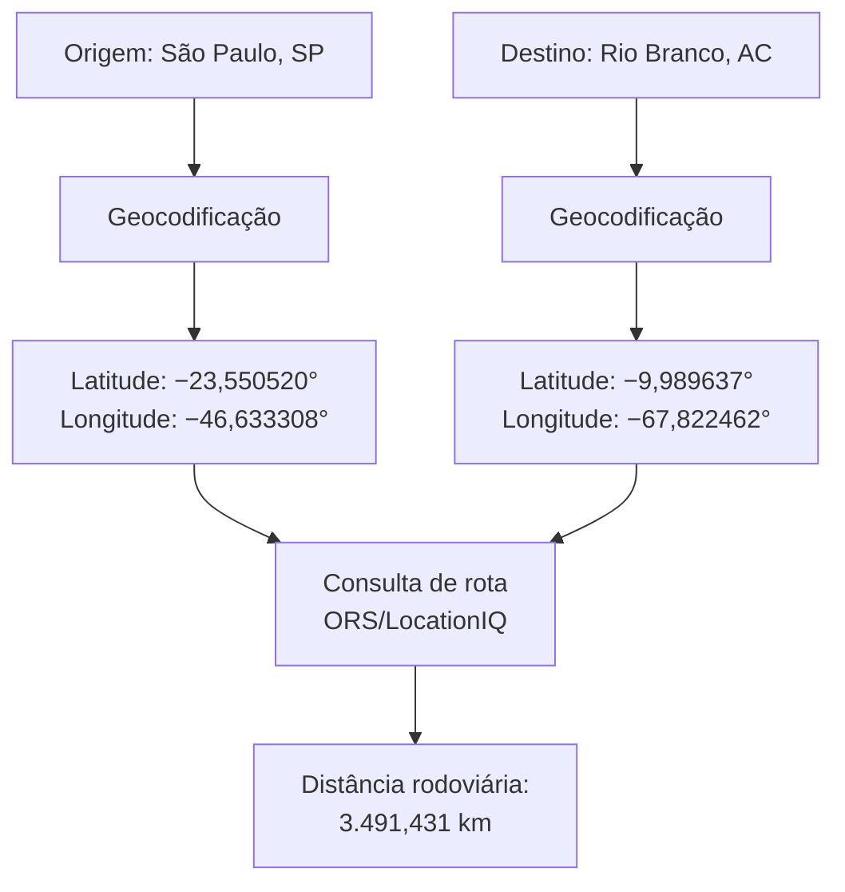
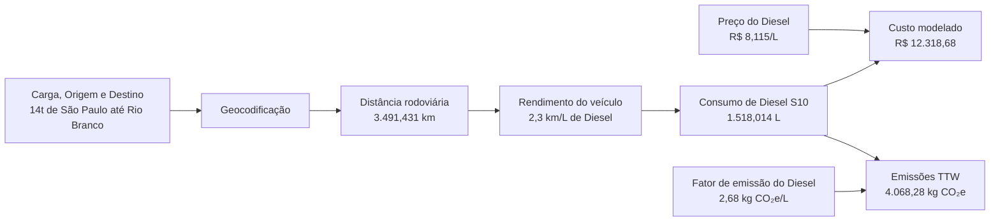
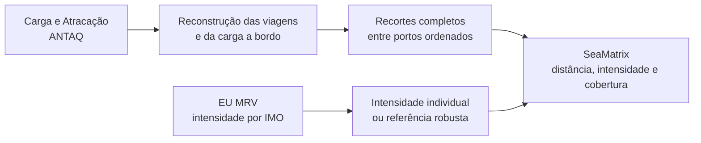
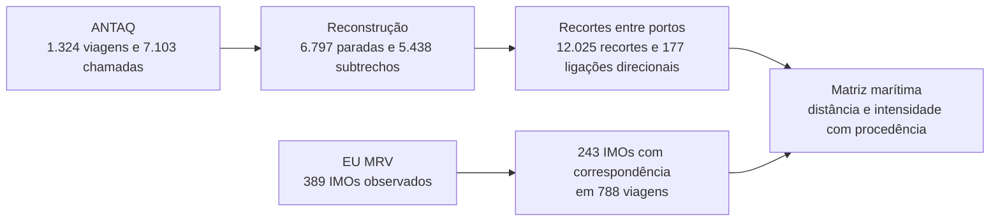
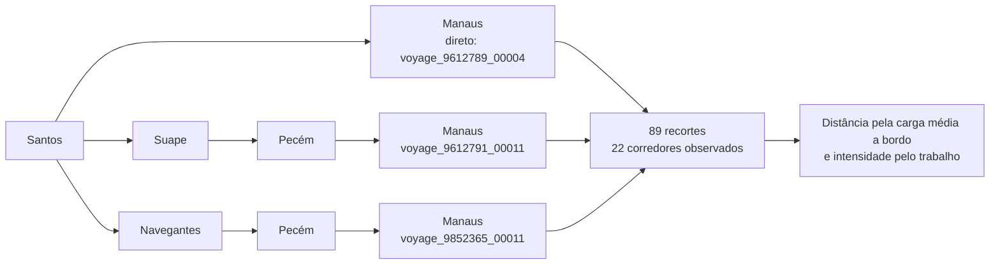

# CabotageLens: sistema computacional auditável para comparação porta a porta entre rodovia e cabotagem no Brasil

> **Documento de validação textual.**
>
> Durante esta etapa, este Markdown concentra o conteúdo editável do artigo técnico. As revisões de texto devem ser feitas aqui. O [arquivo LaTeX](article/cabotagelens_technical_article.tex) e o [PDF](article/cabotagelens_technical_article.pdf) serão sincronizados e compilados somente depois da aprovação do conteúdo.

**Autor:** Felipe de Sá Proença

**Status:** em validação textual

---

## Resumo

A escolha entre transporte rodoviário direto e transporte com cabotagem não depende apenas da distância percorrida. No Brasil, uma rota com cabotagem pode reduzir parte das emissões no trecho principal, mas também inclui deslocamentos rodoviários até os portos, operações portuárias, espera, movimentação de carga e o percurso real realizado pelo navio. Quando esses elementos são ignorados, a comparação entre os modais fica incompleta e pode levar a conclusões pouco confiáveis.

Este trabalho apresenta o CabotageLens, uma ferramenta desenvolvida para comparar, de forma mais assertiva, duas alternativas para a mesma origem, destino e carga: uma viagem totalmente rodoviária e uma cadeia logística formada por rodovia, cabotagem e rodovia. A ferramenta utiliza dados públicos de instituições públicas e privadas, combinando informações de rotas terrestres, movimentação portuária, viagens marítimas, consumo de combustível, emissões e custos modelados.

A principal contribuição do sistema é tratar a operação logística como uma cadeia completa, e não como trechos isolados. Na perna marítima, o sistema reconstrói o percurso observado dos navios, considera cargas transportadas ao longo dos subtrechos e evita assumir previamente um corredor fixo. Na comparação ambiental, inclui pontos de emissão que normalmente ficam fora de análises simplificadas, como acessos terrestres aos portos e emissões associadas às etapas portuárias quando há dados disponíveis.

Com isso, o CabotageLens fornece uma base mais transparente para avaliar custo e emissões de carbono entre alternativas rodoviárias e multimodais, permitindo que a decisão seja sustentada por dados rastreáveis, premissas explícitas e uma representação mais próxima da operação real.

**Palavras-chave**: cabotagem; transporte rodoviário; transporte multimodal; ANTAQ; EU MRV; emissões operacionais; logística; Brasil.

## 1. Introdução

O transporte de cargas no Brasil é fortemente concentrado nas rodovias. Em 2015, o modal rodoviário respondeu por 65% da atividade de transporte de cargas, medida em toneladas-quilômetro úteis (TKU). No mesmo recorte, a ferrovia respondeu por 15% e a cabotagem por 11%. A distribuição ajuda a explicar por que o caminhão é a referência mais imediata para transportar cargas no país, inclusive em trajetos longos.


*Figura 1 — Distribuição da atividade de transporte de cargas no Brasil em 2015, medida em TKU. Fonte: [Sindicato dos Bancários de São Paulo, Osasco e Região (2018)](https://spbancarios.com.br/05/2018/brasil-e-dependente-do-transporte-rodoviario-de-cargas), com dados de 2015 do Plano Nacional de Logística, conforme informado pela publicação.*

Além do papel predominante na matriz, o transporte rodoviário de cargas depende, principalmente, do diesel e contribui para as emissões de gases de efeito estufa do setor. Por isso, políticas de transporte buscam transferir parte das viagens longas para modais mais eficientes. Tomemos de exemplo a [Comissão Europeia, 2011](https://eur-lex.europa.eu/legal-content/EN/TXT/?uri=CELEX:52011DC0144), que no Livro Branco dos Transportes definiu a meta de transferir, até 2030, 30% das cargas rodoviárias transportadas por mais de 300 km para ferrovias ou vias aquaviárias e, até 2050, mais de 50%. Nesse contexto, a cabotagem — o transporte marítimo entre portos do mesmo país utilizando a navegação pela costa nacional ou por vias interiores — é uma alternativa possível para parte das cargas de longa distância no Brasil [icct2022].

Para saber se a cabotagem faz sentido em uma ligação específica, a comparação precisa ser porta a porta. Uma comparação porta a porta começa no local onde a carga está e termina no local em que ela será entregue. As duas alternativas precisam prestar exatamente o mesmo serviço: transportar a mesma massa entre esses dois pontos. No caminho rodoviário, o caminhão percorre todo o trajeto por estrada. Na alternativa com cabotagem, a carga segue de caminhão até o porto de embarque, é transportada pelo navio entre os portos e, depois, segue de caminhão do porto de desembarque até o destino final. Por isso, a análise soma distância, consumo, emissões e custo de todas essas etapas, em vez de comparar apenas o trecho marítimo com a viagem rodoviária completa. Os portos escolhidos, as distâncias de acesso, a carga e as operações de transbordo podem mudar o resultado [shortsea2019; modalshiftreview2020].

É para tornar essa comparação possível que foi desenvolvido o CabotageLens. O usuário informa a origem, o destino e a massa da carga, e o sistema constrói as duas alternativas de transporte. Para cada uma, apresenta a distância total, o consumo de combustível, as emissões operacionais e o custo modelado. Ao reunir essas informações em uma mesma base de comparação, a ferramenta permite avaliar, para cada ligação, como a alternativa com cabotagem se diferencia da rota feita inteiramente por estrada. Com isso, a comparação deixa de ser uma escolha abstrata entre caminhão e navio e passa a considerar a operação logística completa.

## 2. Revisão da literatura e fundamentação metodológica

A literatura mostra que a cabotagem pode ser relevante em viagens longas, mas o resultado muda de uma ligação para outra [icct2022]. Uma rota pode ter uma longa navegação e acessos rodoviários curtos. Outra pode exigir muitos quilômetros por estrada até o porto. Frequência, tempo, confiabilidade, estoque e disponibilidade do serviço também influenciam a decisão real [competitiveness2024]. O CabotageLens calcula rotas, combustível, emissões operacionais e custo modelado. Ele não representa por completo todas as condições comerciais.

Estudos de *short sea shipping* (navegação marítima de curta distância) também mostram que a substituição do transporte rodoviário pelo transporte marítimo não significa uma vantagem ambiental automática. O resultado depende do tipo de navio, de sua utilização, das distâncias e da carga à qual o consumo é atribuído [shortsea2019]. Por isso, a unidade analisada deve ser a remessa completa, e não um navio e um caminhão considerados isoladamente [modalshiftreview2020].

Um princípio metodológico do estudo é dar preferência a dados públicos, oficiais, observados e auditáveis. A Agência Nacional de Transportes Aquaviários (ANTAQ), órgão federal que regula e acompanha o transporte aquaviário brasileiro, fornece os registros de escalas e de movimentação de carga. A base europeia de Monitoramento, Reporte e Verificação da União Europeia (EU MRV) publica indicadores anuais de consumo e atividade dos navios. Essas fontes permitem relacionar uma operação registrada no Brasil ao desempenho do navio identificado pelo número da Organização Marítima Internacional (IMO), uma identificação permanente da embarcação. Os campos utilizados, os arquivos de origem e a forma de reconstruir as viagens são apresentados na Seção 3.3 [antaq2025; eumrv2025].

A fronteira ambiental adotada é a de emissões operacionais *tank-to-wheel* (TTW, "do tanque à roda") de dióxido de carbono equivalente (CO₂e). Ela contabiliza o combustível queimado durante a operação do caminhão, do navio e dos equipamentos portuários. Não inclui a produção, o refino, o transporte ou a distribuição dos combustíveis. Essa delimitação não equivale a uma avaliação do ciclo de vida (*life-cycle assessment*, LCA), que também abrange etapas como a fabricação, a operação e o fim de vida dos equipamentos. Ela também se diferencia de uma avaliação *well-to-wheel* (WTW, do poço à roda), que inclui a cadeia do combustível anterior ao uso [decarb2024; maritimelca2024].

Além das emissões, o estudo delimita o custo e o serviço que serão comparados. O custo apresentado é uma estimativa do custo do combustível consumido nas etapas calculadas. Ele não representa frete comercial, tarifa contratada, negociação, seguro, estoque ou multas por permanência. O serviço comparado é o transporte da mesma remessa entre a mesma origem e o mesmo destino. As viagens observadas permitem reconstruir os percursos marítimos, mas não garantem frequência, espaço no navio ou disponibilidade comercial futura.

**Tabela 1 — O que está dentro e fora da comparação.**

| Dimensão | Incluído | Fora da fronteira |
| :-------------- | :------------------------------------------------------------------------------------ | :------------------------------------------------------------------------------------------------ |
| Emissões | Emissões operacionais TTW de CO₂e por remessa | WTW, LCA, fabricação de ativos e inventário completo de poluentes locais |
| Custo | Estimativa do custo operacional modelado | Frete comercial, negociação, seguro, estoque, multas por permanência e reserva de espaço no navio |
| Serviço | Sequências de portos realmente registradas no período analisado | Garantia de frequência, espaço no navio ou disponibilidade comercial futura |

## 3. Metodologia

Esta seção descreve como o CabotageLens constrói e compara as alternativas de transporte. A Seção 3.1 define o serviço que as duas alternativas precisam atender. Em seguida, a Seção 3.2 calcula a alternativa rodoviária e a Seção 3.3 monta a alternativa com cabotagem, incluindo os acessos terrestres, as operações portuárias e a navegação. A Seção 3.4 reúne os resultados do exemplo. A Seção 4 apresenta a implementação dessas regras no sistema.

### 3.1 Serviço comparado e alternativas logísticas

Para que a comparação seja válida, as duas alternativas devem prestar o mesmo serviço: entregar uma remessa com massa definida entre a mesma origem e o mesmo destino. Esses três elementos formam a unidade funcional da avaliação. Assim, uma alternativa não pode apresentar resultado mais favorável apenas por transportar menos carga ou terminar em outro local.

Nos exemplos desta seção, a remessa tem 14 t e segue de São Paulo (SP) para Rio Branco (AC). Na alternativa rodoviária, ela percorre um único trecho por estrada, da origem ao destino. Na alternativa com cabotagem, a mesma remessa percorre três trechos:

- origem → porto de embarque;
- porto de embarque → porto de desembarque; e
- porto de desembarque → destino.

As operações de movimentação de carga nos dois terminais também entram no cálculo. Dessa forma, a comparação considera a cadeia completa, e não apenas o trecho marítimo frente à viagem rodoviária inteira [shortsea2019; competitiveness2024].

Para estimar as operações portuárias, o sistema representa a remessa de 14 t como 1 TEU (*twenty-foot equivalent unit*, unidade equivalente a um contêiner de 20 pés). Essa conversão determina quantos contêineres precisam ser movimentados nos terminais.

### 3.2 Alternativa rodoviária

O cálculo rodoviário começa pela distância terrestre total entre a origem e o destino. O sistema obtém uma rota rodoviária em quilômetros e utiliza essa distância para representar o percurso do caminhão. A forma como essa rota é consultada e transformada em distância está descrita na Seção 4.3.1.

#### 3.2.1 Escolha do veículo e consumo de diesel

A massa transportada define o veículo representativo. O modelo utiliza os rendimentos médios por número de eixos publicados pela **Agência Nacional de Transportes Terrestres (ANTT)**. Esses dados oficiais foram obtidos na tabela da Política Nacional de Pisos Mínimos do Transporte Rodoviário de Cargas, disponibilizada no [portal de legislação da ANTT (ANTTlegis)](https://anttlegis.antt.gov.br/action/UrlPublicasAction.php?acao=abrirAtoPublico&cod_menu=9230&cod_modulo=623&num_ato=00000001&seq_ato=ATT&sgl_orgao=SUROC%2FANTT%2FMT&sgl_tipo=POR&vlr_ano=2025). A tabela de referência adotada no modelo associa a faixa de carga ao número de eixos e relaciona cada configuração à eficiência básica em quilômetros por litro (km/L). A seleção automática é uma regra de modelagem para estimar consumo; não é uma verificação de limite legal de peso nem substitui o planejamento operacional de uma transportadora.

**Tabela 2 — Regra automática para o veículo rodoviário representativo e eficiência básica adotada.**

| Massa da remessa | Veículo representativo | Eixos | Eficiência básica |
| :--------------- | :--------------------- | ----: | ----------------: |
| Até 18 t | Carreta | 5 | 2,3 km/L |
| Acima de 18 t até 30 t | Carreta | 6 | 2,0 km/L |
| Acima de 30 t até 40 t | Bitrem | 7 | 2,0 km/L |
| Acima de 40 t | Rodotrem | 9 | 2,0 km/L |

*Fonte: elaboração do sistema a partir dos rendimentos médios por número de eixos publicados pela Agência Nacional de Transportes Terrestres (ANTT), no portal ANTTlegis.*

Com a distância rodoviária $D_{\mathrm{rod}}$, em quilômetros, a eficiência aplicada $\eta_{\mathrm{rod}}$, em km/L, e $N$ viagens carregadas necessárias para transportar a remessa, o consumo de diesel do trecho $F_{\mathrm{rod}}$ é calculado por:

$$
F_{\mathrm{rod}}=N\frac{D_{\mathrm{rod}}}{\eta_{\mathrm{rod}}}.
$$

Como exemplo, usemos os 3.491,431 km de distância rodoviária entre São Paulo e Rio Branco. Para transportar uma remessa de 14 t nessa ligação, o modelo seleciona uma carreta de cinco eixos, com eficiência de 2,3 km/L. Como a remessa cabe em uma única viagem, $N=1$ e o consumo estimado é:

$$
\begin{aligned}
F_{\mathrm{rod}}
&=1\times\frac{3.491{,}431\ \mathrm{km}}{2{,}3\ \mathrm{km/L}}\\
&=1.518{,}014\ \mathrm{L}.
\end{aligned}
$$

Quando a carga exige mais de uma viagem do veículo escolhido, o sistema multiplica esse consumo pelo número necessário de viagens carregadas. Os litros calculados são convertidos em custo na Seção 3.2.2 e em emissões operacionais na Seção 3.2.3.

#### 3.2.2 Custo estimado do combustível

Depois de estimar o consumo em litros, o sistema calcula o custo do diesel da rota rodoviária. O preço do Diesel S10 vem do levantamento semanal da [Agência Nacional do Petróleo, Gás Natural e Biocombustíveis (ANP)](https://www.gov.br/anp/pt-br/assuntos/precos-e-defesa-da-concorrencia/precos/levantamento-de-precos-de-combustiveis-ultimas-semanas-pesquisadas), agência federal que publica preços médios de combustíveis por Unidade da Federação (UF). O sistema sempre busca os dados mais recentes para a comparação.

Nas rotas interestaduais, o preço adotado é a média aritmética entre o valor registrado na UF de origem e o valor registrado na UF de destino. Em uma rota inteiramente dentro de uma mesma UF, os dois valores são iguais e, portanto, o cálculo mantém o preço desse estado. O preço usado na rota é dado por:

$$
p_{\mathrm{diesel}}=\frac{p_{\mathrm{origem}}+p_{\mathrm{destino}}}{2}.
$$

O custo estimado é o consumo calculado na Seção 3.2.1 multiplicado pelo preço do litro:

$$
C_{\mathrm{rod}}=F_{\mathrm{rod}}\,p_{\mathrm{diesel}}.
$$

Nessas expressões, $F_{\mathrm{rod}}$ é o consumo de diesel, em litros, e $p_{\mathrm{diesel}}$ é o preço adotado, em reais por litro. Na execução São Paulo–Rio Branco, os valores correspondem aos preços médios de revenda do Diesel S10 divulgados pela ANP para a semana de 12 a 18 de julho de 2026. Nesse levantamento, São Paulo registrou R\$ 6,960/L e o Acre, R\$ 9,270/L. Assim, o preço aplicado à rota foi:

$$
p_{\mathrm{diesel}}
=\frac{6{,}960+9{,}270}{2}
=8{,}115\ \text{R\$/L}.
$$

Com o consumo de 1.518,014 L calculado para a remessa de 14 t, o custo estimado da rota rodoviária é:

$$
C_{\mathrm{rod}}
=1.518{,}014\ \mathrm{L}\times8{,}115\ \text{R\$/L}
=12.318{,}68\ \text{R\$}.
$$

#### 3.2.3 Emissões operacionais da perna rodoviária

As emissões da alternativa rodoviária são calculadas a partir do diesel consumido na Seção 3.2.1. A fronteira adotada é *tank-to-wheel* (TTW, do tanque à roda): ela considera somente as emissões geradas pela queima do combustível durante o transporte. O sistema aplica o fator 2,68 kg CO₂e por litro de diesel, baseado nas Diretrizes de 2006 do Painel Intergovernamental sobre Mudanças Climáticas (IPCC) [ipcc2006]. Costa et al. [competitiveness2024] é a referência brasileira usada para manter essa estimativa na fronteira TTW, sem incluir a produção, o refino ou a distribuição do combustível.

A emissão rodoviária é o consumo de diesel multiplicado pelo fator de emissão:

$$
E_{\mathrm{rod}}=F_{\mathrm{rod}}\,f_{\mathrm{diesel}}.
$$

Nessa expressão, $E_{\mathrm{rod}}$ é a emissão operacional da rota, em kg CO₂e; $F_{\mathrm{rod}}$ é o consumo de diesel, em litros; e $f_{\mathrm{diesel}}$ é o fator de emissão, em kg CO₂e/L. No exemplo São Paulo–Rio Branco, os 1.518,014 L estimados na Seção 3.2.1 resultam em:

$$
E_{\mathrm{rod}}
=1.518{,}014\ \mathrm{L}\times2{,}68\ \text{kg CO₂e/L}
=4.068{,}28\ \text{kg CO₂e}.
$$

#### 3.2.4 Resultado consolidado da alternativa rodoviária

A Tabela 3 reúne os resultados da alternativa rodoviária para a mesma remessa usada no exemplo São Paulo-Rio Branco.

**Tabela 3 — Resultados da alternativa rodoviária no exemplo São Paulo–Rio Branco, para uma remessa de 14 t.**

| Item | Valor no exemplo |
| :-- | :-- |
| **Percurso** | São Paulo (SP)–Rio Branco (AC) |
| **Distância rodoviária** | 3.491,431 km |
| **Veículo representativo** | Carreta de cinco eixos |
| **Eficiência adotada** | 2,3 km/L |
| **Número de veículos** | 1 |
| **Diesel consumido** | 1.518,014 L |
| **Preço do Diesel S10** | R\$ 8,115/L |
| **Custo modelado do combustível** | R\$ 12.318,68 |
| **Emissões operacionais TTW** | 4.068,28 kg CO₂e |

### 3.3 Alternativa multimodal

A alternativa multimodal também precisa transportar a remessa do ponto inicial ao ponto final. Ela é formada por três partes: o acesso rodoviário até o porto de embarque, a navegação entre os portos e o acesso rodoviário depois do desembarque. Portanto, o combustível é consumido não só pelo navio, em cada subtrecho marítimo, mas também nos deslocamentos da origem até o porto de embarque e do porto de desembarque até o destino final. Além disso, o sistema calcula separadamente o consumo da movimentação de carga nos terminais portuários.

Os próximos subitens mostram como esses componentes são formados: a escolha dos portos define os extremos da ligação; os acessos terrestres usam o cálculo rodoviário; as viagens registradas permitem reconstruir a navegação e a carga a bordo; a intensidade define o consumo do navio; e a agregação reúne combustível, emissões, custo e operações portuárias.

#### 3.3.1 Escolha dos portos

O sistema associa a origem ao porto mais próximo disponível na base portuária e faz o mesmo para o destino. Esses dois portos definem a ligação marítima que será pesquisada. A forma como essa proximidade é calculada e usada para selecionar os portos é apresentada na Seção 4.4.3.1. Essa regra fornece uma forma objetiva de montar o cenário, mas não afirma se o porto é necessariamente a melhor escolha comercial ou operacional. Um porto mais distante pode ser preferível na prática por motivos como frequência de navios, contrato, terminal, custo ou disponibilidade de espaço, fatores que não são decididos por essa seleção geográfica.

#### 3.3.2 Acessos rodoviários: *first mile* e *last mile*

O primeiro acesso, chamado de *first mile*, leva a carga da origem até o porto de embarque. O segundo, chamado de *last mile*, leva a carga do porto de desembarque até o destino final. Para cada um deles, o sistema obtém uma distância rodoviária, aplica a regra de veículo, eficiência e consumo de diesel da Seção 3.2.1 e converte o consumo em emissões conforme a Seção 3.2.3.

#### 3.3.3 Operações portuárias

As operações portuárias são as movimentações realizadas dentro do terminal quando a remessa passa entre o transporte rodoviário e o navio. No porto de embarque, o contêiner chega pelo *first mile* e precisa ser movimentado até o navio; no porto de desembarque, ocorre o caminho inverso antes do *last mile*. Essas atividades não pertencem nem ao acesso rodoviário nem à navegação. Por isso, o combustível consumido no terminal é calculado como um componente próprio da alternativa multimodal.

O modelo representa esse consumo pelos equipamentos para os quais há fatores de atividade no cenário adotado: o guindaste sobre pneus do pátio (*rubber-tyred gantry*, RTG) e o caminhão que circula internamente no terminal. Estudos sobre carga e descarga em portos e sobre o uso energético de RTGs fundamentam a representação da operação por equipamento a seguir [shipops2022; rtg2017].

O cálculo segue uma sequência simples: a carga informada é convertida em contêineres equivalentes a 20 pés (TEU); cada TEU gera uma quantidade definida de movimentos por equipamento; e cada movimento é convertido em litros de diesel. Os movimentos por contêiner e os consumos por movimento vêm do cenário de referência parametrizado com dados de Santos no estudo de Costa et al [workbookdados].

O cenário sempre considera duas operações portuárias: uma no porto de embarque e outra no porto de desembarque. Como a mesma remessa passa pelos dois terminais, a fórmula já usa a multiplicação por 2:

$$
L_{\mathrm{operações}}
=2\times T\times
\left(a_{\mathrm{RTG}}\,f_{\mathrm{RTG}}
+a_{\mathrm{caminhao}}\,f_{\mathrm{caminhao}}\right).
$$

Nessa expressão, $T$ é a quantidade de TEUs da remessa; $a$ é o número de movimentos por TEU; e $f$ é o consumo em litros por movimento. O primeiro termo ($a_{\mathrm{RTG}}\,f_{\mathrm{RTG}}$) calcula o diesel do RTG e o segundo calcula o diesel do caminhão interno. A multiplicação por 2 leva esse consumo para os dois terminais. O resultado é o total em litros de diesel usado posteriormente no cálculo das emissões operacionais e do custo modelado.

No exemplo, a remessa de 14 t equivale a 1 TEU. O RTG realiza quatro movimentos por contêiner, com consumo de 0,355148 L por movimento, e o caminhão interno realiza dois movimentos, com consumo de 0,494671 L por movimento. Aplicando diretamente a fórmula:

$$
\begin{aligned}
L_{\mathrm{operações}}
&=2\times1\times
\left[(4\times0{,}355148)+(2\times0{,}494671)\right]\\
&=2\times(1{,}421+0{,}989)\\
&=4{,}820\ \mathrm{L}.
\end{aligned}
$$

Assim, no exemplo São Paulo–Rio Branco, as operações portuárias em Santos e Manaus totalizam 4,820 L de diesel.

#### 3.3.4 Consumo de combustível na perna marítima

A perna marítima é o trecho em que a remessa segue por cabotagem entre o porto de embarque e o porto de desembarque. O consumo desse trecho é estimado em VLSFO (*very low sulphur fuel oil*, óleo combustível de baixíssimo teor de enxofre), combustível naval adotado pelo modelo.

Na rodovia, um serviço público de roteamento pode receber dois pontos e devolver com precisão a distância percorrida pela malha viária. Para a cabotagem, porém, não há um serviço equivalente que informe o itinerário efetivamente realizado por cada navio, suas escalas e a carga a bordo em cada trecho. Uma rota marítima desenhada apenas entre dois portos não mostraria, por exemplo, se o navio passou por Suape ou Pecém antes de chegar a Manaus. Por isso, em vez de estimar um corredor teórico, o sistema usa os registros reais de escalas e movimentação de carga publicados pela Agência Nacional de Transportes Aquaviários (ANTAQ) [antaq2025].

O sistema não reconstrói apenas a ligação que será comparada. Primeiro, ele percorre todas as viagens de cabotagem registradas na base e reconstitui, em cada uma delas, a ordem das escalas e a carga a bordo. Depois, sempre que um porto aparece antes de outro na mesma viagem, essa sequência passa a ser uma observação válida para a ligação entre os dois portos.

Assim, uma viagem observada como Santos → Suape → Pecém → Manaus pode contribuir para as ligações Santos → Suape, Santos → Pecém e Santos → Manaus. Ela também mostra que uma ligação não precisa ser direta: os portos intermediários permanecem no cálculo. 

O percurso apresentado a seguir serve apenas para mostrar, com um caso real, como essa reconstrução é feita para todas as viagens da base; ele não é um corredor previamente definido pelo sistema.

##### 3.3.4.1 Atividade observada na ANTAQ e reconstrução das viagens

Para executar essa reconstrução, o sistema parte dos arquivos brutos da ANTAQ, que não trazem uma viagem pronta, como “Santos–Manaus”. Cada linha registra apenas um evento: uma escala em um porto e uma movimentação de carga. Ao reunir os registros do mesmo navio, ordenar as escalas e calcular a carga a bordo, o sistema transforma esses eventos isolados em uma viagem observada.

Para reconstruir uma viagem, o sistema combina duas tabelas que cumprem papéis diferentes. A tabela de Carga mostra o que entrou e o que saiu do navio em cada escala. A tabela de Atracação mostra onde e quando essa escala ocorreu e qual navio a realizou. O campo `IDAtracacao` aparece nos dois arquivos e faz a ligação entre eles.

###### 3.3.4.1.1 Tabela de Carga da ANTAQ

A tabela de Carga é um registro de movimentações, não um itinerário pronto. Cada linha representa uma parcela de carga movimentada em determinada escala: informa a massa, a quantidade de contêineres e se ela foi embarcada ou desembarcada. Uma mesma escala pode ter várias linhas, pois o navio pode descarregar e carregar mercadorias associadas a diferentes pares de origem e destino.

Para saber quanto foi movimentado no porto, o sistema reúne as linhas com o mesmo `IDAtracacao` e soma separadamente os desembarques e os embarques. A carga embarcada entra no navio naquele porto e segue para o trecho seguinte; a carga desembarcada deixa o navio naquele porto. Por isso, os valores da Tabela 4 são apresentados na ordem **desembarcados / embarcados**. Eles mostram o movimento ocorrido na escala, e não a carga total que o navio levava ao partir.

**Tabela 4 — Campos do arquivo `2025Carga.txt` usados para reconstruir os movimentos de carga.**

| Coluna | Uso na avaliação | Valor na viagem `voyage_9612791_00011` |
| :-- | :-- | :-- |
| `IDAtracacao` | Liga cada movimento de carga à escala correspondente. | Santos: `1618801`; Suape: `1625119`; Pecém: `1625546`; Manaus: `1620276`. |
| `Tipo Navegação` | Mantém somente os registros de cabotagem. | `Cabotagem` nas quatro escalas. |
| `TEU` | Ajuda a identificar a carga conteinerizada e registra a quantidade de contêineres em unidade equivalente a 20 pés. | **Desembarcados / embarcados:** Santos: 0/866; Suape: 804/881; Pecém: 541/187; Manaus: 1.639/621. |
| `Natureza da Carga` e `Carga Geral Acondicionamento` | Complementam a identificação da carga conteinerizada quando necessário. | `Carga Conteinerizada` e `Conteinerizada` em todas as linhas da viagem. |
| `VLPesoCargaBruta` | Informa a massa embarcada ou desembarcada, em toneladas. | **Desembarcados / embarcados:**</br>Santos: 0/9.881,860;</br>Suape: 8.002,620/11.862,199;</br>Pecém: 7.624,347/3.231,914;</br>Manaus: 19.897,560/7.571,660 t. |
| `Sentido` | Indica se a massa foi embarcada ou desembarcada na escala. | `Desembarcados` e `Embarcados`. |
| `Origem` e `Destino` | Preservam os códigos dos portos de origem e destino declarados para cada movimento de carga; não definem, sozinhos, o itinerário completo do navio. | Santos; Suape; Pecém; e Manaus. |

*Arquivo: `2025Carga.txt`. Fonte: [Agência Nacional de Transportes Aquaviários (ANTAQ), Painel Estatístico Aquaviário](https://estatistica.antaq.gov.br/ea/sense/download.html).*

Para reconstruir a carga a bordo, o sistema lê os desembarques e embarques na ordem das escalas. A primeira escala disponível pode ocorrer depois de o navio já estar carregado. Se o saldo acumulado de embarques menos desembarques ficar negativo em algum ponto, isso indica que havia carga a bordo antes do primeiro registro observado. Nesses casos, o sistema inclui apenas a carga inicial mínima necessária para manter o saldo não negativo e continua a reconstrução dos subtrechos. Se isso não ocorrer, a carga inicial é considerada zero.

###### 3.3.4.1.2 Tabela de Atracação da ANTAQ

A tabela de Atracação é o registro cronológico das escalas. Cada linha informa que determinado navio esteve em um porto ou terminal, em quais datas chegou e saiu e qual é o seu número IMO, identificador único do navio usado internacionalmente. Ela não informa a massa movimentada. Ao ligar seu `IDAtracacao` aos movimentos da tabela de Carga e ordenar as datas de atracação, o sistema transforma os registros isolados na sequência Santos → Suape → Pecém → Manaus.

**Tabela 5 — Campos do arquivo `2025Atracacao.txt` usados para identificar e ordenar as escalas dos navios.**

| Coluna | Uso na avaliação | Valor na viagem `voyage_9612791_00011` |
| :-- | :-- | :-- |
| `IDAtracacao` | Liga a escala aos movimentos de carga do arquivo `2025Carga.txt`. | `1618801`; `1625119`; `1625546`; `1620276`. |
| `CDTUP` e `Porto Atracação` | Identificam o porto ou a instalação portuária da escala. | `BRSSZ` — Santos; `BRSUA` — Suape; `BRCE001` — Terminal Portuário do Pecém; `BRAM012` — Super Terminais Comércio e Indústria. |
| `Data Atracação` | Define a ordem cronológica das escalas. | 30/09/2025 03:57; 05/10/2025 10:06; 08/10/2025 03:23; 13/10/2025 18:00. |
| `Data Chegada` e `Data Desatracação` | Registram o intervalo observado da escala. | Santos: 29/09 05:45–30/09 17:30; Suape: 04/10 06:45–06/10 08:50; Pecém: 07/10 14:00–08/10 16:38; Manaus: 13/10 16:30–17/10 06:20. |
| `Tipo de Navegação da Atracação` | Registra o tipo de navegação informado para a escala. | Santos, Suape e Pecém: `Cabotagem`; Manaus: `Interior`. |
| `Terminal`, `Município` e `UF` | Complementam a identificação do local atendido. | Santos Brasil, Guarujá/SP; TECON Suape, Ipojuca/PE; Terminal do Pecém, São Gonçalo do Amarante/CE; Super Terminais, Manaus/AM. |
| `Nº do IMO` | Identifica o navio e permite procurá-lo no EU MRV. | `9612791` nas quatro escalas. |

*Arquivo: `2025Atracacao.txt`. Fonte: [Agência Nacional de Transportes Aquaviários (ANTAQ), Painel Estatístico Aquaviário](https://estatistica.antaq.gov.br/ea/sense/download.html).*

##### 3.3.4.1.3 Reconstrução das viagens

A integração das duas tabelas mostra, portanto, a ordem das escalas e a mudança de carga em cada uma delas. Ela não descreve apenas uma ligação abstrata Santos–Manaus: registra o que entrou e saiu do navio em Santos, Suape, Pecém e Manaus. A Figura 2 mostra o resultado da reconstrução para a parte de ida da viagem `voyage_9612791_00011`; em cada seta, a carga é aquela que estava a bordo enquanto o navio navegava para o porto seguinte e a distância está em milhas náuticas (nm):


*Figura 2 — Parte de ida reconstruída da viagem `voyage_9612791_00011`. Fonte: elaboração própria com dados de Carga e Atracação da ANTAQ e distâncias da matriz marítima do sistema.*

##### 3.3.4.2 Intensidade de combustível do navio

Depois de reconstruir o percurso e a carga a bordo, é preciso estimar quanto combustível foi necessário para realizar esse transporte. Para isso, o sistema usa a **intensidade de combustível**, isto é, a quantidade de combustível associada ao transporte de uma tonelada por uma milha náutica. A unidade é grama por tonelada-milha náutica, ou $\mathrm{g/(t\cdot nm)}$.

Esse indicador é uma razão, e não o consumo total de uma viagem. Uma intensidade de $7{,}43\ \mathrm{g/(t\cdot nm)}$, por exemplo, significa que, em média, são associados 7,43 g de combustível a cada tonelada transportada por uma milha náutica. Assim, ele permite comparar navios e viagens de tamanhos diferentes. O consumo total de cada viagem só é obtido depois, ao multiplicar essa intensidade pelo trabalho de transporte reconstruído, conforme a Seção 3.3.4.3.

###### 3.3.4.2.1 Valor individual do navio no EU MRV

A ANTAQ informa por onde o navio passou e qual carga levava, mas não informa diretamente o combustível consumido. Esse dado vem da base de **Monitoramento, Reporte e Verificação da União Europeia** (*European Union Monitoring, Reporting and Verification*, EU MRV), que publica indicadores anuais de consumo, atividade e emissões por embarcação. O número IMO registrado na ANTAQ permite procurar o mesmo navio nessa base.

Na viagem `voyage_9612791_00011`, o IMO 9612791 foi encontrado diretamente no EU MRV, com intensidade de $7{,}43\ \mathrm{g/(t\cdot nm)}$ [eumrv2025]. A Tabela 6 mostra os campos usados nessa correspondência.

**Tabela 6 — Dados do EU MRV usados para a viagem `voyage_9612791_00011`.**

| Fonte ou campo | Valor usado | Papel no cálculo |
| :-- | :-- | :-- |
| Arquivo de origem | `2023-v85-08022026-EU MRV Publication of information.xlsx` | Publicação anual consultada para obter o indicador do navio. |
| `IMO Number` | `9612791` | Faz a correspondência direta com as escalas observadas na ANTAQ. |
| `Ship type` | `Container ship` | Classificação do navio informada na base. |
| `Annual average Fuel consumption per transport work (mass)` | $7{,}43\ \mathrm{g/(t\cdot nm)}$ | Informa a intensidade média de combustível por tonelada-milha náutica do navio. |
| Regra de seleção | Valor positivo mais recente para o mesmo IMO | Mantém o indicador individual mais atual disponível para o navio. |

*Fonte: [THETIS-MRV, Agência Europeia de Segurança Marítima (EMSA)](https://mrv.emsa.europa.eu/), publicação anual de informações do EU MRV.*

O sistema procura primeiro o mesmo IMO no EU MRV. Quando encontra o mesmo navio em mais de um ano, usa o indicador positivo mais recente. Esse é o caso preferencial, pois a intensidade pertence ao navio que aparece nos registros da ANTAQ. Quando não há correspondência individual, ou quando o valor individual é estatisticamente muito fora do padrão do seu tipo de navio, o sistema usa uma estimativa documentada de um grupo semelhante. As regras para isso são apresentadas a seguir.

###### 3.3.4.2.2 Valores atípicos, P95 e estatística robusta

Um valor alto publicado no EU MRV não é descartado por ser necessariamente incorreto. Ainda assim, ele pode ser muito diferente dos navios comparáveis e, se usado sem verificação, pode distorcer a intensidade média de uma ligação. Por esse motivo, o sistema compara a intensidade individual com as intensidades dos navios do mesmo tipo.

O percentil 95 (P95) é o ponto abaixo do qual estão 95% dos valores do grupo ordenado. Em outras palavras, depois de ordenar as intensidades de todos os navios de um tipo, apenas os 5% maiores ficam acima do P95. A regra só é aplicada quando há pelo menos 20 navios no grupo, para que essa comparação tenha uma base mínima.

No grupo de 243 navios classificados como *container ship*, o P95 é $24{,}073\ \mathrm{g/(t\cdot nm)}$. O navio de IMO 9603221 (*Fernão de Magalhães*), por exemplo, possui valor individual de $228{,}83\ \mathrm{g/(t\cdot nm)}$, acima desse limite. A viagem observada não é retirada: suas escalas, distâncias e carga a bordo continuam no cálculo. O que muda é somente a intensidade aplicada a ela. Quando há uma estimativa de classe disponível, ela é usada; caso contrário, aplica-se a estimativa robusta do tipo *container ship*, de $9{,}322050\ \mathrm{g/(t\cdot nm)}$.

O P95 e a estatística robusta têm funções diferentes. Enquanto P95 identifica quando o valor individual é excepcionalmente alto para seu grupo, a estatística robusta produz o valor de grupo que será usado quando o IMO estiver ausente ou quando o valor individual precisar ser substituído. Tanto para a **classe** como para o **tipo** do navio, o sistema usa a **média aparada disponível**, que exclui valores abaixo do percentil 1 e acima do percentil 99 e calcula a média dos valores restantes como intensidade desse grupo.

Essas regras evitam que poucos valores extremos definam a estimativa coletiva. Elas não foram criadas para escolher um resultado mais baixo: a mesma regra é aplicada a todos os grupos e sua aplicação fica registrada na saída do cálculo, com a estatística usada, o tamanho da amostra e a quantidade de valores retirados.

###### 3.3.4.2.3 Estimativa quando não há valor individual

Nem todos os navios que operam no Brasil aparecem na base europeia. Nessa situação, o sistema continua usando a própria base EU MRV, mas procura um grupo de embarcações semelhantes. Primeiro, procura a classe do navio, que é o grupo mais específico disponível. Se não houver uma estatística utilizável para essa classe, procura o tipo do navio, categoria mais ampla, como *container ship*. O resultado é identificado como estimativa da classe ou do tipo; ele não é apresentado como se fosse uma medição individual do navio ausente.

Cada recorte recebe, portanto, uma intensidade e uma descrição clara de sua origem: valor individual do IMO, estimativa pela classe ou estimativa pelo tipo.

###### 3.3.4.2.4 Exemplo de estimativa pelo tipo de navio

A viagem `voyage_9974486_00001`, realizada pelo navio de IMO 9974486, passou por Paranaguá, Rio de Janeiro e Salvador. Esse IMO aparece nos registros da ANTAQ, mas não possui correspondência individual no EU MRV. Como o registro também não traz uma classe mais específica, o sistema usa os dados do tipo documentado *container ship* na própria base do EU MRV.

Para formar esse valor, o sistema reuniu um indicador positivo e mais recente de cada um dos 243 navios classificados como *container ship* no EU MRV. Depois de ordenar os valores, retirou os dois menores e os dois maiores, que são os valores removidos pela regra de 1% em cada extremidade. Restaram 239 valores para o cálculo:

$$
I_{\mathrm{container\ ship}}
=\frac{\sum_{j=1}^{239} I_j}{239}
=9{,}322050\ \mathrm{g/(t\cdot nm)}.
$$

Portanto, todos os subtrechos dessa viagem recebem a intensidade de $9{,}322050\ \mathrm{g/(t\cdot nm)}$. A saída identifica esse número como uma estimativa baseada no tipo *container ship*, e não como uma medição do navio de IMO 9974486.

##### 3.3.4.3 Trabalho de transporte e intensidade da ligação

Uma ligação entre dois portos não corresponde, necessariamente, a uma única viagem nem a uma única sequência de escalas. Para representar Santos–Manaus, por exemplo, o sistema aproveita cada recorte histórico que começou em Santos e chegou a Manaus na mesma viagem e no mesmo sentido, independente do número de paradas. Antes de reunir esses recortes em uma única intensidade, ele calcula quanto transporte foi realizado em cada um deles. A ideia é ponderar a média das intensidades pela quantidade de carga que de fato foi transportada naquele trecho.

Esse cálculo usa o trabalho de transporte. Em cada subtrecho, a carga a bordo é multiplicada pela distância percorrida; depois, os resultados dos subtrechos são somados. Para uma viagem $v$, o trabalho entre a origem $o$ e o destino $d$ é:

$$
W_{v,o,d}=\sum_{s\in\mathcal{S}_{v,o,d}}m_{v,s}\,d_{v,s}.
$$

Nessa fórmula, $\mathcal{S}_{v,o,d}$ é o conjunto de subtrechos entre os dois portos, $m_{v,s}$ é a carga a bordo no subtrecho $s$, em toneladas, e $d_{v,s}$ é a distância correspondente, em milhas náuticas. O resultado $W_{v,o,d}$ é expresso em tonelada-milha náutica ($\mathrm{t\cdot nm}$). Portanto, uma viagem recebe mais peso quando transporta mais carga, percorre uma distância maior ou reúne as duas condições.

O exemplo real da viagem `voyage_9612791_00011` mostra por que a carga precisa ser reconstruída trecho a trecho. Entre Santos e Manaus, o navio passou por Suape e Pecém; a carga a bordo mudou em cada escala.

| Subtrecho observado | Carga a bordo (t) | Distância (nm) | Trabalho de transporte ($\mathrm{t\cdot nm}$) |
| :-- | --: | --: | --: |
| Santos → Suape | 12.858,754 | 1.259,179 | 16.191.476,419 |
| Suape → Pecém | 16.718,333 | 507,806 | 8.489.677,588 |
| Pecém → Manaus | 12.325,900 | 1.185,594 | 14.613.514,486 |
| **Total Santos → Manaus** | — | — | **39.294.668,494** |

*Fonte: elaboração própria com os registros de Carga e Atracação da ANTAQ, a matriz marítima e a reconstrução da viagem `voyage_9612791_00011`. Os valores exibidos foram arredondados.*

O trabalho de transporte desse recorte é, portanto:

$$
\begin{aligned}
W_{\mathrm{Santos,Manaus}}
&=16.191.476{,}419+8.489.677{,}588+14.613.514{,}486\\
&=39.294.668{,}494\ \mathrm{t\cdot nm}.
\end{aligned}
$$

O IMO 9612791 possui intensidade individual de $7{,}43\ \mathrm{g/(t\cdot nm)}$ no EU MRV. O consumo reconstruído para essa viagem observada é:

$$
F_v=\frac{I_v\,W_{v,o,d}}{1000}
=\frac{7{,}43\times39.294.668{,}494}{1000}
=291.959{,}387\ \mathrm{kg}.
$$

Esse valor descreve a atividade histórica daquela viagem específica. Ele não é somado diretamente ao consumo de uma nova remessa simulada pelo usuário. Seu papel é informar o peso e a intensidade com que essa viagem participa da preparação do indicador Santos–Manaus.

Depois de repetir a reconstrução para todas as viagens registradas, o sistema calcula a média ponderada pelo trabalho de transporte. Ele não escolhe a intensidade de uma única viagem, nem escolhe o corredor com maior volume. A intensidade da ligação é:

$$
I_{o,d}^{\mathrm{rep}}=
\frac{\sum_{v=1}^{n}I_v\,W_{v,o,d}}
{\sum_{v=1}^{n}W_{v,o,d}}.
$$

Aqui, $I_v$ é a intensidade atribuída à viagem $v$, $W_{v,o,d}$ é o trabalho de transporte dessa viagem entre os portos escolhidos e $n$ é o número de recortes aceitos. Assim, o sistema dá maior peso a uma viagem que movimentou mais tonelada-milhas náuticas, sem descartar as demais viagens diretas ou com escalas.

Em Santos–Manaus, os 89 recortes aceitos somam $3.153.328.821{,}755\ \mathrm{t\cdot nm}$ de trabalho de transporte. Antes da média, são aplicadas as regras de intensidade explicadas na subseção anterior:

- 19 recortes usam a intensidade individual do IMO
- 49 usam a estimativa pelo tipo porque não possuem correspondência individual no EU MRV; e
- 21 mantêm a viagem observada, mas recebem a estimativa pelo tipo porque o valor individual ultrapassou o limiar de anomalia. 

A soma dos produtos $I_v\,W_{v,o,d}$ é $28.410.938.295{,}411\ \mathrm{g}$. Logo:

$$
I_{\mathrm{Santos,Manaus}}^{\mathrm{rep}}=
\frac{28.410.938.295{,}411}
{3.153.328.821{,}755}
=9{,}009824\ \mathrm{g/(t\cdot nm)}.
$$

Esse resultado não é a intensidade de um navio escolhido como representante. É a média das 89 viagens registradas nas bases da ANTAQ para esse trecho, em que cada uma contribui conforme a carga efetivamente transportada e a distância percorrida.

##### 3.3.4.4 Distância marítima representativa entre os portos

Para calcular o consumo de uma nova remessa, o sistema usa uma distância marítima representativa entre o porto de origem e o porto de destino. Essa distância é calculada separadamente da intensidade. A intensidade usa o trabalho de transporte como peso; para a distância, o peso da média é a carga que permaneceu a bordo em cada recorte completo. Assim, a distância de uma viagem mais longa não é usada duas vezes no cálculo da média.

Em cada recorte, o sistema primeiro soma as distâncias de seus subtrechos e calcula a carga média a bordo ponderada pela distância. Se $D_{v,o,d}^{\mathrm{nm}}$ é a distância total do recorte, essa carga média é:

$$
\bar q_{v,o,d}=
\frac{\sum_{s\in\mathcal{S}_{v,o,d}}m_{v,s}\,d_{v,s}}
{\sum_{s\in\mathcal{S}_{v,o,d}}d_{v,s}}
=\frac{W_{v,o,d}}{D_{v,o,d}^{\mathrm{nm}}}.
$$

Na fórmula, $m_{v,s}$ é a carga a bordo no subtrecho $s$, $d_{v,s}$ é a distância desse subtrecho e $D_{v,o,d}^{\mathrm{nm}}$ é a soma das distâncias do recorte em milhas náuticas. Assim, $\bar q_{v,o,d}$ é a carga média a bordo do recorte, em toneladas. 

Na viagem `voyage_9612791_00011`, por exemplo, o trabalho de transporte de $39.294.668{,}494\ \mathrm{t\cdot nm}$ é dividido pela distância total de $2.952{,}579\ \mathrm{nm}$, resultando $13.308{,}592\ \mathrm{t}$. Esse é o peso da referida viagem na média de distância; não é a carga de uma nova remessa simulada.

Depois, a distância representativa é a média das distâncias completas dos recortes, ponderada por essa carga média:

$$
\bar D_{o,d}^{\mathrm{rep}}=
\frac{\sum_{v=1}^{n}D_{v,o,d}^{\mathrm{km}}\,\bar q_{v,o,d}}
{\sum_{v=1}^{n}\bar q_{v,o,d}}.
$$

Nessa expressão, $D_{v,o,d}^{\mathrm{km}}$ é a distância total do mesmo recorte em quilômetros e $n$ é o número de recortes aceitos.

Essa média não monta uma rota artificial com trechos de navios diferentes. Cada distância é calculada dentro da própria viagem antes de entrar na média, e nenhum corredor único é escolhido para representar o cenário. 

Em Santos–Manaus, os 89 recortes completos resultam $6.142{,}461\ \mathrm{km}$, ou $3.316{,}664\ \mathrm{nm}$.

#### 3.3.5 Emissões da alternativa multimodal

Os trechos de *first mile* e *last mile* usam a mesma conversão de diesel em emissões descrita na Seção 3.2.3. As operações portuárias também aplicam esse fator diretamente aos litros de diesel calculados na Seção 3.3.3. Na navegação, o consumo de VLSFO (*very low sulphur fuel oil*, óleo combustível de baixíssimo teor de enxofre) é multiplicado pelo fator operacional correspondente. Em ambos os casos, a fronteira continua sendo TTW: considera-se apenas o combustível queimado durante a operação.

**Tabela 7 — Fatores de emissão específicos da alternativa multimodal.**

| Etapa do transporte | Fonte do fator | Fator de emissão |
| :-- | :-- | :-- |
| Operações portuárias | Mesma base do IPCC (2006) [ipcc2006]. | 2,68 kg CO₂e/L de diesel |
| Navegação | Costa et al. [competitiveness2024], Apêndice A, Tabela 13: componente TTW dos parâmetros da Resolução IMO MEPC.391(81). | 3,114 kg CO₂e/kg de VLSFO |

#### 3.3.6 Custo do combustível

O custo modelado considera apenas o combustível estimado em cada etapa; não é uma cotação de frete. Antes de cada execução, o sistema busca a tabela mais recente de preços do Diesel S10 publicada pela Agência Nacional do Petróleo, Gás Natural e Biocombustíveis (ANP). 

No exemplo São Paulo–Rio Branco, a atualização retornou os preços da semana de 12 a 18 de julho de 2026, com data final de pesquisa em 18 de julho. Os acessos rodoviários, *first mile* e *last mile*, usam a mesma regra de escolha do veículo e de cálculo de consumo da Seção 3.2.1. Para precificar o diesel, o *first mile* usa a média entre a UF de origem e a UF do porto de embarque, e o *last mile*, a média entre a UF do porto de desembarque e a UF de destino. Nas operações portuárias, cada porto usa diretamente o preço do diesel na sua própria UF.

O sistema também busca a cotação mais recente disponível do VLSFO na [Ship & Bunker](https://shipandbunker.com/prices/br-brazil). Nesta execução, a cotação de 18 de julho de 2026 foi US\$ 741,50/mt. A sigla `mt` significa *metric tonne*, ou tonelada métrica, equivalente a 1.000 kg. A taxa de conversão USD/BRL também é sempre a mais recente: de R\$ 5,141345 por US\$, obtida pela ferramenta [CurrencyConverter](https://pypi.org/project/CurrencyConverter/) a partir de dados do Banco Central Europeu (BCE), o preço convertido foi R\$ 3.812,31/mt, ou R\$ 3,812/kg. A Tabela 8 resume as fontes, os valores de origem e os preços usados no exemplo.

**Tabela 8 — Preços de combustível usados no exemplo São Paulo–Rio Branco.**

| Etapa do transporte | Fonte do preço | Valores de origem | Preço usado no exemplo |
| :-- | :-- | :-- | :-- |
| Rodovia direta | [ANP](https://www.gov.br/anp/pt-br/assuntos/precos-e-defesa-da-concorrencia/precos/levantamento-de-precos-de-combustiveis-ultimas-semanas-pesquisadas) | Diesel S10: <br/> São Paulo, R\$ 6,960/L; <br/> Acre, R\$ 9,270/L. | R\$ 8,115/L |
| *First mile* | [ANP](https://www.gov.br/anp/pt-br/assuntos/precos-e-defesa-da-concorrencia/precos/levantamento-de-precos-de-combustiveis-ultimas-semanas-pesquisadas) | Diesel S10: <br/> São Paulo, R\$ 6,960/L; <br/> Porto de Santos (SP), R\$ 6,960/L. | R\$ 6,960/L |
| Operações portuárias | [ANP](https://www.gov.br/anp/pt-br/assuntos/precos-e-defesa-da-concorrencia/precos/levantamento-de-precos-de-combustiveis-ultimas-semanas-pesquisadas) | Diesel S10: <br/> Porto de Santos (SP), R\$ 6,960/L; <br/> Porto de Manaus (AM), R\$ 7,250/L. | R\$ 6,960/L em Santos e <br/> R\$ 7,250/L em Manaus. |
| Navegação | VLSFO: [Ship & Bunker](https://shipandbunker.com/prices/br-brazil); <br/> Taxa USD/BRL: BCE. | VLSFO: US\$ 741,50/mt; <br/> USD/BRL: R\$ 5,141345 por US\$. | R\$ 3,812/kg |
| *Last mile* | [ANP](https://www.gov.br/anp/pt-br/assuntos/precos-e-defesa-da-concorrencia/precos/levantamento-de-precos-de-combustiveis-ultimas-semanas-pesquisadas) | Diesel S10: <br/> Porto de Manaus (AM), R\$ 7,250/L; <br/> Acre, R\$ 9,270/L. | R\$ 8,260/L |

#### 3.3.7 Resultado consolidado da alternativa multimodal do exemplo São Paulo–Rio Branco

Para a remessa de 14 t entre São Paulo (SP) e Rio Branco (AC), a Tabela 9 reúne os resultados das etapas que compõem a alternativa multimodal. Os cálculos e as fontes de cada etapa estão descritos nas Seções 3.3.1 a 3.3.6.

**Tabela 9 — Resultado da alternativa multimodal no exemplo São Paulo–Rio Branco, para uma remessa de 14 t.**

| Etapa | Percurso | Distância | Combustível estimado | Custo modelado | Emissões operacionais TTW |
| :-- | :-- | --: | --: | --: | --: |
| *First mile* | São Paulo–Porto de Santos | 86,170 km | 37,465 L de diesel | R\$ 260,76 | 100,41 kg CO₂e |
| Navegação | Porto de Santos–Porto de Manaus | 6.142,461 km<br/>(3.316,664 milhas náuticas) | 418,356 kg de VLSFO | R\$ 1.594,90 | 1.302,76 kg CO₂e |
| Operações portuárias | Santos e Manaus | — | 4,820 L de diesel | R\$ 34,25 | 12,92 kg CO₂e |
| *Last mile* | Porto de Manaus–Rio Branco | 1.403,691 km | 610,300 L de diesel | R\$ 5.041,08 | 1.635,60 kg CO₂e |
| **Total** | — | **7.632,322 km** | — | **R\$ 6.930,99** | **3.051,69 kg CO₂e** |

### 3.4 Resultado final do exemplo São Paulo–Rio Branco

Esta seção compara, para a mesma remessa de 14 t, os resultados totais da alternativa A, rodoviária direta, e da alternativa B, multimodal. Os valores das alternativas A e B foram consolidados nas Seções 3.2.4 e 3.3.7, respectivamente.

**Tabela 10 — Comparação dos resultados totais no exemplo São Paulo–Rio Branco, para uma remessa de 14 t.**

| Indicador | Alternativa A: rodovia direta | Alternativa B: multimodal | Resultado da alternativa B em relação à A |
| :-- | --: | --: | :-- |
| Distância percorrida | 3.491,431 km | 7.632,322 km | 4.140,891 km a mais (118,60%). |
| Emissões operacionais TTW | 4.068,28 kg CO₂e | 3.051,69 kg CO₂e | 1.016,59 kg CO₂e a menos (24,99%). |
| Custo modelado do combustível | R\$ 12.318,68 | R\$ 6.930,99 | R\$ 5.387,69 a menos (43,74%). |

Embora a alternativa multimodal percorra uma distância total maior, ela apresenta menor custo modelado de combustível e menores emissões operacionais TTW no cenário analisado.

## 4. Implementação computacional

A Seção 3 descreve o que é calculado: duas alternativas que prestam o mesmo serviço logístico, seus trechos, os dados usados e as regras físicas aplicadas. Esta seção mostra como essas regras foram transformadas em software: o objetivo não é repetir as fórmulas, mas explicar como o sistema recebe os dados, executa cada etapa, trata uma informação ausente e registra a origem de cada resultado.

O CabotageLens separa a preparação dos dados históricos da execução de uma comparação. Assim, uma pessoa que informa uma origem, um destino e uma carga não precisa reconstruir toda a base da Agência Nacional de Transportes Aquaviários (ANTAQ) nem consultar novamente a base de Monitoramento, Reporte e Verificação da União Europeia (EU MRV), por exemplo. A aplicação utiliza os artefatos marítimos já preparados e concentra a execução na montagem do cenário porta a porta.

As ferramentas e os serviços empregados são utilizados em suas modalidades gratuitas. Os limites de consulta, armazenamento e processamento dessas modalidades são compatíveis com o escopo acadêmico, o volume de dados e a quantidade de cenários avaliados neste estudo. Dessa forma, a execução do sistema não depende de infraestrutura ou licenças pagas para cumprir seu propósito.

### 4.1 Arquitetura do sistema e tecnologias utilizadas

O sistema é desenvolvido em Python. A interface, os cálculos, a organização dos dados e as integrações externas ficam em componentes separados.

A Tabela 11 apresenta as tecnologias e os serviços essenciais para entender a execução do sistema. Ela não lista todas as bibliotecas do Python internas utilizadas no código. Essas ferramentas também não devem ser confundidas com as fontes metodológicas e de insumos: ANTAQ, EU MRV, Agência Nacional do Petróleo, Gás Natural e Biocombustíveis (ANP) e Ship & Bunker fornecem dados ou preços externos; as tecnologias da tabela permitem obter, tratar, calcular, armazenar ou apresentar essas informações.

**Tabela 11 — Tecnologias e serviços utilizados na implementação do CabotageLens.**

| Tecnologia ou serviço | Função no sistema | Papel na execução |
| :-- | :-- | :-- |
| [Python](https://www.python.org/) | Linguagem principal do projeto. | Executa o tratamento de dados, a reconstrução marítima, os cálculos e os scripts de atualização. |
| [Streamlit](https://streamlit.io/) | Ferramenta para construir a interface web em Python. | Recebe o cenário informado pelo usuário e apresenta mapas, totais, detalhamentos e avisos. |
| [Supabase](https://supabase.com/) | Serviço de banco de dados. | Guarda pontos geocodificados, rotas reutilizáveis, execuções em lote e resultados que precisam permanecer disponíveis. |
| [OpenRouteService (ORS)](https://openrouteservice.org/) | Serviço externo de localização e roteamento. | É o provedor principal para transformar um local em coordenadas e obter a geometria das rotas rodoviárias. |
| [LocationIQ](https://locationiq.com/) | Serviço externo alternativo de localização e roteamento. | É consultado somente quando o ORS não entrega uma resposta utilizável. |
| [`requests`](https://requests.readthedocs.io/en/stable/) e [Beautiful Soup](https://www.crummy.com/software/BeautifulSoup/bs4/doc/) | `requests` realiza consultas pela internet; Beautiful Soup lê a estrutura de páginas em HyperText Markup Language (HTML). | Ajudam a buscar serviços externos e, no fluxo de preparação marítima, a localizar no portal da ANTAQ os arquivos públicos a serem baixados. |
| [`CurrencyConverter`](https://pypi.org/project/CurrencyConverter/) | Biblioteca de conversão de moedas. | Converte para reais a referência internacional de preço do combustível marítimo quando ela está em dólar por tonelada. |

*Fonte: elaboração própria a partir da arquitetura versionada do CabotageLens.*

### 4.2 Dados de entrada, tratamento de endereços e geocodificação

#### 4.2.1 Dados recebidos pelo pipeline

Cada execução do pipeline recebe três dados: a origem, o destino e a massa da remessa. A origem e o destino definem os pontos inicial e final das duas alternativas; a massa, informada em toneladas, define a carga que será transportada em ambas. Antes dos cálculos, o pipeline normaliza os textos, verifica a massa e reúne os três valores em um único cenário. Assim, a rota rodoviária e a rota multimodal sempre partem dos mesmos pontos e transportam a mesma carga.

#### 4.2.2 Do texto às coordenadas

Origem e destino precisam ser convertidos em latitude e longitude antes de uma rota ser calculada. Esse procedimento é chamado de geocodificação. A entrada pode ser o nome de uma cidade, um endereço completo, coordenadas já conhecidas ou um Código de Endereçamento Postal (CEP).

Quando o provedor encontra uma correspondência suficiente, o motor de geocodificação também pode reconhecer abreviações e pequenos erros de digitação. Por exemplo, `av prof luciano galberto` é interpretado corretamente como "Avenida Professor Luciano Gualberto, São Paulo, SP".

#### 4.2.3 Consulta aos serviços de localização

O pipeline envia o texto de origem ou destino primeiro ao OpenRouteService (ORS). Se o ORS devolver uma localização válida, recebe o rótulo do local, a latitude, a longitude e a identificação do provedor. Quando o ORS não devolve uma resposta utilizável, o pipeline envia a mesma consulta ao LocationIQ. A saída desta etapa é um ponto identificado por coordenadas (latitude e longitude).

#### 4.2.4 Fluxograma explicativo

O fluxograma mostra o caminho de quatro formas de entrada para o mesmo local:



Depois que um local é geocodificado, suas coordenadas são armazenadas no banco de dados Supabase/PostgreSQL. Se o mesmo ponto for usado novamente, o sistema reutiliza esse resultado em vez de realizar outra geocodificação.

#### 4.2.5 Validação das coordenadas

Antes de calcular uma rota, é preciso verificar se o endereço foi associado à região correta. Para isso, foi usado o endereço de referência `Avenida Professor Luciano Gualberto, São Paulo, SP`. A consulta independente no Google Maps retornou as coordenadas latitude igual a −23,560017° e longitude igual a −46,727769°, apresentadas na Figura 3. Para o mesmo endereço, o motor de geocodificação retornou as coordenadas (−23,558808°; −46,730357°). A distância em linha reta entre os dois pontos é aproximadamente 296 m.


*Figura 3 — Consulta independente do endereço Avenida Professor Luciano Gualberto, São Paulo, SP, no Google Maps. Fonte: captura de tela do Google Maps realizada em 18 de julho de 2026.*

A Figura 4 mostra a consulta, no Google Maps, das coordenadas devolvidas pelo motor; os dois pontos permanecem na Avenida Professor Luciano Gualberto, na região da Universidade de São Paulo (USP).


*Figura 4 — Consulta no Google Maps das coordenadas retornadas pelo motor de geocodificação para a Avenida Professor Luciano Gualberto. Fonte: captura de tela do Google Maps realizada em 18 de julho de 2026.*

Essa comparação confirma que as coordenadas apontam para a região correta em escala de endereço. Ela não comprova precisão cadastral, como a posição de um portão ou de um número específico do imóvel, mas é suficiente para o propósito deste estudo.

### 4.3 Implementação da alternativa rodoviária

#### 4.3.1 Consulta de rota rodoviária

Com as coordenadas da origem e do destino já definidas, o sistema envia esse par primeiro ao OpenRouteService (ORS). Se o ORS não devolver uma rota utilizável, envia o mesmo par ao LocationIQ. O provedor que responder devolve a distância rodoviária e sua identificação, que ficam associadas ao cenário.

No exemplo São Paulo–Rio Branco, após a geocodificação descrita na Seção 4.2, o ORS recebeu as coordenadas de São Paulo (latitude −23,550520°; longitude −46,633308°) e de Rio Branco (latitude −9,989637°; longitude −67,822462°). A distância rodoviária devolvida foi 3.491,431 km.



##### 4.3.1.1 Validação da distância rodoviária

A Figura 5 apresenta uma consulta independente no Google Maps para a mesma ligação entre São Paulo e Rio Branco. A rota selecionada pelo Google Maps tem 3.497 km, enquanto o motor do sistema retornou 3.491,431 km. A diferença é de 5,569 km, ou 0,16% da distância exibida no Google Maps.


*Figura 5 — Consulta no Google Maps para São Paulo–Rio Branco: rota selecionada de 3.497 km. Fonte: captura de tela do Google Maps realizada em 15 de julho de 2026.*

Essa proximidade mostra que a distância usada no cálculo representa uma rota pela malha rodoviária, e não a distância geográfica em linha reta entre as cidades. Usar a distância em linha reta reduziria artificialmente os quilômetros percorridos e poderia distorcer as estimativas de consumo, custo e emissões.

#### 4.3.2 Consulta do preço do diesel

Para calcular o custo, a rotina Python busca os preços mais recentes de Diesel S10. Ela baixa a planilha semanal de preços de revenda por estado da Agência Nacional do Petróleo, Gás Natural e Biocombustíveis (ANP), disponibilizada no [site oficial da agência](https://www.gov.br/anp/pt-br/assuntos/precos-e-defesa-da-concorrencia/precos/precos-revenda-e-de-distribuicao-combustiveis/shlp/semanal/).

Depois de confirmar que o XLSX baixado gerou uma tabela válida de preços por Unidade da Federação (UF), a rotina também salva os dois arquivos no Supabase Storage, o espaço de armazenamento de arquivos do projeto, para garantir rastreabilidade e uma alternativa caso o site da ANP esteja indisponível.

**Tabela 12 — Recorte bruto da planilha semanal da ANP para `OLEO DIESEL S10`.**

| DATA INICIAL | DATA FINAL | REGIÃO | ESTADO | PRODUTO | UNIDADE DE MEDIDA | PREÇO MÉDIO REVENDA |
| :-- | :-- | :-- | :-- | :-- | :-- | --: |
| 07-12-26 | 07-18-26 | SUDESTE | SAO PAULO | OLEO DIESEL S10 | R$/l | 6.96 |
| 07-12-26 | 07-18-26 | NORTE | ACRE | OLEO DIESEL S10 | R$/l | 9.27 |
| 07-12-26 | 07-18-26 | NORTE | AMAZONAS | OLEO DIESEL S10 | R$/l | 7.25 |
| 07-12-26 | 07-18-26 | NORDESTE | PERNAMBUCO | OLEO DIESEL S10 | R$/l | 6.88 |

*Fonte: planilha semanal de preços de revenda por estado da ANP, aba `ESTADOS - DESDE 30.12.2012`, produto `OLEO DIESEL S10`, período de 12 a 18 de julho de 2026. Valores reproduzidos do arquivo `SEMANAL_ESTADOS-DESDE_2013.xlsx` usado para conferir a rotina de leitura.*

#### 4.3.3 Consumo, custo e emissões rodoviárias

Com a distância disponível, o avaliador aplica as regras das Seções 3.2.1 a 3.2.3. Ele seleciona a configuração rodoviária representativa a partir da massa da remessa, calcula os litros de diesel de cada perna e converte esse consumo em custo e emissões.

Cada perna guarda, além do valor calculado, a distância, o tipo de veículo, o preço de diesel, o fator de emissão e a origem desses insumos. Dessa forma, o total rodoviário pode ser auditado sem misturá-lo com as parcelas portuárias ou marítimas.

#### 4.3.4 Resumo do pipeline da alternativa direta

A alternativa direta é calculada de forma independente da alternativa multimodal. O pipeline recebe origem, destino e carga; transforma os locais em coordenadas; obtém a distância pela malha rodoviária; seleciona o veículo representativo; estima o consumo de diesel; e, por fim, converte esse consumo em custo modelado e emissões operacionais. O resultado serve como referência para a comparação, sem incluir portos ou navegação.

No exemplo São Paulo–Rio Branco, uma remessa de 14 t percorre 3.491,431 km. O sistema seleciona uma carreta de cinco eixos, com eficiência de 2,3 km/L, e estima 1.518,014 L de Diesel S10. Com o preço e o fator de emissão definidos nas Seções 3.2.2 e 3.2.3, o resultado é R$ 12.318,68 de custo modelado do combustível e 4.068,28 kg CO₂e de emissões operacionais TTW.



### 4.4 Montagem da alternativa multimodal

Depois de calcular a rota rodoviária direta, o sistema monta a alternativa multimodal. Essa etapa reutiliza os veículos representativos do transporte rodoviário, os endereços já geocodificados, os preços de diesel por unidade federativa e a cotação do VLSFO.

#### 4.4.1 Consulta e conversão do preço do VLSFO

Antes de avaliar a alternativa multimodal, o pipeline busca a cotação mais recente disponível do VLSFO (*very low sulphur fuel oil*, óleo combustível de baixíssimo teor de enxofre) na [Ship & Bunker](https://shipandbunker.com/prices/br-brazil). A biblioteca `requests` acessa a página brasileira do serviço e obtém o preço do VLSFO em dólares por tonelada métrica (US$/mt).

A cotação internacional precisa ser convertida antes de entrar no cálculo de custo. A biblioteca [CurrencyConverter](https://pypi.org/project/CurrencyConverter/) obtém a taxa USD/BRL a partir das referências do Banco Central Europeu (BCE). No exemplo São Paulo–Rio Branco, a conversão é:

$$
\begin{aligned}
P_{\mathrm{VLSFO,\,R\$/mt}}
&= 741{,}50\ \mathrm{US\$/mt} \times 5{,}141345\ \mathrm{R\$/US\$} \\
&= 3.812{,}31\ \mathrm{R\$/mt}, \\[4pt]
P_{\mathrm{VLSFO,\,R\$/kg}}
&= \frac{3.812{,}31\ \mathrm{R\$/mt}}{1.000\ \mathrm{kg/mt}} \\
&= 3{,}812\ \mathrm{R\$/kg}.
\end{aligned}
$$

Esse é o valor entregue ao avaliador para calcular o custo do combustível marítimo. A fonte, os valores e a regra de custo estão detalhados na Seção 3.3.6 e na Tabela 8.

#### 4.4.2 Matriz marítima

Antes de definir os portos de um novo cenário, o sistema prepara a referência marítima com viagens de cabotagem que realmente ocorreram. O produto dessa preparação é uma matriz marítima construída com dados observados.

##### 4.4.2.1 Dados da ANTAQ

A rotina de atualização acessa o [Painel Estatístico Aquaviário da ANTAQ](https://estatistica.antaq.gov.br/ea/sense/download.html), portal oficial de download das tabelas públicas. A biblioteca `requests` realiza as consultas e baixa os arquivos em formato TXT. A biblioteca Beautiful Soup lê a página e seus arquivos de apoio para localizar os endereços de download disponibilizados pela ANTAQ. São obtidas as tabelas de Carga, Atracação e Tempos de Atracação. Os campos de Carga e Atracação usados na reconstrução estão detalhados na Seção 3.3.4.1, nas Tabelas 4 e 5.

A atualização também sincroniza os dados necessários e os artefatos gerados para o Supabase Storage, o armazenamento de arquivos do projeto. Dessa forma, os arquivos usados na reconstrução e a matriz marítima permanecem disponíveis para reutilização e rastreabilidade, sem depender apenas do acesso imediato ao portal da ANTAQ.

##### 4.4.2.2 Reconstrução das viagens

Para implementar a lógica apresentada na Seção 3.3.4.1.3, a função de reconstrução reúne os registros de cabotagem conteinerizada e relaciona cada movimentação de carga à escala correspondente. A Atracação fornece o porto, a data e o número da Organização Marítima Internacional (IMO) do navio; a Carga informa o que foi embarcado e desembarcado.

Em seguida, as escalas do mesmo navio são reunidas em ordem cronológica. A carga a bordo também é reconstruída em cada escala. O sistema calcula o saldo entre o que entrou e o que saiu do navio e aplica esse saldo ao subtrecho seguinte. Quando o recorte de dados começa com o navio já carregado, é calculada a carga inicial mínima necessária para evitar valores negativos. Depois disso, em cada viagem, o sistema identifica os pares de portos em que o navio atracou primeiro na origem e, posteriormente, no destino. A parte da viagem entre essas duas escalas forma um recorte completo, direto ou com escalas intermediárias. Por exemplo, Santos–Suape–Pecém–Manaus contribui para Santos–Manaus com seus três subtrechos; Manaus–Suape–Santos não contribui, pois está no sentido contrário.

O resultado da reconstrução também é gravado em tabelas do Supabase PostgreSQL. A tabela `antaq_voyages` registra cada viagem reconstruída; `antaq_voyage_stops` armazena suas paradas em ordem; e `antaq_voyage_stop_calls` preserva as escalas que formaram cada parada. Isso permite consultar as viagens já reconstruídas sem repetir o processamento dos arquivos brutos.

##### 4.4.2.3 Dados da EU MRV

Os arquivos anuais da base europeia de Monitoramento, Reporte e Verificação da União Europeia (EU MRV) são obtidos no [THETIS-MRV, da Agência Europeia de Segurança Marítima](https://mrv.emsa.europa.eu/) e armazenados no Supabase Storage. Os campos e o exemplo de correspondência por IMO estão apresentados na Seção 3.3.4.2 e na Tabela 6.

##### 4.4.2.4 Cálculo do trabalho de transporte

Como explicado na Seção 3.3.4.2, o sistema procura primeiro o IMO do navio observado na ANTAQ. Se não houver indicador individual utilizável, ou se ele for classificado como atípico, é aplicada uma referência robusta de navios da mesma classe ou, se necessário, do mesmo tipo. A carga a bordo, a distância e a intensidade permitem calcular o trabalho de transporte e o consumo estimado de cada viagem.

##### 4.4.2.5 Compilação na estrutura matricial

Os resultados são reunidos na estrutura `SeaMatrix`. Para cada par ordenado de portos, ela mantém a distância representativa dos recortes completos, ponderada pela carga média a bordo, e a intensidade, ponderada pelo trabalho de transporte. Também registra a quantidade de recortes elegíveis e a procedência dos dados. A matriz é direcional: Santos → Manaus e Manaus → Santos são consultas diferentes, pois reúnem viagens, cargas e distâncias observadas diferentes. A `SeaMatrix` também é salva no Supabase Storage como o arquivo JSON `data/sea_matrix.json`.



As Tabelas 13 e 14 mostram parte da matriz marítima preparada com dados reais. As linhas indicam o porto de origem e as colunas, o porto de destino. A Tabela 13 apresenta a distância representativa de cada sentido. Nela, cada recorte completo é ponderado pela carga média mantida a bordo durante o percurso. A Tabela 14 apresenta a intensidade média, ponderada pelo trabalho de transporte. Por isso, a distância de ida pode ser diferente da distância de volta: cada sentido reúne seu próprio conjunto de viagens, cargas e distâncias observadas. As duas tabelas incluem recortes diretos e recortes com escalas intermediárias. O travessão indica que origem e destino são o mesmo porto, situação que não forma uma perna marítima.

**Tabela 13 — Distância marítima representativa, ponderada pela carga média a bordo, na matriz marítima (km).**

| Origem / destino | Santos | Salvador | Suape | Pecém | Manaus |
| :-- | --: | --: | --: | --: | --: |
| Santos | — | 3.092,510 | 3.035,287 | 3.730,892 | 6.142,461 |
| Salvador | 3.246,911 | — | 4.312,202 | 3.831,370 | 3.839,071 |
| Suape | 4.086,744 | 3.023,760 | — | 1.070,363 | 3.256,185 |
| Pecém | 4.161,942 | 2.660,713 | 5.519,085 | — | 2.195,720 |
| Manaus | 5.931,919 | 7.095,857 | 5.900,540 | 6.341,446 | — |

*Fonte: elaboração própria a partir da matriz marítima direcional preparada com viagens de cabotagem observadas pela ANTAQ, atualizada em 19 de julho de 2026.*

**Tabela 14 — Intensidade média da ligação marítima, ponderada pelo trabalho de transporte [g/(t·nm)].**

| Origem / destino | Santos | Salvador | Suape | Pecém | Manaus |
| :-- | --: | --: | --: | --: | --: |
| Santos | — | 9,605744 | 8,729368 | 9,745651 | 9,009824 |
| Salvador | 9,338150 | — | 8,558943 | 10,183560 | 9,322050 |
| Suape | 9,292748 | 9,984933 | — | 9,551157 | 9,034616 |
| Pecém | 9,643543 | 9,716983 | 8,681143 | — | 9,092814 |
| Manaus | 9,098669 | 9,322050 | 9,178646 | 9,055626 | — |

*Fonte: elaboração própria a partir de viagens de cabotagem observadas pela ANTAQ e das intensidades do EU MRV, consolidadas na matriz marítima direcional atualizada em 19 de julho de 2026.*

O trecho abaixo representa, de forma simplificada, como a matriz pode ser consultada. O porto de origem contém os portos de destino e, para cada ligação, ficam disponíveis a distância representativa e a intensidade média. Foram exibidos apenas três destinos de Santos para manter a visualização curta; o arquivo real também guarda a procedência e os indicadores de cobertura apresentados nas seções anteriores.

**Bloco de código 1 — Representação simplificada do arquivo `sea_matrix.json`.**

```json
{
    "Porto de Santos": {
        "Porto de Salvador": {
            "distancia_km": 3092.510,
            "intensidade_g_por_t_nm": 9.605744,
            ...
        },
    "Porto de Suape": {
        "distancia_km": 3035.287,
        "intensidade_g_por_t_nm": 8.729368,
        ...
    },
    "Porto de Manaus": {
      "distancia_km": 6142.461,
      "intensidade_g_por_t_nm": 9.009824,
      ...
    },
    ...
  },
...
}
```

#### 4.4.3 Escolha dos portos e acessos rodoviários

##### 4.4.3.1 Escolha dos portos

A definição dos portos de embarque e desembarque começa pela função `find_nearest_port`. Ela usa a distância de Haversine, um cálculo geométrico feito a partir da latitude e da longitude que estima a menor distância sobre a superfície da Terra entre dois pontos. Esse cálculo é rápido, executado localmente e não representa uma rota por estrada. A função mede a distância entre o ponto de origem ou destino e cada porto disponível e seleciona o porto com a menor distância. O pipeline executa a função uma vez para as coordenadas da origem, definindo o porto de embarque, e outra vez para as coordenadas do destino, definindo o porto de desembarque.

A distância de Haversine, porém, é usada apenas nessa escolha inicial. Ela não entra nos cálculos de consumo, custo ou emissões.

##### 4.4.3.2 Acessos rodoviários: *first mile* e *last mile*

Depois de escolher os dois portos e suas respectivas coordenadas, o sistema calcula a distância real dos dois acessos rodoviários — origem → porto de embarque e porto de desembarque → destino — pelo mesmo procedimento da Seção 4.3.1.

Essa sequência reduz consultas desnecessárias aos provedores de rota. Em vez de solicitar uma rota rodoviária para cada porto candidato de uma coordenada, o sistema faz uma única consulta para o acesso do porto já selecionado. Assim, a distância usada no cálculo continua sendo rodoviária, enquanto a distância de Haversine é usada apenas como um filtro rápido para definir qual porto consultar.

##### 4.4.3.3 Resultado consolidado do exemplo São Paulo–Rio Branco

No exemplo São Paulo–Rio Branco, a seleção geográfica indicou o Porto de Santos para o embarque e o Porto de Manaus para o desembarque. A Tabela 15 compara a distância de Haversine usada na seleção com a distância rodoviária calculada depois que cada porto foi escolhido.

**Tabela 15 — Distâncias de seleção e de acesso rodoviário no exemplo São Paulo–Rio Branco.**

| Acesso | Ponto geocodificado | Referência do porto | Haversine: seleção | Distância rodoviária: cálculo |
| :-- | :-- | :-- | --: | --: |
| *First mile*:<br/>São Paulo → Porto de Santos | São Paulo:<br/>[−23,550520°; −46,633308°] | Porto de Santos (embarque):<br/>[−23,987012°; −46,293383°] | 59,601 km | 86,170 km |
| *Last mile*:<br/>Porto de Manaus → Rio Branco | Rio Branco (destino):<br/>[−9,989637°; −67,822462°] | Porto de Manaus:<br/>[−3,156700°; −60,007900°] | 1.149,569 km | 1.403,691 km |

*Fonte: elaboração própria com a base de portos do sistema e as rotas rodoviárias obtidas no cenário.*

A diferença entre as duas colunas é esperada: Haversine mede a separação geométrica entre os pontos, enquanto a distância rodoviária acompanha o caminho percorrido pela malha viária. Apenas a última é usada nos cálculos da alternativa multimodal.

#### 4.4.4 Operações portuárias

A rotina de operações portuárias recebe a carga, os dois portos e o número de escalas para realizar o procedimento descrito na Seção 3.3.3. O resultado da execução foi 4,820 L de diesel para as operações quantificadas, equivalentes a R$ 34,25 e 12,92 kg CO₂e.

### 4.5 Consulta da ligação marítima

Com os portos de embarque e desembarque já definidos, o avaliador consulta a matriz preparada na Seção 4.4.2. Nessa etapa, ele não escolhe um novo corredor nem reconstrói as viagens históricas: apenas recupera os valores representativos do par de portos selecionado e os aplica à carga do cenário.

#### 4.5.1 Consulta da ligação marítima no cenário

No exemplo São Paulo–Rio Branco, a escolha dos portos leva à consulta Santos–Manaus na `SeaMatrix`. A Tabela 16 mostra o que a matriz devolve para esse par. Um recorte é a parte de uma viagem observada compreendida entre os dois portos da ligação; ele pode ser direto ou conter escalas intermediárias.

**Tabela 16 — Informações devolvidas pela matriz marítima para a ligação Santos–Manaus.**

| Informação | Valor retornado na execução | Como deve ser lido |
| :-- | :-- | :-- |
| Cobertura observada | 89 recortes em 22 corredores | Todas as viagens em que Santos aparece antes de Manaus são consideradas no mesmo sentido |
| Forma dos recortes | 1 direto e 88 com escalas intermediárias | Não há corredor obrigatório nem seleção do percurso mais curto |
| Distância marítima | 6.142,461 km, ou 3.316,664 nm | Média da distância total, ponderada pela carga média a bordo das 89 viagens completas |
| Intensidade marítima | 9,009824 g/(t·nm) | Média ponderada pelo trabalho de transporte dos 89 recortes |
| Origem das intensidades | 19 por IMO; 49 por tipo sem IMO utilizável; 21 por tipo após tratamento de valor atípico | A fonte permanece identificada para cada recorte |
| Aviso de distância | 1 subtrecho aproximado por haversine entre 402 subtrechos | A distância do cenário continua sendo uma média ponderada de percursos observados, mas o aviso é preservado |

### 4.6 Resultado final do cenário

Depois de executar as etapas descritas nas seções anteriores, o pipeline reúne os totais das duas alternativas para a mesma remessa. A Tabela 17 apresenta o resultado final do exemplo São Paulo–Rio Branco, com 14 t de carga.

**Tabela 17 — Resultado final do cenário São Paulo–Rio Branco.**

| Indicador | Rodovia direta | Alternativa multimodal | Diferença da alternativa multimodal |
| :-- | --: | --: | :-- |
| Distância percorrida | 3.491,431 km | 7.632,322 km | 4.140,891 km a mais (118,60%) |
| Custo modelado do combustível | R$ 12.318,68 | R$ 6.930,99 | R$ 5.387,69 a menos (43,74%) |
| Emissões operacionais TTW | 4.068,28 kg CO₂e | 3.051,69 kg CO₂e | 1.016,59 kg CO₂e a menos (24,99%) |

### 4.7 Rastreabilidade, auditoria e versionamento

O resultado não guarda apenas os totais de custo e emissão. A cada execução, o pipeline registra os dados que formaram a rota, as fontes utilizadas e os avisos que afetam a leitura do resultado. A Tabela 18 exemplifica esse registro no cenário São Paulo–Rio Branco.

**Tabela 18 — Informações de rastreabilidade registradas no exemplo São Paulo–Rio Branco.**

| Informação registrada | Exemplo no cenário | Finalidade |
| :-- | :-- | :-- |
| Rota rodoviária direta | 3.491,431 km; resultado originalmente obtido do ORS e reutilizado na execução | Permite conferir a distância usada na alternativa direta |
| Portos selecionados | Santos (SP) e Manaus (AM) | Mostra onde começam e terminam os acessos marítimos e rodoviários |
| Ligação marítima | 89 viagens completas observadas em 22 corredores | Identifica a base da intensidade e da distância marítimas |
| Intensidade marítima | 9,009824 g/(t·nm); fontes por IMO e por tipo identificadas | Diferencia medição individual de estimativa de grupo |
| Operações portuárias | RTG e caminhão interno do terminal | Identifica os equipamentos considerados no cálculo |
| Preços de combustível | Diesel S10 da ANP e VLSFO da Ship & Bunker, com data e valor usados | Permite atualizar ou repetir o componente de custo |
| Avisos de qualidade | Um subtrecho marítimo aproximado por haversine | Sinaliza a aproximação sem ocultá-la no total |

*Esses são os mesmos dados consolidados na Tabela 9 da Sessão 3.3.7*

#### 4.7.1 Versionamento e reprodução do cálculo

O versionamento é etapa fundamental do desenvolvimento de sistemas. Git é uma ferramenta que registra o histórico das alterações feitas nos arquivos de um projeto. O GitHub é a plataforma on-line em que esse histórico é armazenado e pode ser consultado. O código e os documentos do CabotageLens estão disponíveis [no repositório público do GitHub](https://github.com/pennylanesccp/cabotage-lens). Esse registro permite identificar quais regras e arquivos foram usados em cada versão do estudo, comparar alterações e apoiar a rastreabilidade e a auditoria dos resultados.

## 5. Evidência empírica e resultados

As Seções 3 e 4 explicaram como o cálculo é construído. Esta seção mostra o que os dados processados permitem observar na prática. A leitura segue quatro etapas: primeiro, verifica a cobertura da base; depois, examina a ligação marítima Santos–Manaus; em seguida, reúne o resultado completo de São Paulo–Rio Branco; por fim, confronta a direção desse resultado com uma referência externa ao sistema.

### 5.1 Cobertura dos dados observados

A base processada reúne 1.324 viagens de cabotagem conteinerizada registradas em 2025, 7.103 chamadas portuárias e 6.797 paradas consolidadas. Ela também contém 389 navios identificados pelo número da Organização Marítima Internacional (IMO). A Figura do fluxo abaixo mostra como esses registros se transformam em ligações marítimas que podem ser consultadas pelo cenário.



A Tabela 19 mostra quatro formas de medir a cobertura do cruzamento entre a Agência Nacional de Transportes Aquaviários (ANTAQ) e o sistema europeu de Monitorização, Comunicação e Verificação de emissões (EU MRV): por navio, por viagem, pela massa e por contêiner equivalente. Cada proporção responde a uma pergunta diferente; por isso, elas não devem ser somadas nem interpretadas como uma única taxa de qualidade.

**Tabela 19 — Cobertura do cruzamento entre viagens ANTAQ e intensidade EU MRV.**

| Indicador                                |                              Valor | Cobertura |
| :--------------------------------------- | ---------------------------------: | --------: |
| IMOs com correspondência exata           |                         243 de 389 |     62,5% |
| Viagens com correspondência exata        |                       788 de 1.324 |     59,5% |
| Carga em massa com correspondência exata | 15.959.761,561 de 30.191.845,948 t |     52,9% |
| Carga em TEU com correspondência exata   |   1.454.351,75 de 2.872.715,00 TEU |     50,6% |

Uma correspondência exata significa que o mesmo IMO aparece nas duas bases. Ainda assim, uma viagem com IMO encontrado pode não usar a intensidade individual: se o valor for identificado como atípico, a rotina mantém a viagem e substitui apenas a intensidade pela referência robusta do grupo. A Tabela 20 separa essas situações e também mostra a procedência das distâncias marítimas.

**Tabela 20 — Reconstrução e procedência dos dados na base processada.**

| Resultado do processamento | Quantidade | Leitura para o cálculo |
| :-- | --: | :-- |
| Ligações portuárias direcionais | 177 | Santos → Manaus e Manaus → Santos são ligações diferentes |
| Recortes históricos entre origem e destino | 12.025 | Uma viagem com várias escalas pode gerar mais de um recorte |
| Subtrechos entre paradas consecutivas | 5.438 | Um mesmo subtrecho pode participar de recortes diferentes |
| Distâncias vindas da matriz marítima | 5.023 subtrechos | Distâncias disponíveis para a navegação observada |
| Distâncias aproximadas por haversine | 415 subtrechos | Aproximações mantidas com aviso de procedência |
| Intensidade individual por IMO efetivamente usada | 730 viagens | Indicador individual disponível e aceito pela regra de valores atípicos |
| Referência robusta do tipo de navio | 594 viagens | 536 sem IMO utilizável e 58 com IMO cujo valor foi substituído por ser atípico |

Assim, a ausência de um indicador individual não exclui automaticamente uma viagem da matriz. A saída diferencia o valor individual do valor estimado para um grupo de navios semelhantes, mantendo essa informação disponível para a interpretação do resultado.

### 5.2 Evidência da ligação Santos–Manaus

#### 5.2.1 Corredores observados

Santos–Manaus é uma ligação útil para evidenciar a diferença entre um corredor fixo e uma ligação reconstruída com dados reais. A matriz identificou 89 recortes de viagem em que Santos aparece antes de Manaus. Esses recortes formam 22 sequências de portos diferentes. O fluxograma apresenta três delas; as demais permanecem na matriz e participam do mesmo indicador.



O fluxograma não representa uma rota única criada pelo sistema. Ele mostra exemplos de sequências observadas na Agência Nacional de Transportes Aquaviários (ANTAQ). A ligação é calculada com todos os recortes aceitos no mesmo sentido, inclusive os que não passam por Suape.

**Tabela 21 — Formação do indicador marítimo Santos–Manaus.**

| Informação | Valor observado ou calculado | Papel no indicador |
| :-- | :-- | :-- |
| Recortes com trabalho de transporte positivo | 89 | Observações que participam da média ponderada |
| Corredores observados | 22 | Sequências de portos preservadas na reconstrução |
| Forma dos recortes | 1 direto e 88 com escalas | Demonstra que não há corredor obrigatório |
| Trabalho de transporte acumulado | 3.153.328.821,755 t·nm | Peso usado para combinar as intensidades das viagens |
| Soma das cargas médias a bordo | 950.753,295 t | Peso usado para combinar as distâncias completas das viagens |
| Distância marítima representativa | 6.142,461 km, ou 3.316,664 nm | Média da distância total das 89 viagens, ponderada pela carga média a bordo |
| Intensidade da ligação | 9,009824 g/(t·nm) | Média ponderada pelo trabalho de transporte |
| Fonte da intensidade | 19 IMO individual; 49 tipo sem IMO utilizável; 21 tipo após valor atípico | Proveniência mantida em cada recorte |
| Referência robusta do tipo *container ship* | 9,322050 g/(t·nm) | Média aparada de 239 valores, após retirar dois extremos de cada lado entre 243 IMOs |

Como verificação da dispersão do conjunto de navios do tipo *container ship*, a média aritmética sem tratamento dos 243 valores seria 21,661852 g/(t·nm), enquanto a mediana seria 4,620000 g/(t·nm). Esses números não substituem a regra aplicada: eles mostram por que a média aparada é usada como referência quando não há intensidade individual utilizável.

Os valores da Tabela 21 não são a carga nem o combustível de uma nova remessa. O trabalho de transporte forma a intensidade da ligação, enquanto a carga média a bordo forma a distância representativa. Os dois indicadores são então aplicados à carga informada pelo usuário. Portanto, o resultado representa a ligação Santos–Manaus sem se transformar em uma viagem física única.

#### 5.2.2 Conferência de uma viagem histórica

A viagem direta `voyage_9612789_00004` permite conferir um caso simples dentro do conjunto. O navio de IMO 9612789 saiu de Santos com 11.584,165 t a bordo e chegou a Manaus na escala seguinte. A distância do subtrecho foi 3.300,216 nm, ou 6.112 km. Como não havia intensidade individual aplicável para esse IMO, a rotina usou a referência robusta do tipo *container ship*, de 9,322050 g/(t·nm).

$$
\begin{aligned}
F_{\mathrm{hist}}
&=\frac{9{,}322050\times11.584{,}165\times3.300{,}216}{1000}\\
&=356.384{,}277\ \mathrm{kg\ de\ combustível}.
\end{aligned}
$$

Esse resultado reconstrói 38.230.246,479 t·nm de trabalho de transporte e 356.384,277 kg de combustível para a viagem histórica sob a intensidade aplicada. Não é uma medição direta de abastecimento do navio e não é somado ao cenário novo. Na comparação São Paulo–Rio Branco, a carga observada nessa viagem é substituída pela remessa de 14 t, e os acessos terrestres e as operações portuárias são calculados separadamente.

### 5.3 Comparação com os cenários de Gustavo Costa

Para verificar se o CabotageLens preserva a direção observada em referências externas, esta seção organiza os cenários disponibilizados por Gustavo Costa em sua planilha de apoio e em dois artigos. As fontes não medem exatamente a mesma coisa: a planilha apresenta emissões semanais para combinações de combustíveis; o estudo de competitividade calcula um limiar econômico em uma super-rede; e o estudo de descarbonização compara combustíveis para a frota nacional. Por isso, os resultados são apresentados em blocos separados e não são somados entre si [workbookdados; competitiveness2024; decarb2024].

#### 5.3.1 Cenários de emissão da planilha

A aba *Cenarios* da planilha apresenta cinco alternativas. A alternativa Base usa diesel na rodovia e VLSFO com MDO na navegação. As demais substituem combustíveis em uma ou mais etapas. A Tabela 22 destaca os combustíveis da rodovia direta e da navegação; a planilha também altera outras etapas da alternativa com cabotagem, como acessos, terminal e operações portuárias [workbookdados].

**Tabela 22 — Cenários agregados na planilha de Gustavo Costa.**

| Cenário | Rodovia direta | Navegação marítima | Rodovia direta (tCO₂e/semana) | Cabotagem (tCO₂e/semana) | Redução da cabotagem |
| :-- | :-- | :-- | --: | --: | --: |
| Base | Diesel | VLSFO + MDO | 7.614,971 | 4.159,789 | 45,374% |
| C1 | GNV | VLSFO + MDO | 6.981,470 | 4.103,280 | 41,226% |
| C2 | HVO | VLSFO + HVO | 7.185,135 | 4.121,218 | 42,642% |
| C3 | GNV | LNG | 6.798,985 | 3.592,099 | 47,167% |
| C4 | GNV | Metanol | 6.798,985 | 3.787,436 | 44,294% |

O modelo atual usa diesel nas pernas rodoviárias e nas operações portuárias, além de VLSFO na navegação. Portanto, somente o cenário Base pode ser reexecutado sem mudar a metodologia. Reexecutar C1 a C4 exigiria definir, para cada etapa, o consumo, o fator de emissão e a fronteira ambiental dos combustíveis alternativos. Apresentá-los como resultados atuais do CabotageLens sem essa implementação acrescentaria hipóteses que não fazem parte do modelo.

#### 5.3.2 Reexecução do cenário Base por ligação

O cenário Base possui 21 ligações válidas entre Manaus, Fortaleza, Recife, Salvador, Rio de Janeiro e São Paulo. Todas foram reexecutadas com a matriz marítima atual, carga de um contêiner de 14 t, volume de 1 TEU e fator de alocação de 80%. A Tabela 23 compara as emissões por contêiner. A planilha é apresentada como a fonte externa em CO₂e; os valores do CabotageLens são emissões operacionais TTW. Assim, a tabela permite verificar se as duas análises apontam o mesmo modal com menor emissão, mas não serve para validar a magnitude dos valores.

**Tabela 23 — Comparação do cenário Base por ligação.**

| Ligação | Planilha: rodovia | Planilha: cabotagem | Redução na planilha | CabotageLens: rodovia TTW | CabotageLens: multimodal TTW | Redução no CabotageLens |
| :-- | --: | --: | --: | --: | --: | --: |
| Manaus → Fortaleza | 1.733,9 | 751,6 | 56,7% | 9.984,3 | 1.461,8 | 85,4% |
| Manaus → Recife | 2.113,1 | 960,2 | 54,6% | 9.964,6 | 434,7 | 95,6% |
| Manaus → Rio de Janeiro | 2.902,2 | 1.705,8 | 41,2% | 7.673,7 | 1.522,7 | 80,2% |
| Manaus → São Paulo | 2.744,4 | 1.639,4 | 40,3% | 6.953,3 | 1.448,2 | 79,2% |
| Fortaleza → Manaus | 1.982,3 | 1.019,5 | 48,6% | 9.974,6 | 556,0 | 94,4% |
| Fortaleza → Rio de Janeiro | 1.886,6 | 1.151,8 | 39,0% | 4.835,0 | 344,8 | 92,9% |
| Fortaleza → São Paulo | 2.254,2 | 1.085,3 | 51,9% | 5.619,2 | 628,1 | 88,8% |
| Recife → Manaus | 2.361,5 | 1.255,9 | 46,8% | 9.948,9 | 434,2 | 95,6% |
| Recife → Rio de Janeiro | 1.695,2 | 943,6 | 44,3% | 4.141,6 | 288,9 | 93,0% |
| Recife → São Paulo | 1.934,8 | 877,1 | 54,7% | 4.738,0 | 475,4 | 90,0% |
| Salvador → Manaus | 2.381,3 | 1.387,7 | 41,7% | 8.735,5 | 875,2 | 90,0% |
| Salvador → Fortaleza | 864,4 | 567,3 | 34,4% | 2.133,1 | 183,2 | 91,4% |
| Salvador → Recife | 618,9 | 334,5 | 45,9% | 1.448,3 | 120,5 | 91,7% |
| Rio de Janeiro → Manaus | 3.150,7 | 1.863,5 | 40,9% | 7.653,4 | 1.164,6 | 84,8% |
| Rio de Janeiro → Fortaleza | 1.886,6 | 1.043,1 | 44,7% | 4.826,7 | 345,4 | 92,8% |
| Rio de Janeiro → Recife | 1.695,2 | 810,4 | 52,2% | 4.139,8 | 287,7 | 93,1% |
| Rio de Janeiro → Salvador | 1.193,2 | 560,7 | 53,0% | 2.923,3 | 255,6 | 91,3% |
| São Paulo → Manaus | 2.992,8 | 1.959,1 | 34,5% | 6.937,5 | 1.482,3 | 78,6% |
| São Paulo → Fortaleza | 2.254,2 | 1.138,7 | 49,5% | 5.617,9 | 762,6 | 86,4% |
| São Paulo → Recife | 1.934,8 | 905,9 | 53,2% | 4.745,1 | 477,7 | 89,9% |
| São Paulo → Salvador | 1.409,5 | 656,3 | 53,4% | 3.528,6 | 875,7 | 75,2% |

*Nota: emissões em kg CO₂e por contêiner de 14 t. A redução é calculada em relação à alternativa rodoviária da mesma fonte.*

Nas 21 ligações, a alternativa com cabotagem ou multimodal apresenta emissão menor que a alternativa rodoviária nas duas fontes. A redução média simples é 46,7% na planilha e 88,6% no CabotageLens. Dez ligações utilizaram uma intensidade marítima observada para o mesmo par de portos, reconstruída com dados da ANTAQ e do EU MRV; nas outras 11, a matriz não possuía essa observação direcional e foi usada a intensidade documentada da classe de navio. A concordância é, portanto, direcional. As diferenças numéricas refletem rotas, acessos cidade–porto, fatores e fronteiras de cálculo distintos, e não devem ser usadas para calibrar a intensidade marítima do modelo.

#### 5.3.3 Cenários do artigo de competitividade

O artigo de competitividade não fornece uma nova matriz de emissões por ligação. Seu resultado é o limiar de competitividade: a distância a partir da qual a cabotagem passa a ser competitiva segundo a super-rede, os custos, o tempo de trânsito e os fatores ambientais adotados no próprio estudo. A Tabela 24 registra todos os casos apresentados no artigo. O termo *slot* indica o preço do espaço do contêiner no navio; a movimentação no terminal corresponde ao custo conhecido como *terminal handling charge* (THC) [competitiveness2024].

**Tabela 24 — Sensibilidades do estudo de competitividade de Costa et al.**

| Caso | Alteração em relação ao caso Base | Limiar de competitividade |
| :-- | :-- | --: |
| Base | Parâmetros de referência do artigo | 1.616 km |
| C1 | Preço do *slot* marítimo 20% menor | 1.448 km |
| C2 | Fator de emissão do diesel 80% menor | 1.666 km |
| C3 | Fator de emissão marítimo 80% menor | 1.568 km |
| C4 | Valor da carga de R$ 200 mil para R$ 500 mil | 1.777 km |
| C5 | Juros diários em dobro | 1.724 km |
| C6 | Carbono de R$ 356,20 para R$ 100 por tCO₂e | 1.617 km |
| C7 | Tempo de trânsito marítimo de 10,5 para 16 dias | 1.719 km |
| C8 | *Slot* e movimentação no terminal 20% maiores, com juros em dobro | 2.159 km |

Essas sensibilidades não foram reexecutadas pelo CabotageLens. Elas dependem de frete, estoque em trânsito, preço de carbono, serviços e emissões WTW na super-rede do artigo, enquanto o sistema calcula custos operacionais e emissões TTW para uma ligação origem–destino. Elas são usadas como contexto para interpretar os fatores que podem mudar a competitividade da cabotagem, e não como uma validação numérica do resultado do sistema.

#### 5.3.4 Cenário do artigo de descarbonização

O segundo artigo compara a frota brasileira de cabotagem com os combustíveis VLSFO e MDO a uma substituição integral por HVO. A comparação está na fronteira WTW e em escala anual nacional, e não por ligação. A Tabela 25 preserva o resultado percentual informado no estudo [decarb2024].

**Tabela 25 — Caminho de descarbonização apresentado por Costa et al.**

| Caso | Combustível marítimo | Escala e fronteira | Resultado informado | Situação no CabotageLens |
| :-- | :-- | :-- | :-- | :-- |
| Referência | VLSFO + MDO | Frota nacional; WTW | Base de comparação | Não reexecutado |
| Substituição integral | HVO | Frota nacional; WTW | Redução de 75,4% de CO₂e em relação à referência | Não reexecutado |

O artigo informa valores absolutos anuais diferentes no resumo e no corpo do texto. Por essa razão, a tabela registra somente a redução percentual, que é consistente no documento. Reproduzir esse cenário no CabotageLens exigiria fatores WTW, consumo e preço do HVO definidos para cada etapa; ele permanece, portanto, como referência de descarbonização, e não como uma saída do modelo atual.

## 6. Discussão e limitações

Os resultados devem ser lidos como uma comparação entre duas alternativas para a mesma carga, a mesma origem e o mesmo destino. No exemplo de 14 t entre São Paulo e Rio Branco, a alternativa multimodal percorre 118,60% mais quilômetros do que a rodoviária direta. Mesmo assim, emite 24,99% menos CO₂e operacional e apresenta custo modelado de combustível 43,74% menor. O exemplo mostra por que a distância total, isoladamente, não é suficiente para comparar os modais: os acessos rodoviários, as operações portuárias e a navegação precisam ser considerados no mesmo cálculo.

A principal diferença da abordagem marítima é usar atividade observada, e não impor uma rota previamente escolhida. Em Santos–Manaus, os 89 recortes completos formam 22 sequências de portos, incluindo uma viagem direta e 88 viagens com escalas. A distância representativa de 6.142,461 km e a intensidade de 9,009824 g/(t·nm) são, portanto, indicadores formados a partir desse conjunto de viagens. Eles não descrevem uma rota única nem o desempenho de um único navio. A procedência da intensidade e das distâncias permanece registrada para que o resultado possa ser conferido.

A comparação externa fornece apenas uma referência de direção. Nas 21 ligações válidas do cenário Base de Gustavo Costa, a planilha e o CabotageLens apontaram menor emissão para a alternativa com cabotagem. A redução média simples é 46,7% na planilha e 88,6% no CabotageLens. Essa diferença não é uma validação da magnitude nem um motivo para calibrar o modelo, pois as análises usam rotas, acessos, fatores e fronteiras ambientais diferentes. Ela mostra que, no conjunto comparado, as duas abordagens chegam ao mesmo sentido na comparação de emissões [workbookdados; competitiveness2024].

Com essa interpretação, o CabotageLens é uma ferramenta de triagem e comparação auditável. Ele permite identificar como cada alternativa foi calculada e quais dados, estimativas e aproximações participaram do resultado. A decisão logística final ainda exige informações que não são resolvidas pelo modelo, como frequência do serviço, capacidade disponível, prazo, terminais, contratos e fretes comerciais.

As principais limitações que delimitam esse uso são:

- **Janela e cobertura dos dados:** as viagens da ANTAQ representam o período observado em 2025. O cruzamento individual com o EU MRV cobre 243 dos 389 IMOs e 788 das 1.324 viagens; os demais casos dependem de referências de grupos de navios semelhantes.

- **Intensidade marítima:** uma referência de classe ou tipo e a substituição de valores atípicos são estimativas documentadas. Elas preservam a viagem no cálculo, mas não equivalem a uma medição direta do consumo de cada navio.

- **Distância e oferta de serviço:** algumas distâncias marítimas usam a aproximação de haversine, sempre identificada na saída. Além disso, uma viagem registrada demonstra que a sequência ocorreu na janela analisada, mas não garante frequência futura, espaço disponível ou serviço comercial regular.

- **Fronteiras do resultado:** as emissões são operacionais TTW de CO₂e e os valores monetários são custos operacionais modelados. Eles não representam emissões WTW, ciclo de vida completo, tarifa de frete, contrato de armador ou análise comercial completa.

- **Combustíveis alternativos:** os cenários externos com GNV, HVO, LNG e metanol foram mantidos como referência. Eles ainda não podem ser reexecutados pelo modelo sem definir consumo, fator de emissão e preço para cada combustível e cada etapa da cadeia.

Esses limites não anulam a comparação; eles definem a forma correta de utilizá-la. Um resultado favorável à cabotagem em determinado cenário não demonstra superioridade universal, mas oferece uma base explícita e verificável para a análise inicial de alternativas logísticas [competitiveness2024; modalshiftreview2020].

## 7. Conclusão e trabalhos futuros

Este trabalho apresentou o CabotageLens, uma ferramenta para comparar duas formas de transportar a mesma remessa entre uma origem e um destino: a alternativa rodoviária direta e a alternativa multimodal com acessos rodoviários, operações portuárias e cabotagem. Ao aplicar as duas alternativas à mesma carga, origem e destino, o sistema evita comparar apenas o trecho marítimo com uma viagem rodoviária completa.

A principal contribuição do CabotageLens está na construção da perna marítima com dados observados. Em vez de fixar um corredor entre dois portos, o sistema reconstrói as viagens registradas pela Agência Nacional de Transportes Aquaviários (ANTAQ), preserva as escalas intermediárias e calcula a carga a bordo em cada subtrecho. Sempre que possível, a intensidade vem do mesmo número IMO no sistema europeu de Monitorização, Comunicação e Verificação de emissões (EU MRV). Quando essa correspondência não está disponível ou é considerada atípica, o cálculo usa uma referência estatística de navios semelhantes e informa a fonte adotada.

A ligação Santos–Manaus demonstra o efeito dessa escolha: viagens diretas e viagens com escalas intermediárias participam da mesma estimativa, sem transformar uma sequência de portos em corredor obrigatório. No exemplo aplicado a uma remessa de 14 t entre São Paulo e Rio Branco, a alternativa multimodal apresentou emissões operacionais de CO₂e 24,99% menores e custo modelado de combustível 43,74% menor que a alternativa rodoviária direta. Esse resultado descreve as condições, os dados e os parâmetros usados na execução; não representa uma regra geral de superioridade da cabotagem.

A comparação com o cenário Base da planilha de Gustavo Costa oferece uma referência externa de direção. Nas 21 ligações reexecutadas, tanto a planilha quanto o CabotageLens apontaram menor emissão para a alternativa com cabotagem. Como as fontes adotam rotas, fatores e fronteiras diferentes, essa concordância não valida a magnitude das reduções. Ela mostra apenas que, no conjunto comparado, as duas abordagens chegam ao mesmo sentido na comparação de emissões.

O CabotageLens deve, portanto, ser entendido como um instrumento de triagem e de comparação auditável. Ele apoia a análise inicial ao tornar explícitos os dados, as fontes de intensidade, os preços e as aproximações que formam cada resultado. Uma decisão prática continua dependendo de informações adicionais sobre serviço, prazo, capacidade, terminais e condições comerciais.

Como trabalhos futuros, recomenda-se ampliar a série histórica da ANTAQ, aumentar a cobertura individual por IMO, aperfeiçoar as distâncias marítimas e incorporar dados de frequência e disponibilidade dos serviços. Também são relevantes a ampliação das operações portuárias com dados observados, a análise de incerteza, a inclusão de combustíveis alternativos por etapa e, em uma etapa posterior, a expansão da avaliação para fatores WTW e ciclo de vida.

## Referências

As citações permanecem identificadas por suas chaves, entre colchetes, para facilitar a validação e a posterior sincronização com o LaTeX. Os dados bibliográficos completos estão em [`docs/references.bib`](references.bib), e os limites de uso de cada fonte estão registrados no [mapa de citações da literatura](tf_support/writing/tf_literature_citation_map.md).
