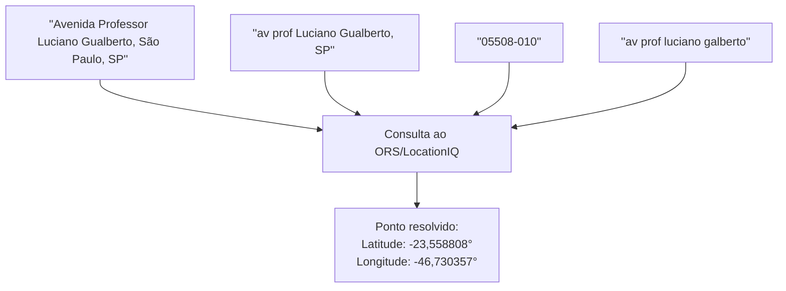
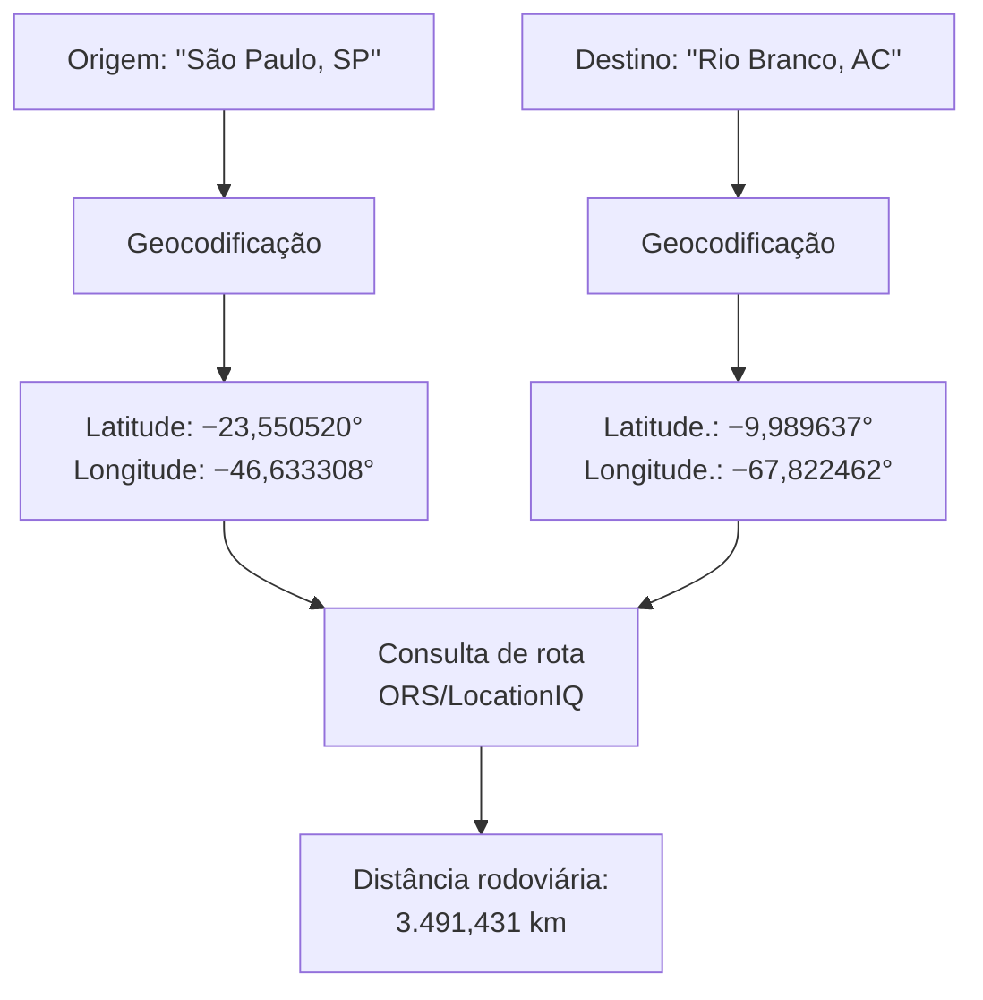
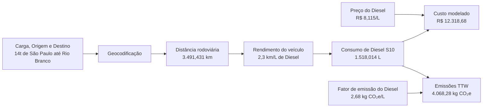
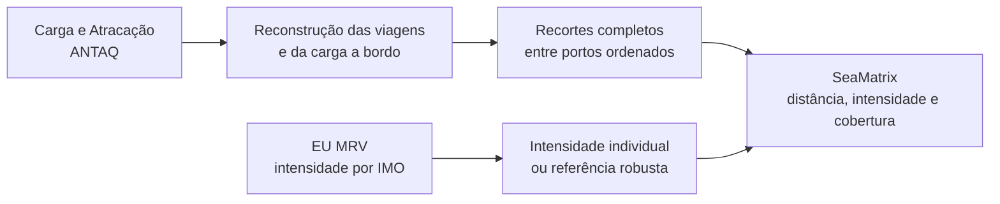
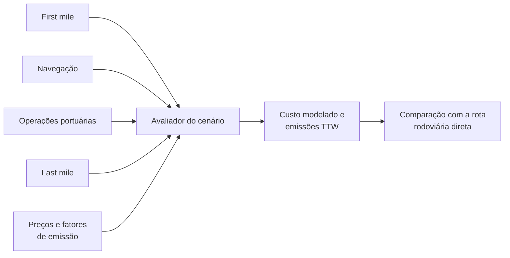
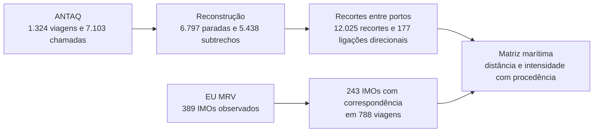
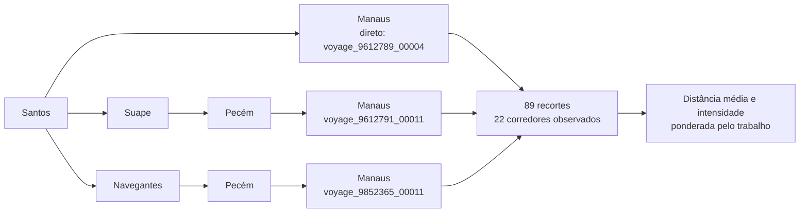

# CabotageLens: sistema computacional auditável para comparação porta a porta entre rodovia e cabotagem no Brasil

> **Documento de validação textual.**
>
> Durante esta etapa, este Markdown concentra o conteúdo editável do artigo técnico. As revisões de texto devem ser feitas aqui. O [arquivo LaTeX](article/cabotagelens_technical_article.tex) e o [PDF](article/cabotagelens_technical_article.pdf) serão sincronizados e compilados somente depois da aprovação do conteúdo.

**Autor:** Felipe de Sá Proença

**Status:** em validação textual

---

## Resumo

A escolha entre transporte rodoviário direto e transporte com cabotagem não depende apenas da distância percorrida. No Brasil, uma rota com cabotagem pode reduzir parte das emissões no trecho principal, mas também inclui deslocamentos rodoviários até os portos, operações portuárias, espera, movimentação de carga e o percurso real realizado pelo navio. Quando esses elementos são ignorados, a comparação entre os modais fica incompleta e pode levar a conclusões pouco confiáveis.

Este trabalho apresenta o CabotageLens, uma ferramenta desenvolvida para comparar, de forma mais assertiva, duas alternativas para a mesma origem, destino e carga: uma viagem totalmente rodoviária e uma cadeia logística formada por rodovia, cabotagem e rodovia. A ferramenta utiliza dados públicos de instituições públicas e privadas, combinando informações de rotas terrestres, movimentação portuária, viagens marítimas, consumo de combustível, emissões e custos modelados.

A principal contribuição do sistema é tratar a operação logística como uma cadeia completa, e não como trechos isolados. Na perna marítima, o sistema reconstrói o percurso observado dos navios, considera cargas transportadas ao longo dos subtrechos e evita assumir previamente um corredor fixo. Na comparação ambiental, inclui pontos de emissão que normalmente ficam fora de análises simplificadas, como acessos terrestres aos portos e emissões associadas às etapas portuárias quando há dados disponíveis.

Com isso, o CabotageLens fornece uma base mais transparente para avaliar custo e emissões de carbono entre alternativas rodoviárias e multimodais, permitindo que a decisão seja sustentada por dados rastreáveis, premissas explícitas e uma representação mais próxima da operação real.

**Palavras-chave**: cabotagem; transporte rodoviário; transporte multimodal; ANTAQ; EU MRV; emissões operacionais; logística; Brasil.

## 1. Introdução

O transporte de cargas no Brasil é fortemente concentrado nas rodovias. Em 2015, o modal rodoviário respondeu por 65% da atividade de transporte de cargas, medida em toneladas-quilômetro úteis (TKU). No mesmo recorte, a ferrovia respondeu por 15% e a cabotagem por 11%. A distribuição ajuda a explicar por que o caminhão é a referência mais imediata para transportar cargas no país, inclusive em trajetos longos.

*Figura 1 — Distribuição da atividade de transporte de cargas no Brasil em 2015, medida em TKU. Fonte: [Sindicato dos Bancários de São Paulo, Osasco e Região (2018)](https://spbancarios.com.br/05/2018/brasil-e-dependente-do-transporte-rodoviario-de-cargas), com dados de 2015 do Plano Nacional de Logística, conforme informado pela publicação.*

Além do papel predominante na matriz, o transporte rodoviário de cargas depende principalmente do diesel e contribui para as emissões de gases de efeito estufa do setor. Por isso, políticas de transporte buscam transferir parte das viagens longas para modais mais eficientes. No Livro Branco dos Transportes, a Comissão Europeia definiu a meta de transferir, até 2030, 30% das cargas rodoviárias transportadas por mais de 300 km para ferrovias ou vias aquaviárias e, até 2050, mais de 50% [Comissão Europeia, 2011](https://eur-lex.europa.eu/legal-content/EN/TXT/?uri=CELEX:52011DC0144). Nesse contexto, a cabotagem — o transporte marítimo entre portos do mesmo país utilizando a navegação pela costa nacional ou por vias interiores — é uma alternativa possível para parte das cargas de longa distância no Brasil [icct2022].

Para saber se a cabotagem faz sentido em uma ligação específica, a comparação precisa ser porta a porta. Uma comparação porta a porta começa no local onde a carga está e termina no local em que ela será entregue. As duas alternativas precisam prestar exatamente o mesmo serviço: transportar a mesma massa entre esses dois pontos. No caminho rodoviário, o caminhão percorre todo o trajeto por estrada. Na alternativa com cabotagem, a carga segue de caminhão até o porto de embarque, é transportada pelo navio entre os portos e, depois, segue de caminhão do porto de desembarque até o destino final. Por isso, a análise soma distância, consumo, emissões e custo de todas essas etapas, em vez de comparar apenas o trecho marítimo com a viagem rodoviária completa. Os portos escolhidos, as distâncias de acesso, a carga e as operações de transbordo podem mudar o resultado [shortsea2019; modalshiftreview2020].

É para tornar essa comparação possível que foi desenvolvido o CabotageLens. O usuário informa a origem, o destino e a massa da carga, e o sistema constrói as duas alternativas de transporte. Para cada uma, apresenta a distância total, o consumo de combustível, as emissões operacionais e o custo modelado. Ao reunir essas informações em uma mesma base de comparação, a ferramenta permite avaliar, para cada ligação, como a alternativa com cabotagem se diferencia da rota feita inteiramente por estrada. Com isso, a comparação deixa de ser uma escolha abstrata entre caminhão e navio e passa a considerar a operação logística completa.

## 2. Revisão da literatura e fundamentação metodológica

A literatura mostra que a cabotagem pode ser relevante em viagens longas, mas o resultado muda de uma ligação para outra [icct2022]. Uma rota pode ter uma longa navegação e acessos rodoviários curtos. Outra pode exigir muitos quilômetros por estrada até o porto. Frequência, tempo, confiabilidade, estoque e disponibilidade do serviço também influenciam a decisão real [competitiveness2024]. O CabotageLens calcula rotas, combustível, emissões operacionais e custo modelado. Ele não representa por completo todas as condições comerciais.

Estudos de *short sea shipping*, ou navegação marítima de curta distância, também mostram que não existe uma vantagem ambiental automática. O resultado depende do tipo de navio, de sua utilização, das distâncias e da carga à qual o consumo é atribuído [shortsea2019]. Por isso, a unidade analisada deve ser a remessa completa, e não um navio e um caminhão considerados isoladamente [modalshiftreview2020].

Um princípio metodológico do estudo é dar preferência a dados públicos, oficiais, observados e auditáveis. A Agência Nacional de Transportes Aquaviários (ANTAQ), órgão federal que regula e acompanha o transporte aquaviário brasileiro, fornece os registros de escalas e de movimentação de carga. A base europeia de Monitoramento, Reporte e Verificação da União Europeia (EU MRV) publica indicadores anuais de consumo e atividade dos navios. Essas fontes permitem relacionar uma operação registrada no Brasil ao desempenho do navio identificado pelo número da Organização Marítima Internacional (IMO), uma identificação permanente da embarcação. Os campos utilizados, os arquivos de origem e a forma de reconstruir as viagens são apresentados na Seção 3.3 [antaq2025; eumrv2025].

A fronteira ambiental adotada é a de emissões operacionais *tank-to-wheel* (TTW, do tanque à roda) de dióxido de carbono equivalente (CO₂e). Ela considera o combustível queimado durante a operação do caminhão ou do navio, mas não as etapas anteriores de produção e distribuição desse combustível. Uma avaliação do ciclo de vida (LCA, do inglês *life-cycle assessment*) considera outras etapas, como a produção do combustível, a fabricação, a operação e o fim de vida dos equipamentos. Fatores *well-to-wheel* (WTW, do poço à roda), resultados de LCA e fatores baseados exclusivamente em dióxido de carbono (CO₂), que contabilizam somente esse gás, não são intercambiáveis com a saída do sistema [decarb2024; maritimelca2024]. Operações portuárias e períodos de navio atracado também precisam de tratamento separado, pois dependem do terminal e da operação observada [berth2009; berthairquality2010; shipops2022].

**Tabela 1 — O que está dentro e fora da comparação.**

| Dimensão        | Incluído                                                                              | Fora da fronteira                                                                                 |
| :-------------- | :------------------------------------------------------------------------------------ | :------------------------------------------------------------------------------------------------ |
| Emissões        | Emissões operacionais TTW de CO₂e por remessa                                          | WTW, LCA, fabricação de ativos e inventário completo de poluentes locais                          |
| Custo           | Estimativa do custo operacional modelado                                              | Frete comercial, negociação, seguro, estoque, multas por permanência e reserva de espaço no navio |
| Dados marítimos | Escalas e cargas da ANTAQ, intensidades do EU MRV e valores substitutos identificados | Apresentar um valor substituto como se fosse medição individual do navio                          |
| Serviço         | Sequências de portos realmente registradas no período analisado                       | Garantia de frequência, espaço no navio ou disponibilidade comercial futura                       |

## 3. Metodologia

O ponto de partida do método é uma pergunta simples: qual é o consumo, o custo operacional e a emissão associados a levar uma mesma remessa de uma origem até um destino? Para respondê-la sem comparar serviços diferentes, o sistema monta duas alternativas completas para a mesma carga e os mesmos pontos inicial e final. Na alternativa rodoviária, a carga segue integralmente por caminhão. Na alternativa com cabotagem, ela percorre um acesso rodoviário até o porto de embarque, a perna marítima entre os portos e um acesso rodoviário final até o destino. Cada parte é calculada separadamente e, ao final, os resultados são somados.

Esta seção apresenta essa construção em termos logísticos e físicos. Primeiro, descreve como a alternativa rodoviária transforma distância e carga em consumo de diesel. Depois, explica como a atividade marítima observada é usada para formar a perna de navegação. A Seção 4 mostra como essas regras foram organizadas no sistema.

### 3.1 Serviço comparado e alternativas logísticas

As duas alternativas precisam prestar o mesmo serviço: transportar a mesma massa, do mesmo ponto de partida até o mesmo destino. Esse serviço comum recebe o nome técnico de unidade funcional. A configuração de referência corresponde a um contêiner de 20 pés (1 TEU, do inglês *twenty-foot equivalent unit*) com 14 t, mas o usuário pode informar outra massa. O TEU é uma unidade usada para expressar carga conteinerizada a partir do tamanho de um contêiner de 20 pés.

Na alternativa rodoviária, há um único trecho: origem → destino. Na alternativa com cabotagem, há três trechos: origem → porto de embarque; porto de embarque → porto de desembarque; e porto de desembarque → destino. Assim, a cabotagem não é comparada apenas com uma parte da rota terrestre: as duas opções começam e terminam nos mesmos lugares [shortsea2019; competitiveness2024].

A massa informada pelo usuário representa a remessa do cenário. Ela não é a carga total de um navio. Os registros históricos de carga dos navios são usados somente para estimar a intensidade da navegação e não são somados à carga da remessa.

### 3.2 Alternativa rodoviária

O cálculo rodoviário começa pela distância total entre a origem e o destino. O sistema obtém uma rota rodoviária em quilômetros e utiliza essa distância para representar o percurso do caminhão.

#### 3.2.1 Escolha do veículo e consumo de diesel

Em seguida, a massa transportada define o veículo representativo. O modelo utiliza os rendimentos médios por número de eixos publicados pela **Agência Nacional de Transportes Terrestres (ANTT)**. Esses dados oficiais foram obtidos na tabela da Política Nacional de Pisos Mínimos do Transporte Rodoviário de Cargas, disponibilizada no [portal de legislação da ANTT (ANTTlegis)](https://anttlegis.antt.gov.br/action/UrlPublicasAction.php?acao=abrirAtoPublico&cod_menu=9230&cod_modulo=623&num_ato=00000001&seq_ato=ATT&sgl_orgao=SUROC%2FANTT%2FMT&sgl_tipo=POR&vlr_ano=2025). A tabela de referência adotada no modelo associa a faixa de carga ao número de eixos e relaciona cada configuração à eficiência básica em quilômetros por litro (km/L). A seleção automática é uma regra de modelagem para estimar consumo; não é uma verificação de limite legal de peso nem substitui o planejamento operacional de uma transportadora.

**Tabela 2 — Regra automática para o veículo rodoviário representativo e eficiência básica adotada.**

| Massa da remessa | Veículo representativo | Eixos | Eficiência básica |
| :--------------- | :--------------------- | ----: | ----------------: |
| Até 18 t | Carreta | 5 | 2,3 km/L |
| Acima de 18 t até 30 t | Carreta | 6 | 2,0 km/L |
| Acima de 30 t até 40 t | Bitrem | 7 | 2,0 km/L |
| Acima de 40 t | Rodotrem | 9 | 2,0 km/L |

*Fonte: elaboração do sistema a partir dos rendimentos médios por número de eixos publicados pela Agência Nacional de Transportes Terrestres (ANTT), no portal ANTTlegis.*

Com a distância rodoviária $D_{\mathrm{rod}}$, em quilômetros, a eficiência aplicada $\eta_{\mathrm{rod}}$, em km/L, e $N$ viagens carregadas necessárias para transportar a remessa, o consumo de diesel do trecho é calculado por:

$$
F_{\mathrm{rod}}=N\frac{D_{\mathrm{rod}}}{\eta_{\mathrm{rod}}}.
$$

Como exemplo de execução reproduzida, usemos os 3.491,431 km de distância rodoviária entre São Paulo e Rio Branco. Para transportar uma remessa de 14 t nessa ligação, o modelo seleciona uma carreta de cinco eixos, com eficiência de 2,3 km/L. Como a remessa cabe em uma única viagem, o consumo estimado é $1\times3.491{,}431/2{,}3=1.518{,}014$ L de diesel. Quando a carga exige mais de uma viagem do veículo escolhido, o sistema multiplica esse consumo pelo número necessário de viagens carregadas. Os litros calculados são posteriormente convertidos em custo e emissões com os fatores e preços adotados pelo cenário.

#### 3.2.2 Custo estimado do combustível

Depois de estimar o consumo em litros, o sistema calcula o custo do diesel da rota rodoviária. O preço do Diesel S10 vem do levantamento semanal da [Agência Nacional do Petróleo, Gás Natural e Biocombustíveis (ANP)](https://www.gov.br/anp/pt-br/assuntos/precos-e-defesa-da-concorrencia/precos/levantamento-de-precos-de-combustiveis-ultimas-semanas-pesquisadas), agência federal que publica preços médios de combustíveis por Unidade da Federação (UF). O sistema sempre busca os dados mais recentes para a comparação.

Nas rotas entre estados, o preço adotado é a média aritmética entre o valor registrado na UF de origem e o valor registrado na UF de destino. Em uma rota inteiramente dentro de uma mesma UF, os dois valores são iguais e, portanto, o cálculo mantém o preço desse estado. O preço usado na rota é dado por:

$$
p_{\mathrm{diesel}}=\frac{p_{\mathrm{origem}}+p_{\mathrm{destino}}}{2}.
$$

O custo estimado é o consumo calculado na Seção 3.2.1 multiplicado pelo preço do litro:

$$
C_{\mathrm{rod}}=F_{\mathrm{rod}}\,p_{\mathrm{diesel}}.
$$

Nessas expressões, $F_{\mathrm{rod}}$ é o consumo de diesel, em litros, e $p_{\mathrm{diesel}}$ é o preço adotado, em reais por litro. Na execução São Paulo–Rio Branco, os valores correspondem aos preços médios de revenda do Diesel S10 divulgados pela ANP para a semana de 12 a 18 de julho de 2026, com data final de pesquisa em 18 de julho de 2026. Nesse levantamento, São Paulo registrou R\$ 6,960/L e o Acre, R\$ 9,270/L. Assim, o preço aplicado à rota foi:

$$
p_{\mathrm{diesel}}
=\frac{6{,}960+9{,}270}{2}
=8{,}115\ \text{R\$/L}.
$$

Com o consumo de 1.518,014 L calculado para a remessa de 14 t, o custo estimado da rota rodoviária é:

$$
C_{\mathrm{rod}}
=1.518{,}014\ \mathrm{L}\times8{,}115\ \text{R\$/L}
=12.318{,}68\ \text{R\$}.
$$

#### 3.2.3 Emissões operacionais da perna rodoviária

As emissões da alternativa rodoviária são calculadas a partir do diesel consumido na Seção 3.2.1. A fronteira adotada é *tank-to-wheel* (TTW, do tanque à roda): ela considera somente as emissões geradas pela queima do combustível durante o transporte. O sistema aplica o fator de 2,68 kg CO₂e por litro de diesel, baseado nas Diretrizes de 2006 do Painel Intergovernamental sobre Mudanças Climáticas (IPCC) [ipcc2006]. Costa et al. [competitiveness2024] é a referência brasileira usada para manter essa estimativa na fronteira TTW, sem incluir a produção, o refino ou a distribuição do combustível.

A emissão rodoviária é o consumo de diesel multiplicado pelo fator de emissão:

$$
E_{\mathrm{rod}}=F_{\mathrm{rod}}\,f_{\mathrm{diesel}}.
$$

Nessa expressão, $E_{\mathrm{rod}}$ é a emissão operacional da rota, em kg CO₂e; $F_{\mathrm{rod}}$ é o consumo de diesel, em litros; e $f_{\mathrm{diesel}}$ é o fator de emissão, em kg CO₂e/L. No exemplo São Paulo–Rio Branco, os 1.518,014 L estimados na Seção 3.2.1 resultam em:

$$
E_{\mathrm{rod}}
=1.518{,}014\ \mathrm{L}\times2{,}68\ \text{kg CO₂e/L}
=4.068{,}28\ \text{kg CO₂e}.
$$

#### 3.2.4 Resultado consolidado da alternativa rodoviária

A Tabela 3 reúne os resultados da alternativa rodoviária para a mesma remessa usada no exemplo. Ela permite visualizar, em um único lugar, a distância, o veículo escolhido, o consumo, o custo e as emissões antes da comparação com a alternativa multimodal.

**Tabela 3 — Resultados da alternativa rodoviária no exemplo São Paulo–Rio Branco, para uma remessa de 14 t.**

| Item | Valor no exemplo |
| :-- | :-- |
| **Percurso** | São Paulo (SP)–Rio Branco (AC) |
| **Distância rodoviária** | 3.491,431 km |
| **Veículo representativo** | Carreta de cinco eixos |
| **Eficiência adotada** | 2,3 km/L |
| **Viagens carregadas** | 1 |
| **Diesel consumido** | 1.518,014 L |
| **Preço do Diesel S10** | R\$ 8,115/L |
| **Custo modelado do combustível** | R\$ 12.318,68 |
| **Emissões operacionais TTW** | 4.068,28 kg CO₂e |

### 3.3 Alternativa multimodal

A alternativa multimodal também precisa levar a remessa do ponto inicial ao ponto final. Ela é formada por três partes: o acesso rodoviário até o porto de embarque, a navegação entre os portos e o acesso rodoviário depois do desembarque. Portanto, o combustível é consumido não só pelo navio, em cada subtrecho marítimo, mas também nos deslocamentos da origem até o porto de embarque e do porto de desembarque até o destino final. Além disso, o sistema calcula separadamente o consumo das operações nos terminais portuários.

Os próximos subitens mostram como esses componentes são formados: a escolha dos portos define os extremos da ligação; os acessos terrestres usam o cálculo rodoviário; as viagens registradas permitem reconstruir a navegação e a carga a bordo; a intensidade define o consumo do navio; e a agregação reúne combustível, emissões, custo e operações portuárias.

#### 3.3.1 Escolha dos portos

O sistema associa a origem ao porto mais próximo disponível na base portuária e faz o mesmo para o destino. Esses dois portos definem a ligação marítima que será pesquisada. Essa regra fornece uma forma objetiva de montar o cenário, mas não afirma que o porto é necessariamente a melhor escolha comercial ou operacional. Um porto mais distante pode ser preferível na prática por motivos como frequência de navios, contrato, terminal, custo ou disponibilidade de espaço, fatores que não são decididos por essa seleção geográfica.

#### 3.3.2 Acessos rodoviários: *first mile* e *last mile*

O primeiro acesso, chamado de *first mile*, leva a carga da origem até o porto de embarque. O segundo, chamado de *last mile*, leva a carga do porto de desembarque até o destino final. Para cada um deles, o sistema obtém uma distância rodoviária, aplica a regra de veículo, eficiência e consumo de diesel da Seção 3.2.1 e converte o consumo em emissões conforme a Seção 3.2.3.

#### 3.3.3 Operações portuárias

As operações portuárias são as atividades necessárias para transferir o contêiner entre o caminhão, o pátio, o cais e o navio. Elas podem consumir combustível nos equipamentos do terminal, como o guindaste de cais (*ship-to-shore*, ou STS), o guindaste sobre pneus do pátio (*rubber-tyred gantry*, ou RTG) e os caminhões que circulam internamente no terminal. Esse consumo não pertence ao trajeto rodoviário nem à navegação entre portos; por isso, é calculado e apresentado em separado.

O cálculo começa convertendo a carga do cenário em contêineres equivalentes. Quando o usuário não informa a quantidade de TEU, o sistema divide a massa por 14 t, arredonda o resultado para cima e usa essa quantidade como número de contêineres. Para cada porto atendido e para cada equipamento, multiplica o número de contêineres pelo número de movimentos necessários por contêiner e pelo consumo específico do equipamento. Para os equipamentos a diesel, o consumo em litros é convertido em massa de combustível:

$$
F_{\mathrm{porto},e}=P\times T\times a_e\times f_e\times\rho.
$$

Em que $P$ é o número de escalas portuárias consideradas, $T$ é a quantidade de contêineres equivalentes, $a_e$ é o número de movimentos do equipamento $e$ por contêiner, $f_e$ é o consumo de diesel do equipamento por movimento, em L/movimento, e $\rho$ é a densidade do diesel, em kg/L. O consumo portuário total é a soma dos resultados dos equipamentos com parâmetros disponíveis.

No cenário de referência baseado em Santos, uma escala que movimenta uma remessa de 14 t corresponde a 1 TEU. O RTG realiza quatro movimentos por contêiner; com o valor mediano de 0,355148 L por movimento, consome 1,421 L de diesel. O caminhão interno do terminal realiza dois movimentos; com 0,494671 L por movimento, consome 0,989 L. Assim, os equipamentos com fator de consumo disponível somam 2,410 L, ou 2,048 kg de diesel, em uma escala.

Substituindo esses valores na fórmula, o consumo de cada equipamento é:

$$
F_{\mathrm{porto,RTG}}
=1\times1\times4\times0{,}355148\times0{,}85
=1{,}208~\mathrm{kg}.
$$

$$
F_{\mathrm{porto,cam}}
=1\times1\times2\times0{,}494671\times0{,}85
=0{,}841~\mathrm{kg}.
$$

$$
F_{\mathrm{porto,total}}
=1{,}208+0{,}841
=2{,}048~\mathrm{kg}.
$$

#### 3.3.4 Consumo de combustível na perna marítima

A perna marítima é o consumo de combustível estimado para levar a remessa pelo mar, em uma viagem de cabotagem, entre o porto de embarque e o porto de desembarque.

##### 3.3.4.1 Atividade observada na ANTAQ e reconstrução das viagens

Para estimar esse consumo, o sistema primeiro precisa reconstruir o que o navio realmente fez. Os arquivos brutos da ANTAQ não trazem uma viagem pronta, como “Santos–Manaus”. Cada linha registra apenas um evento: uma escala em um porto ou uma movimentação de carga. O sistema reúne os registros do mesmo navio, coloca as escalas na ordem em que ocorreram e calcula a carga que permaneceu a bordo em cada trecho entre dois portos.

Os dados são fornecidos pela Agência Nacional de Transportes Aquaviários (ANTAQ). O arquivo de Carga informa a massa e os contêineres embarcados ou desembarcados em cada escala. O arquivo de Atracação identifica o porto, as datas e o número da Organização Marítima Internacional (IMO) do navio. As tabelas a seguir mostram os campos brutos usados para reconstituir os movimentos de carga.

**Tabela 4 — Campos do arquivo `2025Carga.txt` usados para reconstruir os movimentos de carga.**

| Coluna | Uso na avaliação | Valor na viagem `voyage_9612791_00011` |
| :-- | :-- | :-- |
| `IDAtracacao` | Liga cada movimento de carga à escala correspondente. | Santos: `1618801`; Suape: `1625119`; Pecém: `1625546`; Manaus: `1620276`. |
| `Tipo Navegação` | Mantém somente os registros de cabotagem. | `Cabotagem` nas quatro escalas. |
| `TEU` | Ajuda a identificar a carga conteinerizada e registra a quantidade de contêineres em unidade equivalente a 20 pés. | Santos: 866/0; Suape: 881/804; Pecém: 187/541; Manaus: 621/1.639 (embarcados/desembarcados). |
| `Natureza da Carga` e `Carga Geral Acondicionamento` | Complementam a identificação da carga conteinerizada quando necessário. | `Carga Conteinerizada` e `Conteinerizada` em todas as linhas da viagem. |
| `VLPesoCargaBruta` | Informa a massa embarcada ou desembarcada, em toneladas. | Santos: 9.881,860/0; Suape: 11.862,199/8.002,620; Pecém: 3.231,914/7.624,347; Manaus: 7.571,660/19.897,560 t (embarcados/desembarcados). |
| `Sentido` | Indica se a massa foi embarcada ou desembarcada na escala. | Santos: `Embarcados`; nas demais escalas: `Embarcados` e `Desembarcados`. |
| `Origem` e `Destino` | Preservam os códigos dos portos de origem e destino declarados para a carga. | Santos reúne 3 pares declarados; Suape, 5; Pecém, 7; Manaus, 10. |

*Arquivo: `2025Carga.txt`. Fonte: [Agência Nacional de Transportes Aquaviários (ANTAQ), Painel Estatístico Aquaviário](https://estatistica.antaq.gov.br/ea/sense/download.html).*

*Nos campos `TEU` e `VLPesoCargaBruta`, os valores mostrados são a soma das linhas brutas do mesmo `IDAtracacao`, separadas por sentido.*

**Tabela 5 — Campos do arquivo `2025Atracacao.txt` usados para identificar e ordenar as escalas dos navios.**

| Coluna | Uso na avaliação | Valor na viagem `voyage_9612791_00011` |
| :-- | :-- | :-- |
| `IDAtracacao` | Liga a escala aos movimentos de carga do arquivo `2025Carga.txt`. | `1618801`; `1625119`; `1625546`; `1620276`. |
| `CDTUP` e `Porto Atracação` | Identificam o porto ou a instalação portuária da escala. | `BRSSZ` — Santos; `BRSUA` — Suape; `BRCE001` — Terminal Portuário do Pecém; `BRAM012` — Super Terminais Comércio e Indústria. |
| `Data Atracação` | Define a ordem cronológica das escalas. | 30/09/2025 03:57; 05/10/2025 10:06; 08/10/2025 03:23; 13/10/2025 18:00. |
| `Data Chegada` e `Data Desatracação` | Registram o intervalo observado da escala. | Santos: 29/09 05:45–30/09 17:30; Suape: 04/10 06:45–06/10 08:50; Pecém: 07/10 14:00–08/10 16:38; Manaus: 13/10 16:30–17/10 06:20. |
| `Tipo de Navegação da Atracação` | Registra o tipo de navegação informado para a escala. | Santos, Suape e Pecém: `Cabotagem`; Manaus: `Interior`. |
| `Terminal`, `Município` e `UF` | Complementam a identificação do local atendido. | Santos Brasil, Guarujá/SP; TECON Suape, Ipojuca/PE; Terminal do Pecém, São Gonçalo do Amarante/CE; Super Terminais, Manaus/AM. |
| `Nº do IMO` | Identifica o navio e permite procurá-lo no EU MRV. | `9612791` nas quatro escalas. |

*Arquivo: `2025Atracacao.txt`. Fonte: [Agência Nacional de Transportes Aquaviários (ANTAQ), Painel Estatístico Aquaviário](https://estatistica.antaq.gov.br/ea/sense/download.html).*

A integração desses dados permite afirmar que na viagem `voyage_9612791_00011`, o navio de IMO 9612791 atracou em Santos em 30 de setembro de 2025 e embarcou 9.881,860 t. Em seguida, passou por Suape e Pecém. Em 13 de outubro, atracou no terminal Super Terminais Comércio e Indústria, em Manaus, onde desembarcou 19.897,560 t e embarcou 7.571,660 t. Esse exemplo mostra que os dados não descrevem somente uma ligação Santos–Manaus: eles registram o que aconteceu em cada escala, e é essa sequência que o sistema reconstrói.

Para tornar a reconstrução concreta, a Figura 2 mostra somente a parte de ida da viagem `voyage_9612791_00011`, entre Santos e Manaus. Em cada seta, a carga é aquela que estava a bordo enquanto o navio navegava para o porto seguinte.

*Figura 2 — Parte de ida reconstruída da viagem `voyage_9612791_00011`. Fonte: elaboração própria com dados de Carga e Atracação da ANTAQ e distâncias da matriz marítima do sistema.*

O período observado começou quando o navio já levava 2.976,894 t a bordo. Essa é a menor carga inicial necessária para que os saldos da viagem não fiquem negativos. Em Santos, o navio embarcou 9.881,860 t e saiu com 12.858,754 t. Em Suape, embarcou mais carga do que desembarcou, por isso a carga a bordo aumentou para 16.718,333 t. Em Pecém, desembarcou mais do que embarcou e seguiu para Manaus com 12.325,900 t.

O fluxo mostra por que as escalas intermediárias não podem ser ignoradas: cada uma altera a carga que será transportada no subtrecho seguinte. Para representar uma ligação entre dois portos, o sistema usa apenas a sequência contínua observada dentro de uma mesma viagem e no mesmo sentido. Assim, Santos–Suape–Pecém–Manaus pode contribuir para a ligação Santos–Manaus, enquanto Manaus–Suape–Santos não pode.

##### 3.3.4.2 Atribuição do consumo com dados do EU MRV

A ANTAQ informa por onde o navio passou e qual carga levava, mas não informa diretamente quanto combustível ele consumiu. Essa atribuição é feita com a base de Monitoramento, Reporte e Verificação da União Europeia (EU MRV), que publica indicadores anuais de consumo, atividade e emissões por embarcação. O número IMO registrado na ANTAQ permite procurar o mesmo navio nessa base. Na viagem `voyage_9612791_00011`, o IMO 9612791 foi encontrado diretamente no EU MRV de 2023, com intensidade de $7{,}43\ \mathrm{g/(t\cdot nm)}$ [eumrv2025].

**Tabela 6 — Dados do EU MRV usados para a viagem `voyage_9612791_00011`.**

| Fonte ou campo | Valor usado | Papel no cálculo |
| :-- | :-- | :-- |
| Arquivo de origem | `2023-v85-08022026-EU MRV Publication of information.xlsx` | Publicação anual consultada para obter o indicador do navio. |
| `IMO Number` | `9612791` | Faz a correspondência direta com as escalas observadas na ANTAQ. |
| `Ship type` | `Container ship` | Classificação do navio informada na base. |
| `Annual average Fuel consumption per transport work (mass)` | $7{,}43\ \mathrm{g/(t\cdot nm)}$ | Intensidade de combustível aplicada aos subtrechos desse navio. |
| Regra de seleção | Valor positivo mais recente para o mesmo IMO | Mantém o indicador individual do navio; não utiliza valor substituto. |

*Fonte: [THETIS-MRV, Agência Europeia de Segurança Marítima (EMSA)](https://mrv.emsa.europa.eu/), publicação anual de informações do EU MRV.*

O sistema procura primeiro o mesmo IMO no EU MRV. Quando encontra mais de um ano para o mesmo navio, usa o indicador positivo mais recente. Esse é o melhor caso: a intensidade pertence ao próprio navio que apareceu na ANTAQ.

Mesmo quando há correspondência por IMO, o sistema verifica se o indicador é compatível com os valores observados para navios do mesmo tipo. Quando a base tem pelo menos 20 navios desse tipo, valores acima do percentil 95 são tratados como anômalos. A viagem da ANTAQ continua no cálculo, com sua carga e suas distâncias, mas sua intensidade é substituída pela estatística robusta da classe, se ela estiver disponível, ou do tipo do navio. A saída registra o IMO encontrado, o valor original, o limiar aplicado, o tamanho do grupo de comparação e a fonte da estimativa usada.

Essa regra é necessária porque uma intensidade muito alta, embora publicada no EU MRV, pode dominar a média de uma ligação. No conjunto de 243 navios classificados como *container ship*, o percentil 95 é $24{,}073\ \mathrm{g/(t\cdot nm)}$. Em Santos–Manaus, os IMOs 9603221 (*Fernão de Magalhães*, $228{,}83\ \mathrm{g/(t\cdot nm)}$), 9603233 (*Américo Vespúcio*, $49{,}00\ \mathrm{g/(t\cdot nm)}$) e 9602875 (*Sebastião Caboto*, $230{,}23\ \mathrm{g/(t\cdot nm)}$) ultrapassam esse limiar. Os 21 recortes dessas embarcações permanecem entre as viagens observadas, mas recebem a estimativa documentada do tipo *container ship*, de $9{,}322050\ \mathrm{g/(t\cdot nm)}$.

Nem todos os navios que operam no Brasil aparecem na base europeia. Quando isso ocorre, o sistema continua usando os valores publicados no EU MRV, mas busca um grupo de navios semelhantes. Primeiro, procura a classe do navio, que é o grupo mais específico disponível. Se ela não estiver disponível, procura o tipo, que é uma categoria mais ampla, como *container ship*. Para recortes conteinerizados sem outro metadado, usa o grupo documentado como *container ship*. O valor obtido é identificado como uma estimativa do grupo, e não como uma medição do navio ausente.

Para calcular essa estimativa, o sistema evita que poucos valores muito altos ou muito baixos definam o resultado do grupo. Na classe, usa a média depois de retirar os valores abaixo do percentil 1 e acima do percentil 99; se essa média não estiver disponível, usa a mediana. No tipo, guarda um valor recente por IMO, retira 1% dos extremos de cada lado quando a quantidade de navios permite e calcula a média dos valores restantes. Quando o grupo é pequeno demais para essa retirada, usa a mediana.

Cada recorte recebe uma intensidade e uma descrição clara de sua origem: IMO do próprio navio, estimativa pela classe ou estimativa pelo tipo. Quando o indicador individual ultrapassa o limiar de anomalia, a saída registra também o valor original e a regra que levou à estimativa de grupo. Quando a intensidade vem de um grupo, a saída informa a estatística usada, o tamanho da amostra e quantos valores extremos foram retirados. Assim, uma estimativa coletiva não aparece como se fosse uma medição individual.

###### Exemplo de estimativa pelo tipo de navio

A viagem `voyage_9974486_00001`, realizada pelo navio de IMO 9974486, passou por Paranaguá, Rio de Janeiro e Salvador. Esse IMO aparece nos registros da ANTAQ, mas não possui correspondência individual no EU MRV. Como o registro também não traz uma classe mais específica, o sistema usa os dados do tipo documentado *container ship* na própria base do EU MRV.

Para formar esse valor, o sistema reuniu um indicador positivo e mais recente de cada um dos 243 navios classificados como *container ship* no EU MRV. Depois de ordenar os valores, retirou os dois menores e os dois maiores, equivalentes a 1% da amostra em cada extremidade. Restaram 239 valores para o cálculo:

$$
I_{\mathrm{container\ ship}}
=\frac{\sum_{j=1}^{239} I_j}{239}
=9{,}322050\ \mathrm{g/(t\cdot nm)}.
$$

Portanto, todos os subtrechos dessa viagem recebem a intensidade de $9{,}322050\ \mathrm{g/(t\cdot nm)}$. A saída identifica esse número como uma estimativa baseada no tipo *container ship*, e não como uma medição do navio de IMO 9974486.

##### 3.3.4.3 Trabalho de transporte e intensidade da ligação

Uma ligação entre dois portos não corresponde, necessariamente, a uma única viagem nem a uma única sequência de escalas. Para representar Santos–Manaus, por exemplo, o sistema aproveita cada recorte histórico que começou em Santos e chegou a Manaus na mesma viagem e no mesmo sentido. Antes de reunir esses recortes em uma única intensidade, ele calcula quanto transporte foi realizado em cada um deles.

Esse cálculo usa o trabalho de transporte. Em cada subtrecho, a carga a bordo é multiplicada pela distância percorrida; depois, os resultados dos subtrechos são somados. Para uma viagem $v$, o trabalho entre a origem $o$ e o destino $d$ é:

$$
W_{v,o,d}=\sum_{s\in\mathcal{S}_{v,o,d}}m_{v,s}\,d_{v,s}.
$$

Nessa fórmula, $\mathcal{S}_{v,o,d}$ é o conjunto de subtrechos entre os dois portos, $m_{v,s}$ é a carga a bordo no subtrecho $s$, em toneladas, e $d_{v,s}$ é a distância correspondente, em milhas náuticas. O resultado $W_{v,o,d}$ é expresso em tonelada-milha náutica ($\mathrm{t\cdot nm}$). Portanto, uma viagem recebe mais peso quando transporta mais carga, percorre uma distância maior ou reúne as duas condições.

O exemplo real da viagem `voyage_9612791_00011` mostra por que a carga precisa ser reconstruída trecho a trecho. Entre Santos e Manaus, o navio passou por Suape e Pecém; a carga a bordo mudou em cada escala.

| Subtrecho observado | Carga a bordo (t) | Distância (nm) | Trabalho de transporte ($\mathrm{t\cdot nm}$) |
| :-- | --: | --: | --: |
| Santos → Suape | 12.858,754 | 1.259,179 | 16.191.476,419 |
| Suape → Pecém | 16.718,333 | 507,806 | 8.489.677,588 |
| Pecém → Manaus | 12.325,900 | 1.185,594 | 14.613.514,486 |
| **Total Santos → Manaus** | — | — | **39.294.668,494** |

*Fonte: elaboração própria com os registros de Carga e Atracação da ANTAQ, a matriz marítima e a reconstrução da viagem `voyage_9612791_00011`. Os valores exibidos foram arredondados.*

O trabalho de transporte desse recorte é, portanto:

$$
\begin{aligned}
W_{\mathrm{Santos,Manaus}}
&=16.191.476{,}419+8.489.677{,}588+14.613.514{,}486\\
&=39.294.668{,}494\ \mathrm{t\cdot nm}.
\end{aligned}
$$

O IMO 9612791 possui intensidade individual de $7{,}43\ \mathrm{g/(t\cdot nm)}$ no EU MRV. O consumo reconstruído para essa viagem observada é:

$$
F_v=\frac{I_v\,W_{v,o,d}}{1000}
=\frac{7{,}43\times39.294.668{,}494}{1000}
=291.959{,}387\ \mathrm{kg}.
$$

Esse valor descreve a atividade histórica daquela viagem específica. Ele não é somado diretamente ao consumo de uma nova remessa simulada pelo usuário. Seu papel é informar o peso e a intensidade com que esse recorte participa da preparação do indicador Santos–Manaus.

Depois de repetir a reconstrução para todos os recortes aceitos, o sistema calcula uma média ponderada pelo trabalho de transporte. Ele não escolhe a intensidade de uma única viagem, nem escolhe o corredor com maior volume. A intensidade da ligação é:

$$
I_{o,d}^{\mathrm{rep}}=
\frac{\sum_{v=1}^{n}I_v\,W_{v,o,d}}
{\sum_{v=1}^{n}W_{v,o,d}}.
$$

Aqui, $I_v$ é a intensidade atribuída à viagem $v$, $W_{v,o,d}$ é o trabalho de transporte dessa viagem entre os portos escolhidos e $n$ é o número de recortes aceitos. Assim, o sistema dá maior influência a uma viagem que movimentou mais tonelada-milhas náuticas, sem descartar as demais viagens diretas ou com escalas.

Em Santos–Manaus, os 89 recortes aceitos somam $3.153.328.821{,}755\ \mathrm{t\cdot nm}$ de trabalho de transporte. Antes da média, são aplicadas as regras de intensidade explicadas na subseção anterior: 19 recortes usam a intensidade individual do IMO, 49 usam a estimativa pelo tipo porque não possuem correspondência individual no EU MRV e 21 mantêm a viagem observada, mas recebem a estimativa pelo tipo porque o valor individual ultrapassou o limiar de anomalia. A soma dos produtos $I_v\,W_{v,o,d}$ é $28.410.938.295{,}411\ \mathrm{g}$. Logo:

$$
I_{\mathrm{Santos,Manaus}}^{\mathrm{rep}}=
\frac{28.410.938.295{,}411}
{3.153.328.821{,}755}
=9{,}009824\ \mathrm{g/(t\cdot nm)}.
$$

Esse resultado não é a intensidade de um navio escolhido como representante. É a média das 89 viagens, em que cada uma contribui conforme a carga efetivamente transportada e a distância percorrida. Recortes com trabalho de transporte igual a zero não entram na média ponderada quando houver pelo menos um recorte com trabalho positivo. Se todos os recortes tiverem peso zero, o sistema calcula a média simples das intensidades disponíveis e registra essa condição.

##### 3.3.4.4 Distância marítima média entre os portos

Para calcular o consumo de uma nova remessa, o sistema usa a distância média das viagens completas observadas entre o porto de origem e o porto de destino. Em cada viagem, soma as distâncias de todos os subtrechos entre os dois portos. Em seguida, calcula a média aritmética desses totais. Cada viagem conta uma vez: entram tanto viagens diretas quanto viagens com escalas intermediárias.

Se $D_{v,o,d}$ é a distância total observada na viagem $v$ entre a origem $o$ e o destino $d$, e $n$ é o número de viagens completas aceitas, a distância usada no cenário é:

$$
\bar D_{o,d}=\frac{1}{n}\sum_{v=1}^{n}D_{v,o,d}.
$$

Essa média não monta uma rota artificial com trechos de navios diferentes. Cada distância é calculada dentro da própria viagem antes de entrar na média. Em Santos–Manaus, os 89 recortes completos observados resultam em $6.115{,}349\ \mathrm{km}$, ou $3.302{,}024\ \mathrm{nm}$.

#### 3.3.5 Emissões operacionais da alternativa multimodal

Os trechos de *first mile* e *last mile* usam a mesma conversão de diesel em emissões descrita na Seção 3.2.3. Nesta etapa, são acrescentadas as emissões específicas das operações portuárias e da navegação. Nas operações portuárias, o consumo de diesel é registrado em massa; por isso, o fator é expresso em kg CO₂e por kg de diesel. Na navegação, o consumo de VLSFO (*very low sulphur fuel oil*, óleo combustível de baixíssimo teor de enxofre) é multiplicado pelo fator operacional correspondente. Em ambos os casos, a fronteira continua sendo TTW: considera-se apenas o combustível queimado durante a operação.

**Tabela 7 — Fatores de emissão específicos da alternativa multimodal.**

| Etapa do transporte | Fonte do fator | Fator de emissão |
| :-- | :-- | :-- |
| Operações portuárias | Mesma base do IPCC (2006) [ipcc2006], expresso por massa. | 3,15 kg CO₂e/kg de diesel |
| Navegação | Costa et al. [competitiveness2024], Apêndice A, Tabela 13: componente TTW dos parâmetros da Resolução IMO MEPC.391(81). | 3,114 kg CO₂e/kg de VLSFO |

#### 3.3.6 Custo modelado do combustível

O custo modelado considera apenas o combustível estimado em cada etapa; não é uma cotação de frete. Antes de cada execução, o sistema tenta atualizar a tabela mais recente de preços do Diesel S10 publicada pela Agência Nacional do Petróleo, Gás Natural e Biocombustíveis (ANP). No exemplo São Paulo–Rio Branco, a atualização retornou os preços da semana de 12 a 18 de julho de 2026, com data final de pesquisa em 18 de julho. Os acessos rodoviários, *first mile* e *last mile*, usam a mesma regra de escolha do veículo e de cálculo de consumo da Seção 3.2.1. Para precificar o diesel, o *first mile* usa a média entre a UF de origem e a UF do porto de embarque, e o *last mile*, a média entre a UF do porto de desembarque e a UF de destino. Nas operações portuárias, cada porto usa diretamente o preço do diesel na sua própria UF.

O sistema também busca a cotação mais recente do VLSFO em Santos na [Ship & Bunker](https://shipandbunker.com/prices/br-brazil). Nesta execução, a cotação de 18 de julho de 2026 foi US\$ 741,50/mt. A sigla `mt` significa *metric tonne*, ou tonelada métrica, equivalente a 1.000 kg. A taxa de conversão USD/BRL também é sempre a mais recente: de R\$ 5,141345 por US\$, obtida pela biblioteca [CurrencyConverter](https://pypi.org/project/CurrencyConverter/) a partir de dados do Banco Central Europeu (BCE), o preço convertido foi R\$ 3.812,31/mt, ou R\$ 3,812/kg. A Tabela 8 resume as fontes, os valores de origem e os preços usados no exemplo.

**Tabela 8 — Preços de combustível usados no exemplo São Paulo–Rio Branco.**

| Etapa do transporte | Fonte do preço | Valores de origem | Preço usado no exemplo |
| :-- | :-- | :-- | :-- |
| Rodovia direta | [ANP](https://www.gov.br/anp/pt-br/assuntos/precos-e-defesa-da-concorrencia/precos/levantamento-de-precos-de-combustiveis-ultimas-semanas-pesquisadas) | Diesel S10: São Paulo, R\$ 6,960/L; Acre, R\$ 9,270/L. | R\$ 8,115/L — média entre São Paulo e Acre. |
| *First mile* | [ANP](https://www.gov.br/anp/pt-br/assuntos/precos-e-defesa-da-concorrencia/precos/levantamento-de-precos-de-combustiveis-ultimas-semanas-pesquisadas) | Diesel S10: São Paulo, R\$ 6,960/L; Porto de Santos (SP), R\$ 6,960/L. | R\$ 6,960/L — média SP–SP. |
| Operações portuárias | [ANP](https://www.gov.br/anp/pt-br/assuntos/precos-e-defesa-da-concorrencia/precos/levantamento-de-precos-de-combustiveis-ultimas-semanas-pesquisadas) | Diesel: Porto de Santos (SP), R\$ 6,960/L; Porto de Manaus (AM), R\$ 7,250/L. | R\$ 6,960/L em Santos e R\$ 7,250/L em Manaus. |
| Navegação | VLSFO: [Ship & Bunker](https://shipandbunker.com/prices/br-brazil), Santos;   Taxa USD/BRL: BCE, via [CurrencyConverter](https://pypi.org/project/CurrencyConverter/). | VLSFO: US\$ 741,50/mt; USD/BRL: R\$ 5,141345 por US\$. | R\$ 3,812/kg de VLSFO. |
| *Last mile* | [ANP](https://www.gov.br/anp/pt-br/assuntos/precos-e-defesa-da-concorrencia/precos/levantamento-de-precos-de-combustiveis-ultimas-semanas-pesquisadas) | Diesel S10: Porto de Manaus (AM), R\$ 7,250/L; Acre, R\$ 9,270/L. | R\$ 8,260/L — média AM–AC. |

#### 3.3.7 Resultado consolidado da alternativa multimodal do exemplo São Paulo–Rio Branco

Para a remessa de 14 t entre São Paulo (SP) e Rio Branco (AC), a Tabela 9 reúne os resultados das etapas que compõem a alternativa multimodal. Os cálculos e as fontes de cada etapa estão descritos nas Seções 3.3.1 a 3.3.6.

**Tabela 9 — Resultado da alternativa multimodal no exemplo São Paulo–Rio Branco, para uma remessa de 14 t.**

| Etapa | Percurso | Distância | Combustível estimado | Custo modelado | Emissões operacionais TTW |
| :-- | :-- | --: | --: | --: | --: |
| *First mile* | São Paulo–Porto de Santos | 86,170 km | 37,465 L de diesel | R\$ 260,76 | 100,41 kg CO₂e |
| Navegação | Porto de Santos–Porto de Manaus | 6.115,349 km (3.302,024 milhas náuticas) | 416,509 kg de VLSFO | R\$ 1.587,86 | 1.297,01 kg CO₂e |
| Operações portuárias | Santos e Manaus | — | 4,097 kg de diesel | R\$ 34,25 | 12,91 kg CO₂e |
| *Last mile* | Porto de Manaus–Rio Branco | 1.403,691 km | 610,300 L de diesel | R\$ 5.041,08 | 1.635,60 kg CO₂e |
| **Total** | — | **7.605,210 km** | — | **R\$ 6.923,95** | **3.045,93 kg CO₂e** |

Os valores das operações portuárias seguem o escopo e a disponibilidade de dados indicados na Seção 3.3.3.

### 3.4 Resultado final do exemplo São Paulo–Rio Branco

Esta seção compara, para a mesma remessa de 14 t, os resultados totais da alternativa A, rodoviária direta, e da alternativa B, multimodal. Os valores da alternativa A e B foram consolidados nas Seções 3.2.4 e 3.3.7, respectivamete.

**Tabela 10 — Comparação dos resultados totais no exemplo São Paulo–Rio Branco, para uma remessa de 14 t.**

| Indicador | Alternativa A: rodovia direta | Alternativa B: multimodal | Resultado da alternativa B em relação à A |
| :-- | --: | --: | :-- |
| Distância percorrida | 3.491,431 km | 7.605,210 km | 4.113,779 km a mais (117,82%). |
| Emissões operacionais TTW | 4.068,28 kg CO₂e | 3.045,93 kg CO₂e | 1.022,35 kg CO₂e a menos (25,13%). |
| Custo modelado do combustível | R\$ 12.318,68 | R\$ 6.923,95 | R\$ 5.394,73 a menos (43,79%). |

Embora a alternativa multimodal percorra uma distância total maior, ela apresenta menor custo modelado de combustível e menores emissões operacionais TTW no cenário analisado.

## 4. Implementação computacional

A Seção 3 descreve o que é calculado: duas alternativas que prestam o mesmo serviço logístico, seus trechos, os dados usados e as regras físicas aplicadas. Esta seção mostra como essas regras foram transformadas em software: o objetivo não é repetir as fórmulas, mas explicar como o sistema recebe os dados, executa cada etapa, trata uma informação ausente e registra de onde veio cada resultado.

O CabotageLens separa a preparação dos dados históricos da execução de uma comparação. Assim, uma pessoa que informa uma origem, um destino e uma carga não precisa reconstruir toda a base da Agência Nacional de Transportes Aquaviários (ANTAQ) nem consultar novamente a base de Monitoramento, Reporte e Verificação da União Europeia (EU MRV), por exemplo. A aplicação utiliza os artefatos marítimos já preparados e concentra a execução na montagem do cenário porta a porta.

As ferramentas e os serviços empregados são utilizados em suas modalidades gratuitas. Os limites de consulta, armazenamento e processamento dessas modalidades são compatíveis com o escopo acadêmico, o volume de dados e a quantidade de cenários avaliados neste estudo. Dessa forma, a execução do sistema não depende de infraestrutura ou licenças pagas para cumprir o propósito da comparação proposta.

### 4.1 Arquitetura do sistema e tecnologias utilizadas

O sistema é desenvolvido em Python. A interface, os cálculos, a organização dos dados e as integrações externas ficam em componentes separados. Essa divisão permite, por exemplo, testar uma regra de combustível sem abrir a interface ou atualizar a base marítima sem executar uma comparação completa.

A Tabela 11 apresenta as tecnologias e os serviços essenciais para entender a execução do sistema. Ela não lista todas as bibliotecas internas utilizadas no código. Essas ferramentas também não devem ser confundidas com as fontes metodológicas e de insumos: ANTAQ, EU MRV, Agência Nacional do Petróleo, Gás Natural e Biocombustíveis (ANP) e Ship & Bunker fornecem dados ou preços externos; as tecnologias da tabela permitem obter, tratar, calcular, armazenar ou apresentar essas informações.

**Tabela 11 — Tecnologias e serviços utilizados na implementação do CabotageLens.**

| Tecnologia ou serviço | Função no sistema | Papel na execução |
| :-- | :-- | :-- |
| Python | Linguagem principal do projeto. | Executa o tratamento de dados, a reconstrução marítima, os cálculos e os scripts de atualização. |
| Streamlit | Ferramenta para construir a interface web em Python. | Recebe o cenário informado pelo usuário e apresenta mapas, totais, detalhamentos e avisos. |
| Supabase | Serviço de banco de dados PostgreSQL, também chamado de Postgres, e de armazenamento remoto opcional. | Guarda pontos geocodificados, rotas reutilizáveis, execuções em lote e resultados que precisam permanecer disponíveis. |
| OpenRouteService (ORS) | Serviço externo de localização e roteamento. | É o provedor principal para transformar um local em coordenadas e obter a geometria das rotas rodoviárias. |
| LocationIQ | Serviço externo alternativo de localização e roteamento. | É consultado somente quando o ORS não entrega uma resposta utilizável e há credencial configurada. |
| `requests` e Beautiful Soup | `requests` realiza consultas pela internet; Beautiful Soup lê a estrutura de páginas em HyperText Markup Language (HTML). | Ajudam a buscar serviços externos e, no fluxo de preparação marítima, a localizar no portal da ANTAQ os arquivos públicos a serem baixados. |
| `CurrencyConverter` | Biblioteca de conversão de moedas. | Converte para reais a referência internacional de preço do combustível marítimo quando ela está em dólar por tonelada. |

*Fonte: elaboração própria a partir da arquitetura versionada do CabotageLens.*

### 4.2 Dados de entrada, tratamento de endereços e geocodificação

#### 4.2.1 Dados recebidos pelo pipeline

Cada execução do pipeline recebe três dados: a origem, o destino e a massa da remessa. A origem e o destino definem os pontos inicial e final das duas alternativas; a massa, informada em toneladas, define a carga que será transportada em ambas. Antes dos cálculos, o pipeline normaliza os textos, verifica a massa e reúne os três valores em um único cenário. Assim, a rota rodoviária e a rota multimodal sempre partem dos mesmos pontos e transportam a mesma carga.

#### 4.2.2 Do texto às coordenadas

Origem e destino precisam ser convertidos em latitude e longitude antes de uma rota ser calculada. Esse procedimento é chamado de geocodificação. A entrada pode ser o nome de uma cidade, um endereço completo, coordenadas já conhecidas ou um Código de Endereçamento Postal (CEP).

Quando o provedor encontra uma correspondência suficiente, o motor de geocodificação também pode reconhecer abreviações e pequenos erros de digitação. Por exemplo, `av prof luciano galberto` é interpretado corretamente como "Avenida Professor Luciano Gualberto, São Paulo, SP".

#### 4.2.3 Consulta aos serviços de localização

O pipeline envia o texto de origem ou destino primeiro ao OpenRouteService (ORS). Se o ORS devolver uma localização válida, recebe o rótulo do local, a latitude, a longitude e a identificação do provedor. Quando o ORS não devolve uma resposta utilizável, o pipeline envia a mesma consulta ao LocationIQ. A saída desta etapa é um ponto identificado por coordenadas (latitude e longitude).

#### 4.2.4 Fluxograma explicativo

O fluxograma mostra o caminho de três formas de entrada para o mesmo local:

Depois que um local é resolvido, suas coordenadas são armazenadas no banco de dados Supabase/PostgreSQL. Se o mesmo ponto for usado novamente, o sistema reutiliza esse resultado em vez de realizar outra geocodificação.

#### 4.2.5 Validação das coordenadas

Antes de calcular uma rota, é preciso verificar se o endereço foi associado à região correta. Para isso, foi usado o endereço de referência `Avenida Professor Luciano Gualberto, São Paulo, SP`. A consulta independente no Google Maps retornou as coordenadas latitude igual a −23,560017° e longitude igual a −46,727769°, apresentadas na Figura 3. Para o mesmo endereço, o motor de geocodificação retornou as coordenadas (−23,558808°; −46,730357°). A distância em linha reta entre os dois pontos é aproximadamente 296 m.

*Figura 3 — Consulta independente do endereço Avenida Professor Luciano Gualberto, São Paulo, SP, no Google Maps. Fonte: captura de tela do Google Maps realizada em 18 de julho de 2026.*

A Figura 4 mostra a consulta, no Google Maps, das coordenadas devolvidas pelo motor; os dois pontos permanecem na Avenida Professor Luciano Gualberto, na região da Universidade de São Paulo (USP).

*Figura 4 — Consulta no Google Maps das coordenadas retornadas pelo motor de geocodificação para a Avenida Professor Luciano Gualberto. Fonte: captura de tela do Google Maps realizada em 18 de julho de 2026.*

Essa comparação confirma a consistência da localização em escala de endereço. Ela não comprova uma coordenada de precisão cadastral, como a posição de um portão ou de um número específico do imóvel, mas servem o propósito desse estudo.

### 4.3 Implementação da alternativa rodoviária

#### 4.3.1 Consulta de rota rodoviária

Depois das geocodificações e em posse das coordenadas da origem e do destino., o sistema envia esse par de coordenadas primeiro ao OpenRouteService (ORS). Se o ORS não devolver uma rota utilizável, envia o mesmo par ao LocationIQ. O provedor que responder devolve a distância rodoviária e sua identificação, que ficam associadas ao cenário.

No exemplo São Paulo–Rio Branco, com após geocodificação como em 4.2, o ORS recebeu as coordenadas de São Paulo (Latitude −23,550520°; Longitude −46,633308°) e de Rio Branco (Latitude −9,989637°; Longitude −67,822462°). A distância rodoviária devolvida foi 3.491,431 km.

##### 4.3.1.1 Validação da distância rodoviária

A Figura 5 apresenta uma consulta independente no Google Maps para a mesma ligação entre São Paulo e Rio Branco. A rota selecionada pelo Google Maps tem 3.497 km, enquanto o motor do sistema retornou 3.491,431 km. A diferença é de 5,569 km, ou 0,16% da distância exibida no Google Maps.

*Figura 5 — Consulta no Google Maps para São Paulo–Rio Branco: rota selecionada de 3.497 km. Fonte: captura de tela do Google Maps realizada em 15 de julho de 2026.*

Essa proximidade mostra que a distância usada no cálculo representa uma rota pela malha rodoviária, e não a distância geográfica em linha reta entre as cidades. Usar a distância em linha reta reduziria artificialmente os quilômetros percorridos e poderia distorcer as estimativas de consumo, custo e emissões. A comparação é uma conferência de consistência entre motores de rota; ela não substitui o registro de uma viagem realizada em campo.

#### 4.3.2 Consulta do preço do diesel

Para calcular o custo, a rotina Python busca os preços mais recentes de Diesel S10. Ela baixa a planilha semanal de preços de revenda por estado da Agência Nacional do Petróleo, Gás Natural e Biocombustíveis (ANP), disponibilizada no [site oficial da agência](https://www.gov.br/anp/pt-br/assuntos/precos-e-defesa-da-concorrencia/precos/precos-revenda-e-de-distribuicao-combustiveis/shlp/semanal/).

Depois de confirmar que o XLSX baixado gerou uma tabela válida de preços por Unidade da Federação (UF), a rotina também salva os dois arquivos no Supabase Storage, o espaço de armazenamento de arquivos do projeto, para garantir rastreabilidade e uma alternativa caso o site da ANP esteja indisponível.

**Tabela 12 — Recorte bruto da planilha semanal da ANP para `OLEO DIESEL S10`.**

| DATA INICIAL | DATA FINAL | REGIÃO | ESTADO | PRODUTO | UNIDADE DE MEDIDA | PREÇO MÉDIO REVENDA |
| :-- | :-- | :-- | :-- | :-- | :-- | --: |
| 07-12-26 | 07-18-26 | SUDESTE | SAO PAULO | OLEO DIESEL S10 | R$/l | 6.96 |
| 07-12-26 | 07-18-26 | NORTE | ACRE | OLEO DIESEL S10 | R$/l | 9.27 |
| 07-12-26 | 07-18-26 | NORTE | AMAZONAS | OLEO DIESEL S10 | R$/l | 7.25 |
| 07-12-26 | 07-18-26 | NORDESTE | PERNAMBUCO | OLEO DIESEL S10 | R$/l | 6.88 |

*Fonte: planilha semanal de preços de revenda por estado da ANP, aba `ESTADOS - DESDE 30.12.2012`, produto `OLEO DIESEL S10`, período de 12 a 18 de julho de 2026. Valores reproduzidos do arquivo `SEMANAL_ESTADOS-DESDE_2013.xlsx` usado para conferir a rotina de leitura.*

#### 4.3.3 Consumo, custo e emissões rodoviárias

Com a distância disponível, o avaliador aplica as regras das Seções 3.2.1 a 3.2.3. Ele seleciona a configuração rodoviária representativa a partir da massa da remessa, calcula os litros de diesel de cada perna e converte esse consumo em custo e emissões.

Cada perna guarda, além do valor calculado, a distância, o tipo de veículo, o preço de diesel, o fator de emissão e a origem desses insumos. Dessa forma, o total rodoviário pode ser auditado sem misturá-lo com as parcelas portuárias ou marítimas.

#### 4.3.4 Resumo do pipeline da alternativa direta

A alternativa direta é calculada de forma independente da alternativa multimodal. O pipeline recebe origem, destino e carga; transforma os locais em coordenadas; obtém a distância pela malha rodoviária; seleciona o veículo representativo; estima o consumo de diesel; e, por fim, converte esse consumo em custo modelado e emissões operacionais. O resultado serve como referência para a comparação, sem incluir portos ou navegação.

No exemplo São Paulo–Rio Branco, uma remessa de 14 t percorre 3.491,431 km. O sistema seleciona uma carreta de cinco eixos, com eficiência de 2,3 km/L, e estima 1.518,014 L de Diesel S10. Com o preço e o fator de emissão definidos nas Seções 3.2.2 e 3.2.3, o resultado é R$ 12.318,68 de custo modelado do combustível e 4.068,28 kg CO₂e de emissões operacionais TTW.

### 4.4 Montagem da alternativa multimodal

Depois de calcular a rota rodoviária direta, o sistema monta a alternativa multimodal. Essa etapa reutiliza os veículos representativos do transporte rodoviário, os endereços já geocodificados e os preços de diesel por unidade federativa.

#### 4.4.1 Matriz marítima

Antes de definir os portos de um novo cenário, o sistema prepara a referência marítima com viagens de cabotagem que realmente ocorreram. O produto dessa preparação foi chamado de matriz marítima, construída com dados observados.

##### 4.4.1.1 Dados da ANTAQ

A rotina de atualização acessa o [Painel Estatístico Aquaviário da ANTAQ](https://estatistica.antaq.gov.br/ea/sense/download.html), portal oficial de download das tabelas públicas. A biblioteca `requests` realiza as consultas e baixa os arquivos em formato TXT. A biblioteca Beautiful Soup lê a página e seus arquivos de apoio para localizar os endereços de download disponibilizados pela ANTAQ. São obtidas as tabelas de Carga, Atracação e Tempos de Atracação. Os campos de Carga e Atracação usados na reconstrução estão detalhados na Seção 3.3.4.1, nas Tabelas 4 e 5.

A atualização também sincroniza os dados necessários e os artefatos gerados para o Supabase Storage, o armazenamento de arquivos do projeto. Dessa forma, os arquivos usados na reconstrução e a matriz marítima permanecem disponíveis para reutilização e rastreabilidade, sem depender apenas do acesso imediato ao portal da ANTAQ.

##### 4.4.1.2 Reconstrução das viagens

Com esses arquivos, a função de reconstrução mantém os registros de cabotagem conteinerizada e relaciona cada movimentação de carga à escala correspondente. A Atracação fornece o porto, a data e o número da Organização Marítima Internacional (IMO) do navio; a Carga informa o que foi embarcado e desembarcado.

Em seguida, a função reúne as escalas do mesmo navio em ordem cronológica. A carga a bordo também é reconstruída em cada escala. O sistema calcula o saldo entre o que entrou e o que saiu do navio e aplica esse saldo ao subtrecho seguinte. Quando o recorte de dados começa com o navio já carregado, é calculada a carga inicial mínima necessária para evitar valores negativos. Depois disso, cada par de portos em que a origem aparece antes do destino forma um recorte completo. Esse recorte pode ser direto ou incluir escalas intermediárias. Por exemplo, Santos–Suape–Pecém–Manaus contribui para Santos–Manaus com seus três subtrechos; Manaus–Suape–Santos não contribui, pois está no sentido contrário.

O resultado da reconstrução também é gravado em tabelas do Supabase PostgreSQL. A tabela `antaq_voyages` registra cada viagem reconstruída; `antaq_voyage_stops` armazena suas paradas em ordem; e `antaq_voyage_stop_calls` preserva as escalas que formaram cada parada. Isso permite consultar as viagens já reconstruídas sem repetir o processamento dos arquivos brutos.

##### 4.4.1.3 Dados da EU MRV

Os arquivos anuais do sistema europeu de Monitorização, Comunicação e Verificação de emissões (EU MRV) são obtidos no [THETIS-MRV, da Agência Europeia de Segurança Marítima](https://mrv.emsa.europa.eu/), e armazenados no Supabase Storage. Os campos e o exemplo de correspondência por IMO estão apresentados na Seção 3.3.4.2 na Tabela 6.

##### 4.4.1.4 Cálculo do trabalho de transporte

Com esse índice de intensidades, o sistema procura primeiro o IMO do navio observado na ANTAQ. Se não houver indicador individual utilizável, ou se ele for classificado como atípico, é aplicada uma referência robusta de navios da mesma classe ou, se necessário, do mesmo tipo. A carga a bordo, a distância e a intensidade permitem calcular o trabalho de transporte e o consumo estimado de cada viagem. A regra de composição dessa intensidade para uma ligação entre portos está detalhada na Seção 3.3.4.3.

##### 4.4.1.5 Compilação na estrutura matricial

Os resultados são reunidos na estrutura `SeaMatrix`. Para cada par ordenado de portos, ela mantém a distância média dos recortes completos observados, a intensidade média ponderada pelo trabalho de transporte, a quantidade de recortes elegíveis e a procedência dos dados. A matriz é direcional: Santos → Manaus e Manaus → Santos são consultas diferentes (também presentes na matriz), pois reunem viagens e distâncias observadas diferentes. A `SeaMatrix` também é salva no Supabase Storage como o arquivo JSON `data/sea_matrix.json`.

As Tabelas 13 e 14 mostram parte da matriz marítima preparada com dados reais. As linhas indicam o porto de origem e as colunas, o porto de destino. A distância é a média das viagens completas observadas para cada sentido. Por isso, a distância de ida pode ser ligeiramente diferente da distância de volta. Essa diferença é normal, pois cada sentido reúne seu próprio conjunto de viagens observadas. Em cada célula da segunda tabela, a contagem representa as viagens que geraram um recorte completo elegível naquele par ordenado; ela não corresponde ao número de escalas nem apenas a ligações diretas. O travessão indica que origem e destino são o mesmo porto, situação que não forma uma perna marítima.

**Tabela 13 — Distância média dos recortes completos observados na matriz marítima (km).**

| Origem / destino | Santos | Salvador | Suape | Pecém | Manaus |
| :-- | --: | --: | --: | --: | --: |
| Santos | — | 2.459,033 | 3.051,949 | 3.696,619 | 6.115,349 |
| Salvador | 3.066,008 | — | 3.119,115 | 2.676,181 | 3.848,299 |
| Suape | 4.145,624 | 3.304,192 | — | 1.215,622 | 3.270,634 |
| Pecém | 4.652,111 | 2.948,479 | 5.709,531 | — | 2.195,720 |
| Manaus | 6.060,656 | 6.842,213 | 5.954,992 | 6.152,417 | — |

*Fonte: elaboração própria a partir da matriz marítima direcional preparada com viagens de cabotagem observadas pela ANTAQ, atualizada em 18 de julho de 2026.*

**Tabela 14 — Número de viagens observadas (recortes completos) na matriz marítima.**

| Origem / destino | Santos | Salvador | Suape | Pecém | Manaus |
| :-- | --: | --: | --: | --: | --: |
| Santos | — | 165 | 270 | 167 | 89 |
| Salvador | 195 | — | 119 | 101 | 53 |
| Suape | 285 | 113 | — | 233 | 146 |
| Pecém | 217 | 124 | 161 | — | 142 |
| Manaus | 136 | 35 | 126 | 82 | — |

*Fonte: elaboração própria a partir da matriz marítima direcional preparada com viagens de cabotagem observadas pela ANTAQ, atualizada em 18 de julho de 2026.*

#### 4.4.2 Escolha dos portos e acessos rodoviários

#### 4.4.2.1 Escolha dos portos

A definição dos portos de embarque e desembarque começa pela função `find_nearest_port`. Ela usa a distância de Haversine, um cálculo geométrico feito a partir da latitude e da longitude que estima a menor distância sobre a superfície da Terra entre dois pontos. Esse cálculo é rápido, executado localmente e não representa uma rota por estrada. A função mede essa distancia entre um ponto para cada porto disponível para, então, selecionar porto com a menor distância. O pipeline executa a função uma vez para as coordenadas da origem, definindo o porto de embarque, e outra vez para as coordenadas do destino, definindo o porto de desembarque.

A distância de Haversine, porém, é utilizada somente para essa escolha inicial não entrando nos cálculos consumo, no custo ou nas emissões.

#### 4.4.2.2 Acessos rodoviários: *first mile* e *last mile*

Depois de escolher os dois portos e suas respectivas coordenadas, é calculada a distância real de ambos acessos rodoviários (origem → porto de embarque; porto de desembarque → destino) pelo mesmo procedimento da Seção 4.3.1.

Essa sequência reduz consultas desnecessárias aos provedores de rota. Em vez de solicitar uma rota rodoviária para cada porto candidato de uma coordenada, o sistema faz uma única consulta para o acesso do porto já selecionado. Assim, a distância usada no cálculo continua sendo rodoviária, enquanto a distância de Haversine é usada apenas como um filtro rápido para definir qual porto consultar.

#### 4.4.2.2 Resultado consolidado do exemplo São Paulo–Rio Branco

No exemplo São Paulo–Rio Branco, a seleção geográfica indicou o Porto de Santos para o embarque e o Porto de Manaus para o desembarque. A Tabela 15 compara a distância de Haversine usada na seleção com a distância rodoviária calculada depois que cada porto foi escolhido.

**Tabela 15 — Distâncias de seleção e de acesso rodoviário no exemplo São Paulo–Rio Branco.**

| Acesso | Ponto geocodificado | Referência do porto | Haversine: seleção | Distância rodoviária: cálculo |
| :-- | :-- | :-- | --: | --: |
| *First mile*: São Paulo → Porto de Santos | São Paulo: [−23,550520°; −46,633308°] | Porto de Santos: [−23,987012°; −46,293383°] | 59,601 km | 86,170 km |
| *Last mile*: Porto de Manaus → Rio Branco | Rio Branco: [−9,989637°; −67,822462°] | Porto de Manaus: [−3,156700°; −60,007900°] | 1.149,569 km | 1.403,691 km |

*Fonte: elaboração própria com a base de portos do sistema e as rotas rodoviárias obtidas no cenário.*

A diferença entre as duas colunas é esperada: Haversine mede a separação geométrica entre os pontos, enquanto a distância rodoviária acompanha o caminho percorrido pela malha viária. Apenas a última é usada nos cálculos da alternativa multimodal.

#### 4.4.3 Formação dos trechos da cadeia

Com os portos definidos, o pipeline organiza quatro parcelas: o acesso inicial por rodovia, as operações nos dois terminais, a navegação entre os portos e o acesso final por rodovia. O fluxo abaixo mostra os trechos efetivamente montados para a remessa de 14 t entre São Paulo e Rio Branco.

**Tabela 16 — Cadeia multimodal montada pelo pipeline no exemplo São Paulo–Rio Branco.**

| Etapa | Resultado montado na execução | Como o sistema obtém o dado |
| :-- | :-- | :-- |
| *First mile* | São Paulo → Porto de Santos: 86,170 km | Consulta de rota rodoviária descrita na Seção 4.3.1 |
| Operações portuárias | Santos e Manaus; 14 t convertidas em 1 TEU em cada escala | Parâmetros de movimentação disponíveis para os terminais |
| Navegação | Porto de Santos → Porto de Manaus: 6.115,349 km | Consulta da matriz marítima preparada com viagens observadas |
| *Last mile* | Porto de Manaus → Rio Branco: 1.403,691 km | Consulta de rota rodoviária descrita na Seção 4.3.1 |

#### 4.4.4 Operações portuárias

A rotina de operações portuárias recebe a carga, os dois portos e o número de escalas. O resultado da execução foi 4,820 L de diesel para as operações quantificadas, equivalentes a R$ 34,25 e 12,91 kg CO₂e.

### 4.5 Consulta da ligação marítima

Com os portos de embarque e desembarque já definidos, o avaliador consulta a matriz preparada na Seção 4.4.1. Nessa etapa, ele não escolhe um novo corredor nem reconstrói as viagens históricas: apenas recupera os valores representativos do par de portos selecionado e os aplica à carga do cenário.

#### 4.5.1 Consulta da ligação marítima no cenário

No exemplo São Paulo–Rio Branco, a escolha dos portos leva à consulta Santos–Manaus. A Tabela 17 mostra o que a matriz devolve para esse par. Um recorte é a parte de uma viagem observada compreendida entre os dois portos da ligação; ele pode ser direto ou conter escalas intermediárias.

**Tabela 17 — Informações devolvidas pela matriz marítima para a ligação Santos–Manaus.**

| Informação | Valor retornado na execução | Como deve ser lido |
| :-- | :-- | :-- |
| Cobertura observada | 89 recortes em 22 corredores | Todas as viagens em que Santos aparece antes de Manaus são consideradas no mesmo sentido |
| Forma dos recortes | 1 direto e 88 com escalas intermediárias | Não há corredor obrigatório nem seleção do percurso mais curto |
| Distância marítima | 6.115,349 km, ou 3.302,024 nm | Média aritmética da distância total das 89 viagens completas |
| Intensidade marítima | 9,009824 g/(t·nm) | Média ponderada pelo trabalho de transporte dos 89 recortes |
| Origem das intensidades | 19 por IMO; 49 por tipo sem IMO utilizável; 21 por tipo após tratamento de valor atípico | A fonte permanece identificada para cada recorte |
| Aviso de distância | 1 subtrecho aproximado por haversine entre 402 subtrechos | A distância do cenário continua sendo a média observada, mas o aviso é preservado |

Os 89 recortes não são somados como se fossem a carga do novo cenário. Eles servem para estimar a intensidade e a distância representativas de Santos–Manaus. Na etapa seguinte, esses dois valores são aplicados à remessa informada pelo usuário — 14 t neste exemplo. Dessa forma, a aplicação usa todos os corredores observados sem transformar a média em uma rota física única.

### 4.6 Avaliação e consolidação do cenário

#### 4.6.1 Insumos atualizados antes da avaliação

Antes de executar as quatro parcelas, o pipeline busca os preços mais recentes do Diesel S10 na Agência Nacional do Petróleo, Gás Natural e Biocombustíveis (ANP) e do VLSFO em Santos na Ship & Bunker. A conversão do preço marítimo para reais é feita antes de o avaliador receber o dado. Os preços por etapa seguem a regra da Seção 3.3.6 e os valores usados na execução estão registrados na Tabela 8.

Se uma atualização não puder ser concluída, o sistema mantém o último valor válido disponível e registra essa condição. Isso evita que uma falha de consulta seja confundida com preço zero ou esconda a data e a origem do insumo empregado no cálculo.

#### 4.6.2 Resultado das quatro parcelas

O avaliador recebe as quatro parcelas já montadas, os preços e os fatores de emissão definidos na Seção 3. Ele calcula o consumo de diesel nos acessos rodoviários, o consumo marítimo com a intensidade devolvida pela matriz e o consumo dos equipamentos portuários que possuem fator disponível. A rota rodoviária direta é avaliada separadamente; ela não é somada à alternativa multimodal.

Quando a intensidade marítima do EU MRV já representa o consumo por trabalho de transporte, o avaliador não acrescenta uma parcela separada para o combustível do navio durante a atracação. Essa decisão evita dupla contagem. Os equipamentos portuários permanecem como parcela própria, pois representam uma atividade diferente.

**Tabela 18 — Parcelas geradas pelo avaliador no exemplo São Paulo–Rio Branco.**

| Parcela | Custo modelado | Emissões TTW | Situação registrada |
| :-- | --: | --: | :-- |
| *First mile* | R$ 260,76 | 100,41 kg CO₂e | Rota rodoviária calculada até Santos |
| Navegação | R$ 1.587,86 | 1.297,01 kg CO₂e | Matriz marítima observada; um subtrecho aproximado permanece sinalizado |
| Operações portuárias | R$ 34,25 | 12,91 kg CO₂e | Parcela parcial: equipamento de cais sem fator energético disponível |
| *Last mile* | R$ 5.041,08 | 1.635,60 kg CO₂e | Rota rodoviária calculada de Manaus até Rio Branco |
| **Total multimodal** | **R$ 6.923,95** | **3.045,93 kg CO₂e** | **Parcial devido às operações portuárias** |

O total acima é o mesmo apresentado na Seção 3.3.7. A comparação final com a alternativa rodoviária, que totalizou R$ 12.318,68 e 4.068,28 kg CO₂e para a mesma remessa, está reunida na Seção 3.4.

### 4.7 Rastreabilidade e auditoria

O resultado não guarda apenas os totais de custo e emissão. A cada execução, o pipeline registra os dados que formaram a rota, as fontes utilizadas e os avisos que afetam a leitura do resultado. A Tabela 19 exemplifica esse registro no cenário São Paulo–Rio Branco.

**Tabela 19 — Informações de rastreabilidade registradas no exemplo São Paulo–Rio Branco.**

| Informação registrada | Exemplo no cenário | Finalidade |
| :-- | :-- | :-- |
| Rota rodoviária direta | 3.491,431 km; resultado originalmente obtido do ORS e reutilizado na execução | Permite conferir a distância usada na alternativa direta |
| Portos selecionados | Santos (SP) e Manaus (AM) | Mostra onde começam e terminam os acessos marítimos e rodoviários |
| Ligação marítima | 89 viagens completas observadas em 22 corredores | Identifica a base da intensidade e da distância marítimas |
| Intensidade marítima | 9,009824 g/(t·nm); fontes por IMO e por tipo identificadas | Diferencia medição individual de estimativa de grupo |
| Operações portuárias | Parâmetros documentados; parcela parcial por equipamento sem fator energético | Evita que ausência de dado seja interpretada como consumo nulo |
| Preços de combustível | Diesel S10 da ANP e VLSFO da Ship & Bunker, com data e valor usados | Permite atualizar ou repetir o componente de custo |
| Avisos de qualidade | Um subtrecho marítimo aproximado por haversine | Sinaliza a aproximação sem ocultá-la no total |

Quando é necessário examinar uma viagem marítima específica, o processo de atualização aceita o identificador da viagem com `--audit-voyage-id` e usa `--log-level DEBUG`. Para `voyage_9612791_00011`, por exemplo, o log apresenta os embarques e desembarques, a carga a bordo, a distância, o trabalho de transporte, a intensidade e o combustível de cada subtrecho. Esse modo expõe os valores intermediários para conferência e não altera o arquivo resultante.

### 4.8 Versionamento e reprodução do cálculo

O código, os dados processados rastreados e os documentos do projeto são versionados com Git e disponibilizados no GitHub. Essa organização permite identificar qual versão da implementação produziu um resultado e revisar mudanças nas regras ou nos insumos. Credenciais de provedores, banco de dados e serviços externos permanecem fora do repositório.

Para reproduzir uma execução, não basta registrar origem, destino e carga. Também devem estar disponíveis as coordenadas resolvidas, os portos selecionados, as fontes das distâncias, a intensidade marítima, os preços e fatores usados e os avisos emitidos. Com esses elementos, o resultado pode ser lido como uma cadeia de dados e decisões verificáveis, e não apenas como um valor final [cabotagelensrepo; cabotagelensapp].

## 5. Evidência empírica e resultados

As Seções 3 e 4 explicaram como o cálculo é construído. Esta seção mostra o que os dados processados permitem observar na prática. A leitura segue quatro etapas: primeiro, verifica a cobertura da base; depois, examina a ligação marítima Santos–Manaus; em seguida, reúne o resultado completo de São Paulo–Rio Branco; por fim, confronta a direção desse resultado com uma referência externa ao sistema.

### 5.1 Cobertura dos dados observados

A base processada reúne 1.324 viagens de cabotagem conteinerizada registradas em 2025, 7.103 chamadas portuárias e 6.797 paradas consolidadas. Ela também contém 389 navios identificados pelo número da Organização Marítima Internacional (IMO). A Figura do fluxo abaixo mostra como esses registros se transformam em ligações marítimas que podem ser consultadas pelo cenário.

A Tabela 20 mostra quatro formas de medir a cobertura do cruzamento entre a Agência Nacional de Transportes Aquaviários (ANTAQ) e o sistema europeu de Monitorização, Comunicação e Verificação de emissões (EU MRV): por navio, por viagem, pela massa e por contêiner equivalente. Cada proporção responde a uma pergunta diferente; por isso, elas não devem ser somadas nem interpretadas como uma única taxa de qualidade.

**Tabela 20 — Cobertura do cruzamento entre viagens ANTAQ e intensidade EU MRV.**

| Indicador                                |                              Valor | Cobertura |
| :--------------------------------------- | ---------------------------------: | --------: |
| IMOs com correspondência exata           |                         243 de 389 |     62,5% |
| Viagens com correspondência exata        |                       788 de 1.324 |     59,5% |
| Carga em massa com correspondência exata | 15.959.761,561 de 30.191.845,948 t |     52,9% |
| Carga em TEU com correspondência exata   |   1.454.351,75 de 2.872.715,00 TEU |     50,6% |

Uma correspondência exata significa que o mesmo IMO aparece nas duas bases. Ainda assim, uma viagem com IMO encontrado pode não usar a intensidade individual: se o valor for identificado como atípico, a rotina mantém a viagem e substitui apenas a intensidade pela referência robusta do grupo. A Tabela 21 separa essas situações e também mostra a procedência das distâncias marítimas.

**Tabela 21 — Reconstrução e procedência dos dados na base processada.**

| Resultado do processamento | Quantidade | Leitura para o cálculo |
| :-- | --: | :-- |
| Ligações portuárias direcionais | 177 | Santos → Manaus e Manaus → Santos são ligações diferentes |
| Recortes históricos entre origem e destino | 12.025 | Uma viagem com várias escalas pode gerar mais de um recorte |
| Subtrechos entre paradas consecutivas | 5.438 | Um mesmo subtrecho pode participar de recortes diferentes |
| Distâncias vindas da matriz marítima | 5.023 subtrechos | Distâncias disponíveis para a navegação observada |
| Distâncias aproximadas por haversine | 415 subtrechos | Aproximações mantidas com aviso de procedência |
| Intensidade individual por IMO efetivamente usada | 730 viagens | Indicador individual disponível e aceito pela regra de valores atípicos |
| Referência robusta do tipo de navio | 594 viagens | 536 sem IMO utilizável e 58 com IMO cujo valor foi substituído por ser atípico |

Assim, a ausência de um indicador individual não exclui automaticamente uma viagem da matriz. A saída diferencia o valor individual do valor estimado para um grupo de navios semelhantes, mantendo essa informação disponível para a interpretação do resultado.

### 5.2 Evidência da ligação Santos–Manaus

#### 5.2.1 Corredores observados

Santos–Manaus é uma ligação útil para evidenciar a diferença entre um corredor fixo e uma ligação reconstruída com dados reais. A matriz identificou 89 recortes de viagem em que Santos aparece antes de Manaus. Esses recortes formam 22 sequências de portos diferentes. O fluxograma apresenta três delas; as demais permanecem na matriz e participam do mesmo indicador.

O fluxograma não representa uma rota única criada pelo sistema. Ele mostra exemplos de sequências observadas na Agência Nacional de Transportes Aquaviários (ANTAQ). A ligação é calculada com todos os recortes aceitos no mesmo sentido, inclusive os que não passam por Suape.

**Tabela 22 — Formação do indicador marítimo Santos–Manaus.**

| Informação | Valor observado ou calculado | Papel no indicador |
| :-- | :-- | :-- |
| Recortes com trabalho de transporte positivo | 89 | Observações que participam da média ponderada |
| Corredores observados | 22 | Sequências de portos preservadas na reconstrução |
| Forma dos recortes | 1 direto e 88 com escalas | Demonstra que não há corredor obrigatório |
| Trabalho de transporte acumulado | 3.153.328.821,755 t·nm | Peso usado para combinar as intensidades das viagens |
| Distância marítima representativa | 6.115,349 km, ou 3.302,024 nm | Média aritmética da distância total das 89 viagens completas |
| Intensidade da ligação | 9,009824 g/(t·nm) | Média ponderada pelo trabalho de transporte |
| Fonte da intensidade | 19 IMO individual; 49 tipo sem IMO utilizável; 21 tipo após valor atípico | Proveniência mantida em cada recorte |
| Referência robusta do tipo *container ship* | 9,322050 g/(t·nm) | Média aparada de 239 valores, após retirar dois extremos de cada lado entre 243 IMOs |

Como verificação da dispersão do conjunto de navios do tipo *container ship*, a média aritmética sem tratamento dos 243 valores seria 21,661852 g/(t·nm), enquanto a mediana seria 4,620000 g/(t·nm). Esses números não substituem a regra aplicada: eles mostram por que a média aparada é usada como referência quando não há intensidade individual utilizável.

Os valores da Tabela 22 não são a carga nem o combustível de uma nova remessa. Eles formam a intensidade e a distância que serão aplicadas à carga informada pelo usuário. Portanto, a média representa a ligação Santos–Manaus sem se transformar em uma viagem física única.

#### 5.2.2 Conferência de uma viagem histórica

A viagem direta `voyage_9612789_00004` permite conferir um caso simples dentro do conjunto. O navio de IMO 9612789 saiu de Santos com 11.584,165 t a bordo e chegou a Manaus na escala seguinte. A distância do subtrecho foi 3.300,216 nm, ou 6.112 km. Como não havia intensidade individual aplicável para esse IMO, a rotina usou a referência robusta do tipo *container ship*, de 9,322050 g/(t·nm).

$$
\begin{aligned}
F_{\mathrm{hist}}
&=\frac{9{,}322050\times11.584{,}165\times3.300{,}216}{1000}\\
&=356.384{,}277\ \mathrm{kg\ de\ combustível}.
\end{aligned}
$$

Esse resultado reconstrói 38.230.246,479 t·nm de trabalho de transporte e 356.384,277 kg de combustível para a viagem histórica sob a intensidade aplicada. Não é uma medição direta de abastecimento do navio e não é somado ao cenário novo. Na comparação São Paulo–Rio Branco, a carga observada nessa viagem é substituída pela remessa de 14 t, e os acessos terrestres e as operações portuárias são calculados separadamente.

### 5.3 Resultado do cenário São Paulo–Rio Branco

Depois da análise detalhada de Santos–Manaus, a planilha associada aos estudos de Gustavo Costa fornece uma comparação externa [workbookdados]. Ela contém 21 ligações entre seis cidades. Em todas, a carga de referência é um contêiner de 14 t.

Na planilha, as emissões semanais agregadas são 7.614,97 toneladas de dióxido de carbono equivalente (tCO₂e) para o cenário rodoviário e 4.159,79 tCO₂e para o cenário com cabotagem. A diferença é aproximadamente 45,4%.

Esses valores mostram o sentido e a ordem de grandeza do resultado dentro das regras da própria planilha. Eles não servem para escolher ou ajustar a intensidade marítima do CabotageLens. As duas análises podem usar rotas, fatores e limites diferentes.

## 6. Discussão e limitações

Os resultados mostram que o cálculo marítimo depende da combinação de três tipos de informação. A ANTAQ mostra por quais portos o navio passou, o que ele embarcou ou desembarcou e qual é seu IMO. O EU MRV fornece a intensidade do próprio navio quando contém o mesmo IMO. Quando o IMO não aparece, o sistema estima o valor com embarcações semelhantes: procura primeiro o grupo mais específico, chamado de classe, e depois uma categoria mais ampla, chamada de tipo. A saída informa qual dessas fontes foi usada.

O sistema acompanha cada trecho entre duas escalas. Portanto, uma parada intermediária não desaparece da conta. A carga pode mudar nessa parada, e o trecho seguinte usa o novo valor.

O sistema examina todas as viagens nas quais o navio saiu do porto escolhido como início e chegou ao porto escolhido como fim. No cálculo Santos–Manaus, o recorte direto de `voyage_9612789_00004` e o recorte com escalas de `voyage_9612791_00011`, que passou por Suape e Pecém antes de chegar a Manaus, participam da mesma estimativa. Uma viagem Manaus–Suape–Santos não participa porque percorreu o sentido contrário. Nenhum subtrecho entre os dois portos pode estar ausente, e deve existir uma intensidade identificada. Somente os recortes em que a soma da carga a bordo multiplicada pela distância de cada subtrecho é maior que zero recebem peso na média ponderada.

As principais limitações são:

- **Período observado:** o recorte de 2025 não representa automaticamente outros anos. Viagens no começo ou no fim da janela podem estar incompletas.

- **Cobertura do MRV:** nem todos os navios aparecem na base europeia. A estimativa por grupo representa navios semelhantes; ela não é uma medição da embarcação ausente. Em Santos–Manaus, 49 recortes não possuem correspondência individual e 21 tiveram o indicador individual substituído pela regra de valores anômalos. A fonte de cada intensidade precisa, portanto, ser considerada ao interpretar a média.

- **Valores extremos:** para uma intensidade encontrada por IMO, o sistema compara o valor com a distribuição de navios do mesmo tipo no EU MRV. Quando há pelo menos 20 navios no grupo e o valor está acima do percentil 95, a carga e a distância da viagem são preservadas, mas a intensidade é substituída pela estatística robusta da classe ou do tipo. Para as estimativas de grupo, a classe usa os limites dos percentis 1 e 99 registrados no arquivo; o tipo retira uma quantidade inteira correspondente a 1% de cada lado quando a amostra permite. A regra, o limiar, o indicador original e a fonte efetivamente utilizada ficam registrados na saída.

- **Distâncias marítimas:** a matriz contém distâncias calculadas para representar a navegação. Quando o sistema usa haversine, mede apenas a linha de grande círculo entre os portos. Essa linha pode não coincidir com uma rota navegável.

- **Oferta de serviço:** uma viagem observada mostra que a sequência ocorreu na janela analisada. Ela não garante frequência futura, espaço disponível ou serviço comercial regular.

- **Fronteira ambiental:** os resultados são emissões operacionais TTW de CO₂e. Não incluem produção do combustível, construção de veículos, navios ou infraestrutura, nem uma LCA completa.

- **Fronteira econômica:** o valor monetário estima componentes operacionais. Não é cotação de frete, contrato de armador ou análise comercial completa.

Por essas razões, um resultado favorável à cabotagem em determinado cenário não demonstra superioridade universal. A ferramenta é um instrumento de triagem e comparação auditável. Uma decisão logística ainda precisa considerar serviço, tempo, capacidade, terminais e preços comerciais [competitiveness2024; modalshiftreview2020].

## 7. Conclusão e trabalhos futuros

Em síntese, o CabotageLens compara duas maneiras de levar a mesma carga ao mesmo destino. Na primeira, o caminhão percorre toda a rota. Na segunda, caminhões fazem os acessos terrestres e um navio percorre o trecho entre os portos.

No cálculo marítimo, o sistema lê as escalas da ANTAQ na ordem em que aconteceram. Depois de cada escala, calcula quanto o navio leva para o próximo porto. Em seguida, procura o IMO no EU MRV. Se encontrar, usa a intensidade do próprio navio, exceto quando o valor ultrapassa o limiar de anomalia definido para o mesmo tipo de embarcação. Se não encontrar, usa uma estimativa de classe ou tipo e registra essa decisão.

Para analisar Santos–Manaus, o sistema examina uma viagem de cada vez e lê suas escalas na ordem em que aconteceram. Na viagem `voyage_9612791_00011`, o navio saiu de Santos, passou por Suape e Pecém e chegou a Manaus; por isso, os três subtrechos consecutivos entram no recorte Santos–Manaus. Uma viagem Manaus–Suape–Santos não entra, porque o navio fez o percurso no sentido contrário. O recorte aceito pode ser direto ou conter outros portos. Cada recorte recebe um peso igual à soma da carga a bordo multiplicada pela distância de cada subtrecho. A intensidade de Santos–Manaus é a média dessas intensidades, ponderada por esses pesos.

Em uma etapa separada, o sistema calcula a distância média das viagens completas observadas. Para cada recorte, soma as distâncias de todos os subtrechos entre a origem e o destino; depois calcula a média aritmética desses totais. Viagens diretas e viagens com escalas entram nessa média, cada uma uma vez. A média não elimina recortes do cálculo da intensidade nem cria uma rota com trechos de viagens diferentes.

Em Santos–Manaus, 89 recortes históricos provenientes de 89 viagens distintas seguiram 22 sequências de portos. O trabalho total é $3.153.328.821{,}755\ \mathrm{t\cdot nm}$ e, depois do tratamento explícito dos valores anômalos do MRV, a média ponderada resulta em $9{,}009824\ \mathrm{g/(t\cdot nm)}$. No recorte direto de `voyage_9612789_00004`, a reconstrução histórica usa $9{,}322050\ \mathrm{g/(t\cdot nm)}$ e corresponde a 356.384,277 kg de combustível de navegação. Esse valor histórico não inclui acessos rodoviários nem operações portuárias e não é somado ao novo cenário.

Trabalhos futuros devem ampliar a janela da ANTAQ, aumentar a cobertura por IMO e incorporar informações de frequência e disponibilidade de serviço. Também são importantes distâncias marítimas mais detalhadas, operações portuárias baseadas em atividade observada, análise de incerteza, preços comerciais verificáveis e uma futura expansão da fronteira ambiental para WTW ou ciclo de vida.

## Referências

As citações permanecem identificadas por suas chaves, entre colchetes, para facilitar a validação e a posterior sincronização com o LaTeX. Os dados bibliográficos completos estão em [`docs/references.bib`](references.bib), e os limites de uso de cada fonte estão registrados no [mapa de citações da literatura](tf_support/writing/tf_literature_citation_map.md).
