# CabotageLens: sistema computacional auditável para comparação porta a porta entre rodovia e cabotagem no Brasil

**Autor:** Felipe de Sá Proença

## Sumário

1. Objetivo
2. Introdução
3. Revisão da literatura e fundamentação metodológica
4. Metodologia
5. Implementação computacional
6. Comparações com ferramentas externas
7. Conclusões
8. Referências

## Dicionário de termos

| Termo ou sigla | Significado no estudo |
| :-- | :-- |
| ANP | Agência Nacional do Petróleo, Gás Natural e Biocombustíveis; publica os preços de Diesel S10 usados no cálculo de custo. |
| ANTAQ | Agência Nacional de Transportes Aquaviários; fornece os registros observados de atracação e movimentação de carga. |
| ANTT | Agência Nacional de Transportes Terrestres; publica os rendimentos rodoviários por número de eixos usados na estimativa de consumo. |
| Cabotagem | Transporte aquaviário de cargas entre portos do mesmo país. |
| CO₂e | Dióxido de carbono equivalente; unidade que expressa emissões de gases de efeito estufa em uma mesma base. |
| EU MRV | Sistema europeu de Monitoramento, Reporte e Verificação; fornece indicadores anuais de atividade e consumo dos navios. |
| *First mile* e *last mile* | Acessos rodoviários entre a origem e o porto de embarque, e entre o porto de desembarque e o destino, respectivamente. |
| Geocodificação | Conversão de um endereço ou local informado em coordenadas geográficas. |
| Distância de Haversine | Distância geométrica entre dois pontos calculada a partir de latitude e longitude; usada somente para selecionar os portos mais próximos. |
| IMO | Número de identificação permanente atribuído pela Organização Marítima Internacional a cada navio. |
| Intensidade marítima | Combustível associado ao transporte de uma tonelada por uma milha náutica, expresso em g/(t·nm). |
| LCA | *Life-cycle assessment*, ou avaliação de ciclo de vida; fronteira mais ampla que pode incluir veículos, infraestrutura e cadeia do combustível. |
| P95 | Percentil 95; limite usado para identificar valores excepcionalmente altos em conjuntos de dados. |
| Perna marítima | Trecho de cabotagem entre o porto de embarque e o porto de desembarque. |
| TEU e TKU | Unidade equivalente a um contêiner de 20 pés e tonelada-quilômetro útil, respectivamente. |
| Trabalho de transporte | Produto da carga a bordo pela distância em cada subtrecho, expresso em t·nm. |
| TTW e WTW | *Tank-to-wheel*, que considera a queima do combustível durante o transporte, e *well-to-wheel*, que também inclui suas etapas anteriores. |
| VLSFO | *Very low sulphur fuel oil*, óleo combustível naval de baixíssimo teor de enxofre. |

## 1. Objetivo

O objetivo geral deste trabalho é desenvolver e apresentar o CabotageLens como um sistema computacional auditável para comparar, porta a porta, duas alternativas de transporte de uma mesma remessa no Brasil: a rodoviária direta e a multimodal composta por acessos rodoviários, operações portuárias e cabotagem. Para uma origem, um destino e uma massa de carga definidos, o sistema estima as distâncias percorridas, o consumo de Diesel S10 e VLSFO, as emissões operacionais TTW e o custo modelado do combustível, mantendo identificáveis os dados, parâmetros, aproximações e critérios empregados.

Para alcançar esse objetivo geral, o trabalho tem como objetivos específicos: estabelecer uma base funcional comum para as duas alternativas; estruturar os cálculos de distância, combustível, emissões operacionais e custo modelado do combustível; estimar rota e consumo de combustível a partir de dados reais de navegação; implementar essas regras em uma aplicação web; e demonstrar sua aplicação para uma remessa de 14 toneladas de São Paulo, SP até Rio Branco, AC. A avaliação permanece restrita ao escopo operacional e metodológico declarado, sem representar fretes comerciais, disponibilidade futura do serviço ou uma avaliação WTW ou de ciclo de vida.

## 2. Introdução

O transporte de cargas no Brasil é fortemente concentrado nas rodovias. Em 2015, o modal rodoviário respondeu por 65% da atividade de transporte de cargas, medida em toneladas-quilômetro úteis (TKU). No mesmo recorte, a ferrovia respondeu por 15% e a cabotagem por 11%. A distribuição ajuda a explicar por que o caminhão é a referência mais imediata para transportar cargas no país, inclusive em trajetos longos.


*Figura 1 — Distribuição da atividade de transporte de cargas no Brasil em 2015, medida em TKU. Fonte: [Sindicato dos Bancários de São Paulo, Osasco e Região (2018)](https://spbancarios.com.br/05/2018/brasil-e-dependente-do-transporte-rodoviario-de-cargas), com dados de 2015 do Plano Nacional de Logística, conforme informado pela publicação.*

Além do papel predominante na matriz, o transporte rodoviário de cargas depende, principalmente, do diesel e contribui para as emissões de gases de efeito estufa do setor. Por isso, políticas de transporte buscam transferir parte das viagens longas para modais mais eficientes. Tomemos de exemplo a [Comissão Europeia (2011)](https://eur-lex.europa.eu/legal-content/EN/TXT/?uri=CELEX:52011DC0144), que no Livro Branco dos Transportes definiu a meta de transferir, até 2030, 30% das cargas rodoviárias transportadas por mais de 300 km para ferrovias ou vias aquaviárias e, até 2050, mais de 50%. Nesse contexto, a cabotagem — o transporte marítimo entre portos do mesmo país utilizando a navegação pela costa nacional ou por vias interiores — é uma alternativa possível para parte das cargas de longa distância no Brasil (Carvalho, 2022).

Para saber se a cabotagem faz sentido em uma ligação específica, a comparação precisa ser porta a porta. Uma comparação porta a porta começa no local onde a carga está e termina no local em que ela será entregue. As duas alternativas precisam prestar exatamente o mesmo serviço: transportar a mesma massa entre esses dois pontos. No caminho rodoviário, o caminhão percorre todo o trajeto por estrada. Na alternativa com cabotagem, a carga segue de caminhão até o porto de embarque, é transportada pelo navio entre os portos e, em seguida, segue de caminhão do porto de desembarque até o destino final. Por isso, a análise soma distância, consumo, emissões e custo de todas essas etapas, em vez de comparar apenas o trecho marítimo com a viagem rodoviária completa.

Os consumos associados às operações de movimentação de carga nos portos também podem ser deixados de lado quando a avaliação se concentra apenas nos deslocamentos rodoviário e marítimo. Este estudo busca incorporar também esse componente à comparação porta a porta, com base em referências sobre carga e descarga em terminais e sobre o consumo de energia nas operações portuárias (Nguyen, Woo e Kim, 2022; Papaioannou et al., 2017; Dados Relatório 2, 2024).

É para tornar essa comparação possível que foi desenvolvido o CabotageLens. O usuário informa a origem, o destino e a massa da carga, e o sistema constrói as duas alternativas de transporte. Para cada uma, apresenta a distância total, o consumo de combustível, as emissões operacionais e o custo modelado do combustível. Ao reunir essas informações em uma mesma base de comparação, a ferramenta permite avaliar, para cada ligação, como a alternativa com cabotagem se diferencia da rota feita inteiramente por estrada. Com isso, a comparação deixa de ser uma escolha abstrata entre caminhão e navio e passa a considerar a operação logística completa.

## 3. Revisão da literatura e fundamentação metodológica

A literatura mostra que a cabotagem pode ser relevante em viagens longas, mas o resultado muda de uma ligação para outra (Carvalho, 2022). Uma rota pode ter uma longa navegação e acessos rodoviários curtos. Outra pode exigir muitos quilômetros por estrada até o porto. Frequência, tempo, confiabilidade, estoque e disponibilidade do serviço também influenciam a decisão real (Costa et al., 2025). O CabotageLens calcula rotas, combustível, emissões operacionais e custo modelado do combustível. Ele não representa por completo todas as condições comerciais.

Estudos de *short sea shipping* (navegação marítima de curta distância) também mostram que a substituição do transporte rodoviário pelo transporte marítimo não significa uma vantagem ambiental automática. O resultado depende do tipo de navio, de sua utilização, das distâncias e da carga à qual o consumo é atribuído (Svindland e Hjelle, 2019). Por isso, a unidade analisada deve ser a remessa completa, e não um navio e um caminhão considerados isoladamente (Raza, Svanberg e Wiegmans, 2020).

Um princípio metodológico do estudo é dar preferência a dados públicos, oficiais, observados e auditáveis. A [Agência Nacional de Transportes Aquaviários (ANTAQ)](https://estatistica.antaq.gov.br/ea/sense/download.html), órgão federal que regula e acompanha o transporte aquaviário brasileiro, fornece os registros de escalas e de movimentação de carga. A base europeia de [Monitoramento, Reporte e Verificação da União Europeia (EU MRV)](https://mrv.emsa.europa.eu/) publica indicadores anuais de consumo e atividade dos navios. Essas fontes permitem relacionar uma operação registrada no Brasil ao desempenho do navio identificado pelo número da Organização Marítima Internacional (IMO), uma identificação permanente da embarcação. Os campos utilizados, os arquivos de origem e a forma de reconstruir as viagens são apresentados na Seção 4.3 (ANTAQ, 2025; EMSA, 2026).

O cálculo de emissões adota a fronteira operacional *tank-to-wheel* (TTW, do tanque à roda), pois o objetivo é comparar as emissões diretamente associadas ao transporte da mesma remessa. Em um caminhão a diesel, por exemplo, isso corresponde às emissões liberadas pelo escapamento durante a viagem. As fronteiras *well-to-wheel* (WTW, do poço à roda) e de avaliação de ciclo de vida (*life-cycle assessment*, LCA) ampliariam a análise para etapas que ocorrem antes ou além do deslocamento (Costa, Mendes e Silva, 2024; Roux et al., 2024), mas não foram adotadas no presente estudo.

**Quadro 1 — Fronteiras de emissão e aplicação ao caminhão a diesel.**

| Fronteira | Conceito | Aplicação prática ao caminhão |
| :-- | :-- | :-- |
| TTW (*tank-to-wheel*) | Considera somente a queima do combustível durante o transporte. | Emissões do escapamento ao longo da viagem. |
| WTW (*well-to-wheel*) | Inclui a queima e as etapas anteriores da cadeia do combustível. | Também inclui extração, refino, transporte e distribuição do diesel. |
| LCA (*life-cycle assessment*) | Avalia um escopo mais amplo do sistema de transporte. | Pode incluir a fabricação, a manutenção e o fim de vida do caminhão e da infraestrutura. |

*Fonte: elaboração própria com base em Costa, Mendes e Silva (2024) e Roux et al. (2024).*

Além das emissões, o estudo delimita o custo e o serviço que serão comparados. O custo apresentado é uma estimativa do custo do combustível consumido nas etapas calculadas. Ele não representa frete comercial, tarifa contratada, negociação, seguro, estoque ou multas por permanência. O serviço comparado é o transporte da mesma remessa entre a mesma origem e o mesmo destino. As viagens observadas permitem reconstruir os percursos marítimos, mas não garantem frequência, espaço no navio ou disponibilidade comercial futura.

**Tabela 1 — O que está dentro e fora da comparação.**

| Dimensão | Incluído | Não incluído no cálculo |
| :-------------- | :------------------------------------------------------------------------------------ | :------------------------------------------------------------------------------------------------ |
| Emissões | Emissões operacionais TTW de CO₂e por remessa | WTW, LCA, fabricação de caminhões, navios e equipamentos portuários e inventário completo de poluentes locais |
| Custo | Estimativa do custo modelado do combustível | Frete comercial, negociação, seguro, estoque, multas por permanência e reserva de espaço no navio |
| Serviço | Sequências de portos realmente registradas no período analisado | Garantia de frequência, espaço no navio ou disponibilidade comercial futura |

## 3. Metodologia

Esta seção descreve como o CabotageLens constrói e compara as alternativas de transporte. A Seção 3.1 define o serviço que as duas alternativas precisam atender. Em seguida, a Seção 3.2 calcula a alternativa rodoviária e a Seção 3.3 monta a alternativa com cabotagem, incluindo os acessos terrestres, as operações portuárias e a navegação. A Seção 3.4 reúne os resultados do exemplo. A Seção 4 apresenta a implementação dessas regras no sistema.

### 4.1 Serviço comparado e alternativas logísticas

Para que a comparação seja válida, as duas alternativas devem prestar o mesmo serviço: entregar uma remessa com massa definida entre a mesma origem e o mesmo destino. Esses três elementos formam a unidade funcional da avaliação. Assim, uma alternativa não pode apresentar resultado mais favorável apenas por transportar menos carga ou terminar em outro local.

Nos exemplos desta seção, a remessa tem 14 t e segue de São Paulo (SP) para Rio Branco (AC). Na alternativa rodoviária, ela percorre um único trecho por estrada, da origem ao destino. Na alternativa com cabotagem, a mesma remessa percorre três trechos:

- origem → porto de embarque;
- porto de embarque → porto de desembarque; e
- porto de desembarque → destino.

As operações de movimentação de carga nos dois terminais também entram no cálculo. Dessa forma, a comparação considera a cadeia completa, e não apenas o trecho marítimo frente à viagem rodoviária inteira (Svindland e Hjelle, 2019; Costa et al., 2025).

Para estimar as operações portuárias, o sistema representa a remessa de 14 t como 1 TEU (*twenty-foot equivalent unit*, unidade equivalente a um contêiner de 20 pés). Essa conversão determina quantos contêineres precisam ser movimentados nos terminais.

**Quadro 2 — Principais símbolos usados nas fórmulas do sistema.**

| Grandeza | Símbolo | Unidade usual |
| :-- | :-- | :-- |
| Distância | $D$ | km ou milhas náuticas (nm) |
| Volume de diesel | $V$ | L |
| Massa de VLSFO (óleo combustível naval de baixo teor de enxofre) | $M$ | kg |
| Massa da carga | $m$ | t |
| Preço do combustível | $P$ | R$/L ou R$/kg |
| Custo modelado do combustível | $C$ | R$ |
| Emissão operacional | $E$ | kg CO₂e |
| Fator de emissão | $FE$ | kg CO₂e/L |
| Eficiência do veículo | $\eta$ | km/L |
| Intensidade marítima | $I$ | g/(t·nm) |
| Trabalho de transporte | $W$ | t·nm |
| Quantidade contável | $N$ | viagens, TEUs ou recortes |
| Movimentos por TEU | $a$ | movimentos/TEU |
| Consumo por movimento | $c$ | L/movimento |

*Os subscritos identificam a etapa, o combustível ou o conjunto de dados. Os índices e conjuntos específicos são definidos junto às fórmulas em que aparecem.*

### 4.2 Alternativa rodoviária

O cálculo rodoviário começa pela distância terrestre total entre a origem e o destino. O sistema obtém uma rota rodoviária em quilômetros e utiliza essa distância para representar o percurso do caminhão. A forma como essa rota é consultada e transformada em distância está descrita na Seção 5.3.1.

#### 4.2.1 Escolha do veículo e consumo de diesel

A massa transportada define o veículo representativo. O modelo utiliza os rendimentos médios por número de eixos publicados pela **Agência Nacional de Transportes Terrestres (ANTT)**. Esses dados oficiais foram obtidos na tabela da Política Nacional de Pisos Mínimos do Transporte Rodoviário de Cargas, disponibilizada no [portal de legislação da ANTT (ANTTlegis)](https://anttlegis.antt.gov.br/action/UrlPublicasAction.php?acao=abrirAtoPublico&cod_menu=9230&cod_modulo=623&num_ato=00000001&seq_ato=ATT&sgl_orgao=SUROC%2FANTT%2FMT&sgl_tipo=POR&vlr_ano=2025). A tabela de referência adotada no modelo associa a faixa de carga ao número de eixos e relaciona cada configuração à eficiência básica em quilômetros por litro (km/L). A seleção automática é uma regra de modelagem para estimar consumo; não é uma verificação de limite legal de peso nem substitui o planejamento operacional de uma transportadora.

**Tabela 2 — Regra automática para o veículo rodoviário representativo e eficiência básica adotada.**

| Massa da remessa | Veículo representativo | Eixos | Eficiência básica |
| :--------------- | :--------------------- | ----: | ----------------: |
| Até 18 t | Carreta | 5 | 2,3 km/L |
| Acima de 18 t até 30 t | Carreta | 6 | 2,0 km/L |
| Acima de 30 t até 40 t | Bitrem | 7 | 2,0 km/L |
| Acima de 40 t | Rodotrem | 9 | 2,0 km/L |

*Fonte: elaboração do sistema a partir dos rendimentos médios por número de eixos publicados pela Agência Nacional de Transportes Terrestres (ANTT), no portal ANTTlegis.*

Com a distância rodoviária $D_{\mathrm{rod}}$, em quilômetros, a eficiência aplicada $\eta_{\mathrm{rod}}$, em km/L, e $N_{\mathrm{viagens}}$ viagens carregadas necessárias para transportar a remessa, o volume de diesel do trecho $V_{\mathrm{diesel,rod}}$ é calculado por:

$$
V_{\mathrm{diesel,rod}}
=N_{\mathrm{viagens}}\frac{D_{\mathrm{rod}}}{\eta_{\mathrm{rod}}}.
$$

Como exemplo, usemos os 3.491,431 km de distância rodoviária entre São Paulo e Rio Branco. Para transportar uma remessa de 14 t nessa ligação, o modelo seleciona uma carreta de cinco eixos, com eficiência de 2,3 km/L. Como a remessa cabe em uma única viagem, $N_{\mathrm{viagens}}=1$ e o consumo estimado é:

$$
\begin{aligned}
V_{\mathrm{diesel,rod}}
&=1\times\frac{3.491{,}431\ \mathrm{km}}{2{,}3\ \mathrm{km/L}}\\
&=1.518{,}014\ \mathrm{L}.
\end{aligned}
$$

Quando a carga exige mais de uma viagem do veículo escolhido, o sistema multiplica esse consumo pelo número necessário de viagens carregadas. Os litros calculados são convertidos em custo na Seção 4.2.2 e em emissões operacionais na Seção 4.2.3.

#### 4.2.2 Custo estimado do combustível

Após estimar o consumo em litros, o sistema calcula o custo do diesel da rota rodoviária. O preço do Diesel S10 vem do levantamento semanal da [Agência Nacional do Petróleo, Gás Natural e Biocombustíveis (ANP)](https://www.gov.br/anp/pt-br/assuntos/precos-e-defesa-da-concorrencia/precos/levantamento-de-precos-de-combustiveis-ultimas-semanas-pesquisadas), agência federal que publica preços médios de combustíveis por Unidade da Federação (UF). O sistema sempre busca os dados mais recentes para a comparação.

Nas rotas interestaduais, o preço adotado é a média aritmética entre o valor registrado na UF de origem e o valor registrado na UF de destino. Em uma rota inteiramente dentro de uma mesma UF, os dois valores são iguais e, portanto, o cálculo mantém o preço desse estado. O preço usado na rota é dado por:

$$
P_{\mathrm{diesel}}
=\frac{P_{\mathrm{diesel,origem}}+P_{\mathrm{diesel,destino}}}{2}.
$$

O custo estimado é o consumo calculado na Seção 4.2.1 multiplicado pelo preço do litro:

$$
C_{\mathrm{rod}}=V_{\mathrm{diesel,rod}}\,P_{\mathrm{diesel}}.
$$

Nessas expressões, $C_{\mathrm{rod}}$ é o custo modelado do combustível da rota, em reais; $V_{\mathrm{diesel,rod}}$ é o volume de diesel, em litros; e $P_{\mathrm{diesel}}$ é o preço adotado, em reais por litro. $P_{\mathrm{diesel,origem}}$ e $P_{\mathrm{diesel,destino}}$ são, respectivamente, os preços do Diesel S10 nas Unidades da Federação de origem e destino. Na execução São Paulo–Rio Branco, os valores correspondem aos preços médios de revenda do Diesel S10 divulgados pela ANP para a semana de 12 a 18 de julho de 2026. Nesse levantamento, São Paulo registrou R\$ 6,960/L e o Acre, R\$ 9,270/L. Assim, o preço aplicado à rota foi:

$$
P_{\mathrm{diesel}}
=\frac{6{,}960+9{,}270}{2}
=8{,}115\ \text{R\$/L}.
$$

Com o consumo de 1.518,014 L calculado para a remessa de 14 t, o custo estimado da rota rodoviária é:

$$
\begin{aligned}
C_{\mathrm{rod}}
&=V_{\mathrm{diesel,rod}}\times P_{\mathrm{diesel}}\\
&=1.518{,}014\ \mathrm{L}\times8{,}115\ \text{R\$/L}\\
&=12.318{,}68\ \text{R\$}.
\end{aligned}
$$

#### 4.2.3 Emissões operacionais da perna rodoviária

As emissões da alternativa rodoviária são calculadas a partir do diesel consumido na Seção 4.2.1. A fronteira adotada é *tank-to-wheel* (TTW, do tanque à roda): ela considera somente as emissões geradas pela queima do combustível durante o transporte. O sistema aplica o fator 2,68 kg CO₂e por litro de diesel, baseado nas Diretrizes de 2006 do Painel Intergovernamental sobre Mudanças Climáticas (IPCC, 2006). O estudo de Costa et al. (2025) é a referência brasileira usada para manter essa estimativa na fronteira TTW, sem incluir a produção, o refino ou a distribuição do combustível.

A emissão rodoviária é o consumo de diesel multiplicado pelo fator de emissão:

$$
E_{\mathrm{rod}}
=V_{\mathrm{diesel,rod}}\,FE_{\mathrm{diesel}}.
$$

Nessa expressão, $E_{\mathrm{rod}}$ é a emissão operacional da rota, em kg CO₂e; $V_{\mathrm{diesel,rod}}$ é o volume de diesel, em litros; e $FE_{\mathrm{diesel}}$ é o fator de emissão, em kg CO₂e/L. No exemplo São Paulo–Rio Branco, os 1.518,014 L estimados na Seção 4.2.1 resultam em:

$$
\begin{aligned}
E_{\mathrm{rod}}
&=V_{\mathrm{diesel,rod}}\times FE_{\mathrm{diesel}}\\
&=1.518{,}014\ \mathrm{L}\times2{,}68\ \text{kg CO₂e/L}\\
&=4.068{,}28\ \text{kg CO₂e}.
\end{aligned}
$$

#### 4.2.4 Resultado consolidado da alternativa rodoviária

A Tabela 3 reúne os resultados da alternativa rodoviária para a mesma remessa usada no exemplo São Paulo-Rio Branco.

**Tabela 3 — Resultados da alternativa rodoviária no exemplo São Paulo–Rio Branco, para uma remessa de 14 t.**

| Item | Valor no exemplo |
| :-- | :-- |
| **Percurso** | São Paulo (SP)–Rio Branco (AC) |
| **Distância rodoviária** | 3.491,431 km |
| **Veículo representativo** | Carreta de cinco eixos |
| **Eficiência adotada** | 2,3 km/L |
| **Número de viagens carregadas** | 1 |
| **Diesel consumido** | 1.518,014 L |
| **Preço do Diesel S10** | R\$ 8,115/L |
| **Custo modelado do combustível** | R\$ 12.318,68 |
| **Emissões operacionais TTW** | 4.068,28 kg CO₂e |

### 4.3 Alternativa multimodal

A alternativa multimodal também precisa transportar a remessa do ponto inicial ao ponto final. Ela é formada por três partes: o acesso rodoviário até o porto de embarque, a navegação entre os portos e o acesso rodoviário após o desembarque. Portanto, o combustível é consumido não só pelo navio, em cada subtrecho marítimo, mas também nos deslocamentos da origem até o porto de embarque e do porto de desembarque até o destino final. Além disso, o sistema calcula separadamente o consumo da movimentação de carga nos terminais portuários.

Os próximos subitens mostram como esses componentes são formados: a escolha dos portos define os extremos da ligação; os acessos terrestres usam o cálculo rodoviário; as viagens registradas permitem reconstruir a navegação e a carga a bordo; a intensidade define o consumo do navio; e a agregação reúne combustível, emissões, custo e operações portuárias.

#### 4.3.1 Escolha dos portos

O sistema associa a origem ao porto mais próximo disponível na base portuária e faz o mesmo para o destino. Esses dois portos definem a ligação marítima que será pesquisada. A forma como essa proximidade é calculada e usada para selecionar os portos é apresentada na Seção 5.4.3.1. Essa regra fornece uma forma objetiva de montar o cenário, mas não afirma se o porto é necessariamente a melhor escolha comercial ou operacional. Um porto mais distante pode ser preferível na prática por motivos como frequência de navios, contrato, terminal, custo ou disponibilidade de espaço, fatores que não são decididos por essa seleção geográfica.

#### 4.3.2 Acessos rodoviários: *first mile* e *last mile*

O primeiro acesso, chamado de *first mile*, leva a carga da origem até o porto de embarque. O segundo, chamado de *last mile*, leva a carga do porto de desembarque até o destino final. Para cada um deles, o sistema obtém uma distância rodoviária, aplica a regra de veículo, eficiência e consumo de diesel da Seção 3.2.1 e converte o consumo em emissões conforme a Seção 3.2.3.

#### 4.3.3 Operações portuárias

As operações portuárias são as movimentações realizadas dentro do terminal quando a remessa passa entre o transporte rodoviário e o navio. No porto de embarque, o contêiner chega pelo *first mile* e precisa ser movimentado até o navio; no porto de desembarque, ocorre o caminho inverso antes do *last mile*. Essas atividades não pertencem nem ao acesso rodoviário nem à navegação. Por isso, o combustível consumido no terminal é calculado como um componente próprio da alternativa multimodal.

O modelo representa esse consumo pelos equipamentos para os quais há fatores de atividade no cenário adotado: o guindaste sobre pneus do pátio (*rubber-tyred gantry*, RTG) e o caminhão que circula internamente no terminal. Estudos sobre carga e descarga em portos e sobre o uso energético de RTGs fundamentam a representação da operação por equipamento a seguir (Nguyen, Woo e Kim, 2022; Papaioannou et al., 2017).

O cálculo segue uma sequência simples: a carga informada é convertida em contêineres equivalentes a 20 pés (TEU); cada TEU gera uma quantidade definida de movimentos por equipamento; e cada movimento é convertido em litros de diesel. Os movimentos por contêiner e os consumos por movimento vêm do cenário de referência parametrizado com dados de Santos (Dados Relatório 2, 2024).

O cenário sempre considera duas operações portuárias: uma no porto de embarque e outra no porto de desembarque. Como a mesma remessa passa pelos dois terminais, a fórmula já usa a multiplicação por 2:

$$
V_{\mathrm{diesel,porto}}
=2\times N_{\mathrm{TEU}}\times
\left(a_{\mathrm{RTG}}\times\,c_{\mathrm{RTG}}
+a_{\mathrm{caminhao}}\times\,c_{\mathrm{caminhao}}\right).
$$

Nessa expressão, $V_{\mathrm{diesel,porto}}$ é o volume total de diesel das duas operações portuárias, em litros; $N_{\mathrm{TEU}}$ é a quantidade de TEUs da remessa; $a$ é o número de movimentos por TEU; e $c$ é o consumo de diesel, em litros por movimento. O primeiro termo ($a_{\mathrm{RTG}}\times\,c_{\mathrm{RTG}}$) calcula o diesel do RTG e o segundo ($a_{\mathrm{caminhao}}\times\,c_{\mathrm{caminhao}}$) calcula o diesel do caminhão interno. A multiplicação por 2 leva esse consumo para os dois terminais. O resultado é usado posteriormente no cálculo das emissões operacionais e do custo modelado do combustível.

No exemplo, a remessa de 14 t equivale a 1 TEU. O RTG realiza quatro movimentos por contêiner, com consumo de 0,355148 L por movimento, e o caminhão interno realiza dois movimentos, com consumo de 0,494671 L por movimento. Aplicando diretamente a fórmula:

$$
\begin{aligned}
V_{\mathrm{diesel,porto}}
&=2\times1\times
\left[(4\times0{,}355148)+(2\times0{,}494671)\right]\\
&=2\times(1{,}421+0{,}989)\\
&=4{,}820\ \mathrm{L}.
\end{aligned}
$$

Assim, no exemplo São Paulo–Rio Branco, as operações portuárias em Santos e Manaus totalizam 4,820 L de diesel.

#### 3.3.4 Consumo de combustível na perna marítima

A perna marítima corresponde ao deslocamento da remessa por cabotagem entre o porto de embarque e o porto de desembarque. Nesta etapa, o modelo estima o consumo de VLSFO (*very low sulphur fuel oil*, óleo combustível de baixíssimo teor de enxofre) associado a esse deslocamento.

A estimativa não parte de um corredor previamente definido. Ela é construída com registros observados de escalas e movimentações de carga da Agência Nacional de Transportes Aquaviários (ANTAQ) e com indicadores de intensidade de combustível do Monitoramento, Reporte e Verificação da União Europeia (EU MRV).

A seção está organizada em quatro etapas. Primeiro, apresenta como os registros da ANTAQ são reunidos para reconstruir cada viagem e seus subtrechos. Em seguida, explica como é definida a intensidade de combustível de cada navio. Depois, mostra como as viagens válidas são consolidadas para obter a intensidade representativa da ligação. Por fim, descreve o cálculo da distância marítima representativa, considerando os corredores observados e tratando percursos excepcionalmente longos de forma consistente.

##### 4.3.4.1 Atividade observada na ANTAQ e reconstrução das viagens

Para executar essa reconstrução, o sistema parte dos arquivos brutos da ANTAQ, que não trazem uma viagem pronta, como “Santos–Manaus”. Cada linha registra apenas um evento: uma escala em um porto e uma movimentação de carga. Antes de combinar esses registros, o sistema mantém apenas as movimentações de cabotagem e carga conteinerizada vinculadas a uma atracação e a um navio identificado pelo número IMO. Ao reunir os registros do mesmo navio, ordenar as escalas e calcular a carga a bordo, transforma esses eventos isolados em uma viagem observada.

Para reconstruir uma viagem, o sistema combina duas tabelas que cumprem papéis diferentes. A tabela de Carga mostra o que entrou e o que saiu do navio em cada escala. A tabela de Atracação mostra onde e quando essa escala ocorreu e qual navio a realizou. O campo `IDAtracacao` (código único de identificação da atracação) aparece nos dois arquivos e faz a ligação entre eles.

###### 4.3.4.1.1 Tabela de Carga da ANTAQ

A tabela de Carga é um registro de movimentações, não um itinerário pronto. Cada linha representa uma parcela de carga movimentada em determinada escala: informa a massa, a quantidade de contêineres e se ela foi embarcada ou desembarcada. Uma mesma escala pode ter várias linhas, pois o navio pode descarregar e carregar mercadorias associadas a diferentes pares de origem e destino.

Para saber quanto foi movimentado no porto, o sistema reúne as linhas com o mesmo `IDAtracacao` e soma separadamente os desembarques e os embarques. A carga embarcada entra no navio naquele porto e segue para o trecho seguinte; a carga desembarcada deixa o navio naquele porto. Por isso, os valores da Tabela 4 são apresentados na ordem **desembarcados / embarcados**. Eles mostram o movimento ocorrido na escala, e não a carga total que o navio levava ao partir.

A Figura 2 apresenta parte do arquivo bruto de Carga. A repetição do mesmo `IDAtracacao` em várias linhas mostra que uma única escala pode reunir diferentes movimentações de embarque e desembarque.

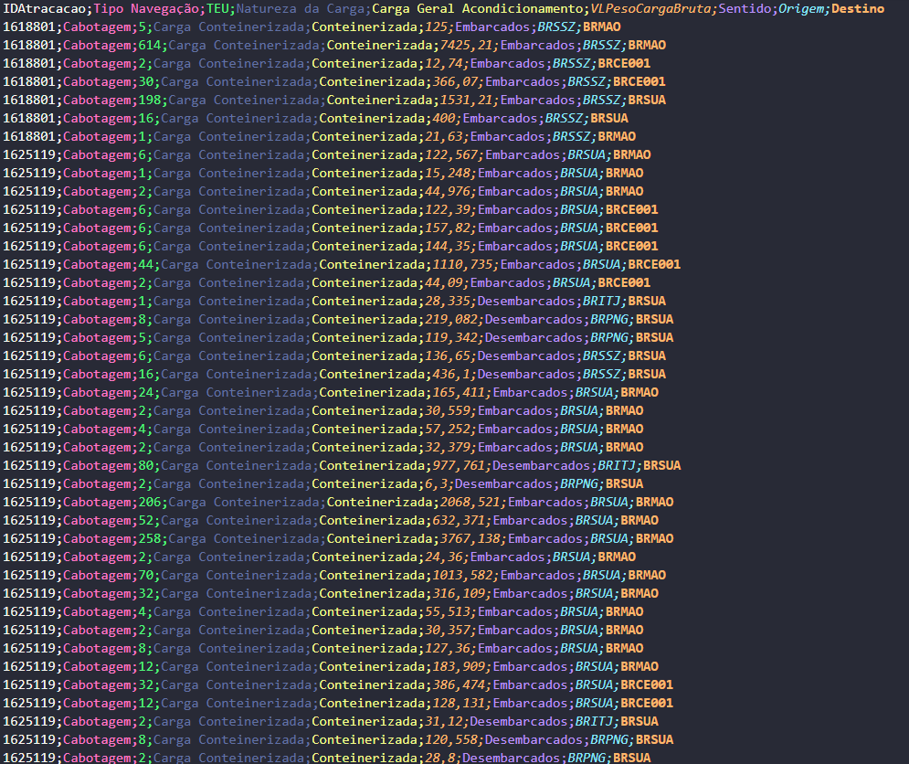

*Figura 2 — Captura de tela de parte do arquivo `2025Carga.txt`, com movimentações de carga associadas às atracações `1618801` e `1625119`. Fonte: Agência Nacional de Transportes Aquaviários (ANTAQ), 2025.*

**Tabela 4 — Campos do arquivo `2025Carga.txt` usados para reconstruir os movimentos de carga.**

| Coluna | Uso na avaliação | Valor na viagem `voyage_9612791_00011` |
| :-- | :-- | :-- |
| `IDAtracacao` | Liga cada movimento de carga à escala correspondente. | Santos: `1618801`; Suape: `1625119`; Pecém: `1625546`; Manaus: `1620276`. |
| `Tipo Navegação` | Mantém somente os registros de cabotagem. | `Cabotagem` nas quatro escalas. |
| `TEU` | Ajuda a identificar a carga conteinerizada e registra a quantidade de contêineres em unidade equivalente a 20 pés. | **Desembarcados / embarcados:** Santos: 0/866; Suape: 804/881; Pecém: 541/187; Manaus: 1.639/621. |
| `Natureza da Carga` e `Carga Geral Acondicionamento` | Complementam a identificação da carga conteinerizada quando necessário. | `Carga Conteinerizada` e `Conteinerizada` em todas as linhas da viagem. |
| `VLPesoCargaBruta` | Informa a massa embarcada ou desembarcada, em toneladas. | **Desembarcados / embarcados:**<br>Santos: 0 / 9.881,860 t;<br>Suape: 8.002,620 / 11.862,199 t;<br>Pecém: 7.624,347 / 3.231,914 t;<br>Manaus: 19.897,560 / 7.571,660 t. |
| `Sentido` | Indica se a massa foi embarcada ou desembarcada na escala. | `Desembarcados` e `Embarcados`. |
| `Origem` e `Destino` | Preservam os códigos dos portos de origem e destino declarados para cada movimento de carga; não definem, sozinhos, o itinerário completo do navio. | Santos; Suape; Pecém; e Manaus. |

*Arquivo: `2025Carga.txt`. Fonte: [Agência Nacional de Transportes Aquaviários (ANTAQ), Painel Estatístico Aquaviário](https://estatistica.antaq.gov.br/ea/sense/download.html).*

Para reconstruir a carga a bordo, o sistema lê os desembarques e embarques na ordem das escalas. A primeira escala disponível pode ocorrer com o navio já carregado. Se o saldo acumulado de embarques menos desembarques ficar negativo em algum ponto, isso indica que havia carga a bordo antes do primeiro registro observado. Nesses casos, o sistema inclui apenas a carga inicial mínima necessária para manter o saldo não negativo e continua a reconstrução dos subtrechos. Se isso não ocorrer, a carga inicial é considerada zero.

###### 3.3.4.1.2 Tabela de Atracação da ANTAQ

A tabela de Atracação é o registro cronológico das escalas. Cada linha informa que determinado navio esteve em um porto ou terminal, em quais datas chegou e saiu e qual é o seu número IMO, identificador único do navio usado internacionalmente. Ela não informa a massa movimentada. Ao ligar seu `IDAtracacao` aos movimentos da tabela de Carga e ordenar as datas de atracação, o sistema transforma os registros isolados na sequência Santos → Suape → Pecém → Manaus.

A Figura 3 apresenta parte do arquivo bruto de Atracação. Cada linha identifica uma escala e reúne o porto, as datas e o número IMO necessários para ordenar as escalas do mesmo navio.

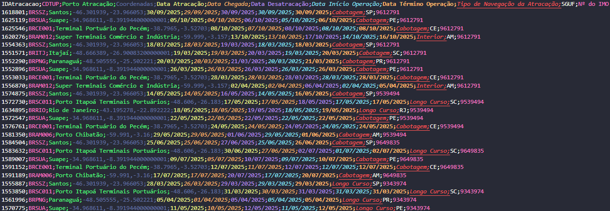

*Figura 3 — Captura de tela de parte do arquivo `2025Atracacao.txt`, com escalas observadas dos navios utilizados no exemplo. Fonte: Agência Nacional de Transportes Aquaviários (ANTAQ), 2025.*

**Tabela 5 — Campos do arquivo `2025Atracacao.txt` usados para identificar e ordenar as escalas dos navios.**

| Coluna | Uso na avaliação | Valor na viagem `voyage_9612791_00011` |
| :-- | :-- | :-- |
| `IDAtracacao` | Liga a escala aos movimentos de carga do arquivo `2025Carga.txt`. | `1618801`; `1625119`; `1625546`; `1620276`. |
| `CDTUP` e `Porto Atracação` | Identificam o porto ou a instalação portuária da escala. | `BRSSZ` — Santos; `BRSUA` — Suape; `BRCE001` — Terminal Portuário do Pecém; `BRAM012` — Super Terminais Comércio e Indústria. |
| `Data Atracação` | Define a ordem cronológica das escalas. | 30/09/2025 03:57; 05/10/2025 10:06; 08/10/2025 03:23; 13/10/2025 18:00. |
| `Data Chegada` e `Data Desatracação` | Registram o intervalo observado da escala. | Santos: 29/09 05:45–30/09 17:30; Suape: 04/10 06:45–06/10 08:50; Pecém: 07/10 14:00–08/10 16:38; Manaus: 13/10 16:30–17/10 06:20. |
| `Tipo de Navegação da Atracação` | Registra o tipo de navegação informado para a escala. | Santos, Suape e Pecém: `Cabotagem`; Manaus: `Interior`. |
| `Terminal`, `Município` e `UF` | Complementam a identificação do local atendido. | Santos Brasil, Guarujá/SP; TECON Suape, Ipojuca/PE; Terminal do Pecém, São Gonçalo do Amarante/CE; Super Terminais, Manaus/AM. |
| `Nº do IMO` | Identifica o navio e permite procurá-lo no EU MRV. | `9612791` nas quatro escalas. |

*Arquivo: `2025Atracacao.txt`. Fonte: [Agência Nacional de Transportes Aquaviários (ANTAQ), Painel Estatístico Aquaviário](https://estatistica.antaq.gov.br/ea/sense/download.html).*

##### 3.3.4.1.3 Reconstrução das viagens

A integração das duas tabelas mostra, portanto, a ordem das escalas e a mudança de carga em cada uma delas. Ela não descreve apenas uma ligação abstrata Santos–Manaus: registra o que entrou e saiu do navio em Santos, Suape, Pecém e Manaus. A Figura 2 mostra o resultado da reconstrução para a parte de ida da viagem `voyage_9612791_00011`; em cada seta, a carga é aquela que estava a bordo enquanto o navio navegava para o porto seguinte e a distância está em milhas náuticas (nm):


*Figura 2 — Parte de ida reconstruída da viagem `voyage_9612791_00011`. Fonte: elaboração própria com dados de Carga e Atracação da ANTAQ e distâncias da matriz marítima do sistema.*

##### 3.3.4.2 Intensidade de combustível do navio

Após reconstruir o percurso e a carga a bordo, é preciso estimar quanto combustível foi necessário para realizar esse transporte. Para isso, o sistema usa a **intensidade de combustível**, isto é, a quantidade de combustível associada ao transporte de uma tonelada por uma milha náutica. A unidade é grama por tonelada-milha náutica, ou $\mathrm{g/(t\cdot nm)}$.

Esse indicador é uma razão, e não o consumo total de uma viagem. Uma intensidade de $7{,}43\ \mathrm{g/(t\cdot nm)}$, por exemplo, significa que, em média, são associados 7,43 g de combustível a cada tonelada transportada por uma milha náutica. Assim, ele permite comparar navios e viagens de tamanhos diferentes. O consumo total de cada viagem só é obtido posteriormente, ao multiplicar essa intensidade pelo trabalho de transporte reconstruído, conforme a Seção 3.3.4.3.

###### 4.3.4.2.1 Valor individual do navio no EU MRV

A ANTAQ informa por onde o navio passou e qual carga levava, mas não informa diretamente o combustível consumido. Esse dado vem da base de **Monitoramento, Reporte e Verificação da União Europeia** (*European Union Monitoring, Reporting and Verification*, EU MRV), que publica indicadores anuais de consumo, atividade e emissões por embarcação. O número IMO registrado na ANTAQ permite procurar o mesmo navio nessa base.

Na viagem `voyage_9612791_00011`, o IMO 9612791 foi encontrado diretamente no EU MRV, com intensidade de $7{,}43\ \mathrm{g/(t\cdot nm)}$ (EMSA, 2026). A Tabela 6 mostra os campos usados nessa correspondência.

**Tabela 6 — Dados do EU MRV usados para a viagem `voyage_9612791_00011`.**

| Fonte ou campo | Valor usado | Papel no cálculo |
| :-- | :-- | :-- |
| Arquivo de origem | `2023-v85-08022026-EU MRV Publication of information.xlsx` | Publicação anual consultada para obter o indicador do navio. |
| `IMO Number` | `9612791` | Faz a correspondência direta com as escalas observadas na ANTAQ. |
| `Ship type` | `Container ship` | Classificação do navio informada na base. |
| `Annual average Fuel consumption per transport work (mass)` | $7{,}43\ \mathrm{g/(t\cdot nm)}$ | Informa a intensidade média de combustível por tonelada-milha náutica do navio. |
| Regra de seleção | Valor positivo mais recente para o mesmo IMO | Mantém o indicador individual mais atual disponível para o navio. |

*Fonte: [THETIS-MRV, Agência Europeia de Segurança Marítima (EMSA)](https://mrv.emsa.europa.eu/), publicação anual de informações do EU MRV.*

O sistema procura primeiro o mesmo IMO no EU MRV. Quando encontra o mesmo navio em mais de um ano, usa o indicador positivo mais recente. Esse é o caso preferencial, pois a intensidade pertence ao navio que aparece nos registros da ANTAQ. Quando não há correspondência individual, ou quando o valor individual é estatisticamente muito fora do padrão do seu tipo de navio, o sistema usa uma estimativa documentada de um grupo semelhante. As regras para isso são apresentadas a seguir.

###### 4.3.4.2.2 Valores atípicos, P95 e estatística robusta

Um valor alto publicado no EU MRV não é descartado por ser necessariamente incorreto. Ainda assim, ele pode ser muito diferente dos navios comparáveis e, se usado sem verificação, pode distorcer a intensidade média de uma ligação. Por esse motivo, o sistema compara a intensidade individual com as intensidades dos navios do mesmo tipo.

O percentil 95 (P95) é o ponto abaixo do qual estão 95% dos valores do grupo ordenado. Em outras palavras, após ordenar as intensidades de todos os navios de um tipo, apenas os 5% maiores ficam acima do P95. A regra só é aplicada quando há pelo menos 20 navios no grupo, para que essa comparação tenha uma base mínima.

No grupo de 243 navios classificados como *container ship*, o P95 é $24{,}073\ \mathrm{g/(t\cdot nm)}$. O navio de IMO 9603221 (*Fernão de Magalhães*), por exemplo, possui valor individual de $228{,}83\ \mathrm{g/(t\cdot nm)}$, acima desse limite. A viagem observada não é retirada: suas escalas, distâncias e carga a bordo continuam no cálculo. O que muda é somente a intensidade aplicada a ela. Quando há uma estimativa de classe disponível, ela é usada; caso contrário, aplica-se a estimativa robusta do tipo *container ship*, de $9{,}322050\ \mathrm{g/(t\cdot nm)}$.

O P95 e a estatística robusta têm funções diferentes. Enquanto P95 identifica quando o valor individual é excepcionalmente alto para seu grupo, a estatística robusta produz o valor de grupo que será usado quando o IMO estiver ausente ou quando o valor individual precisar ser substituído. Tanto para a **classe** como para o **tipo** do navio, o sistema usa a **média aparada disponível**, que exclui valores abaixo do percentil 1 e acima do percentil 99 e calcula a média dos valores restantes como intensidade desse grupo.

Essas regras evitam que poucos valores extremos definam a estimativa coletiva. Elas não foram criadas para escolher um resultado mais baixo: a mesma regra é aplicada a todos os grupos e sua aplicação fica registrada na saída do cálculo, com a estatística usada, o tamanho da amostra e a quantidade de valores retirados. Esse uso do P95 trata apenas a intensidade individual do navio; o uso do P95 para a distância marítima representativa é descrito separadamente na Seção 3.3.4.4.

###### 4.3.4.2.3 Estimativa quando não há valor individual

Nem todos os navios que operam no Brasil aparecem na base europeia. Nessa situação, o sistema continua usando a própria base EU MRV, mas procura um grupo de embarcações semelhantes. Primeiro, procura a classe do navio, que é o grupo mais específico disponível. Se não houver uma estatística utilizável para essa classe, procura o tipo do navio, categoria mais ampla, como *container ship*. O resultado é identificado como estimativa da classe ou do tipo; ele não é apresentado como se fosse uma medição individual do navio ausente.

Cada recorte recebe, portanto, uma intensidade e uma descrição clara de sua origem: valor individual do IMO, estimativa pela classe ou estimativa pelo tipo.

###### 3.3.4.2.4 Exemplo de estimativa pelo tipo de navio

A viagem `voyage_9974486_00001`, realizada pelo navio de IMO 9974486, passou por Paranaguá, Rio de Janeiro e Salvador. Esse IMO aparece nos registros da ANTAQ, mas não possui correspondência individual no EU MRV. Como o registro também não traz uma classe mais específica, o sistema usa os dados do tipo documentado *container ship* na própria base do EU MRV.

Para formar esse valor, o sistema reuniu um indicador positivo e mais recente de cada um dos 243 navios classificados como *container ship* no EU MRV. Após ordenar os valores, retirou os dois menores e os dois maiores, que são os valores removidos pela regra de 1% em cada extremidade. Restaram 239 valores para o cálculo:

$$
I_{\mathrm{container\ ship}}
=\frac{\sum_{j=1}^{239} I_j}{239}
=9{,}322050\ \mathrm{g/(t\cdot nm)}.
$$

Nessa fórmula, $I_{\mathrm{container\ ship}}$ é a intensidade média aparada do tipo *container ship*; $I_j$ é a intensidade do $j$-ésimo navio mantido após a retirada dos valores extremos; e $j$ percorre os 239 valores restantes.

Portanto, todos os subtrechos dessa viagem recebem a intensidade de $9{,}322050\ \mathrm{g/(t\cdot nm)}$. A saída identifica esse número como uma estimativa baseada no tipo *container ship*, e não como uma medição do navio de IMO 9974486.

##### 4.3.4.3 Trabalho de transporte e intensidade da ligação

Uma ligação entre dois portos não corresponde, necessariamente, a uma única viagem nem a uma única sequência de escalas. Para representar Santos–Manaus, por exemplo, o sistema aproveita cada recorte histórico que começou em Santos e chegou a Manaus na mesma viagem e no mesmo sentido, independentemente do número de paradas. Um recorte só entra nessa consolidação quando a origem e o destino são portos distintos da mesma viagem, aparecem na ordem do cenário e todos os subtrechos entre eles têm distância disponível. Se o navio repete a mesma ligação, o sistema usa o recorte direto; se não houver um, usa o recorte completo mais curto, evitando que a mesma viagem seja contada duas vezes. Antes de reunir esses recortes em uma única intensidade, ele calcula quanto transporte foi realizado em cada um deles. A ideia é ponderar a média das intensidades pela quantidade de carga que de fato foi transportada naquele trecho.

Esse cálculo usa o trabalho de transporte. Em cada subtrecho, a carga a bordo é multiplicada pela distância percorrida; em seguida, os resultados dos subtrechos são somados. Para cada recorte válido $v$, extraído de uma viagem reconstruída, o trabalho entre a origem $o$ e o destino $d$ é:

$$
W_{v,o,d}=\sum_{s\in\mathcal{S}_{v,o,d}}m_{v,s}\,d_{v,s}.
$$

Nessa fórmula, $\mathcal{S}_{v,o,d}$ é o conjunto de subtrechos entre os dois portos, $m_{v,s}$ é a carga a bordo no subtrecho $s$, em toneladas, e $d_{v,s}$ é a distância correspondente, em milhas náuticas. O resultado $W_{v,o,d}$ é expresso em tonelada-milha náutica ($\mathrm{t\cdot nm}$). Portanto, um recorte recebe mais peso quando transporta mais carga, percorre uma distância maior ou reúne as duas condições.

O exemplo real da viagem `voyage_9612791_00011` mostra por que a carga precisa ser reconstruída trecho a trecho. Entre Santos e Manaus, o navio passou por Suape e Pecém; a carga a bordo mudou em cada escala.

| Subtrecho observado | Carga a bordo (t) | Distância (nm) | Trabalho de transporte ($\mathrm{t\cdot nm}$) |
| :-- | --: | --: | --: |
| Santos → Suape | 12.858,754 | 1.259,179 | 16.191.476,419 |
| Suape → Pecém | 16.718,333 | 507,806 | 8.489.677,588 |
| Pecém → Manaus | 12.325,900 | 1.185,594 | 14.613.514,486 |
| **Total Santos → Manaus** | — | — | **39.294.668,494** |

*Fonte: elaboração própria com os registros de Carga e Atracação da ANTAQ, a matriz marítima e a reconstrução da viagem `voyage_9612791_00011`. Os valores exibidos foram arredondados.*

O trabalho de transporte desse recorte é, portanto:

$$
\begin{aligned}
W_{\mathrm{Santos,Manaus}}
&=16.191.476{,}419+8.489.677{,}588+14.613.514{,}486\\
&=39.294.668{,}494\ \mathrm{t\cdot nm}.
\end{aligned}
$$

O IMO 9612791 possui intensidade individual de $7{,}43\ \mathrm{g/(t\cdot nm)}$ no EU MRV. A massa de VLSFO atribuída a esse recorte observado é:

$$
\begin{aligned}
M_{\mathrm{VLSFO},v}
&=\frac{I_v\,W_{v,o,d}}{1000}\\
&=\frac{7{,}43\times39.294.668{,}494}{1000}\\
&=291.959{,}387\ \mathrm{kg}.
\end{aligned}
$$

Nessa fórmula, $M_{\mathrm{VLSFO},v}$ é a massa de VLSFO atribuída ao recorte, em kg; $I_v$ é sua intensidade, em $\mathrm{g/(t\cdot nm)}$; e $W_{v,o,d}$ é seu trabalho de transporte, em $\mathrm{t\cdot nm}$. A divisão por 1.000 converte gramas em quilogramas. Esse valor descreve a atividade histórica daquele recorte. Ele não é somado diretamente ao consumo de uma nova remessa simulada pelo usuário. Seu papel é informar o peso e a intensidade com que esse recorte participa da preparação do indicador Santos–Manaus.

Após repetir a reconstrução para todas as viagens registradas, o sistema calcula a média ponderada pelo trabalho de transporte. Ele não escolhe a intensidade de uma única viagem, nem escolhe o corredor com maior volume. A intensidade da ligação é:

$$
I_{o,d}^{\mathrm{rep}}=
\frac{\sum_{v=1}^{N_{\mathrm{recortes}}}I_v\,W_{v,o,d}}
{\sum_{v=1}^{N_{\mathrm{recortes}}}W_{v,o,d}}.
$$

Aqui, $I_{o,d}^{\mathrm{rep}}$ é a intensidade representativa da ligação; $I_v$ é a intensidade atribuída ao recorte $v$; $W_{v,o,d}$ é seu trabalho de transporte entre os portos escolhidos; e $N_{\mathrm{recortes}}$ é o número de recortes aceitos. Assim, o sistema dá maior peso a um recorte que movimentou mais tonelada-milhas náuticas, sem descartar os demais recortes, diretos ou com escalas.

Em Santos–Manaus, os 89 recortes aceitos somam $3.153.328.821{,}755\ \mathrm{t\cdot nm}$ de trabalho de transporte. Antes da média, são aplicadas as regras de intensidade explicadas na subseção anterior:

- 19 recortes usam a intensidade individual do IMO
- 49 usam a estimativa pelo tipo porque não possuem correspondência individual no EU MRV; e
- 21 mantêm a viagem observada, mas recebem a estimativa pelo tipo porque o valor individual ultrapassou o limiar de anomalia.

A soma dos produtos $I_v\,W_{v,o,d}$ é $28.410.938.295{,}411\ \mathrm{g}$. Logo:

$$
I_{\mathrm{Santos,Manaus}}^{\mathrm{rep}}=
\frac{28.410.938.295{,}411}
{3.153.328.821{,}755}
=9{,}009824\ \mathrm{g/(t\cdot nm)}.
$$

Esse resultado não é a intensidade de um navio escolhido como representante. É a média das 89 viagens registradas nas bases da ANTAQ para esse trecho, em que cada uma contribui conforme a carga efetivamente transportada e a distância percorrida.

##### 3.3.4.4 Distância marítima representativa entre os portos

Para calcular o consumo de uma nova remessa, o sistema usa uma distância marítima representativa entre o porto de origem e o porto de destino. Essa distância é calculada separadamente da intensidade. A intensidade usa o trabalho de transporte como peso; para a distância, o peso da média é a carga que permaneceu a bordo em cada recorte completo. Assim, a distância de uma viagem mais longa não é usada duas vezes no cálculo da média.

Antes dessa média, o sistema verifica se há recortes excepcionalmente longos para a mesma ligação e no mesmo sentido. Quando existem pelo menos 20 recortes completos, ele calcula o percentil 95 (P95) das distâncias totais observadas, sem ponderação. Os recortes acima desse limite continuam registrados na matriz e participam da intensidade marítima, mas não entram na média de distância. Com menos de 20 recortes, o filtro não é aplicado e todos permanecem na média. Portanto, o P95 funciona como um limite de triagem para a distância; ele não substitui a distância representativa pelo próprio valor do percentil.

Em cada recorte, o sistema primeiro soma as distâncias de seus subtrechos e calcula a carga média a bordo ponderada pela distância. Se $D_{v,o,d}^{\mathrm{nm}}$ é a distância total do recorte, essa carga média é:

$$
\bar m_{v,o,d}=
\frac{\sum_{s\in\mathcal{S}_{v,o,d}}m_{v,s}\,d_{v,s}}
{\sum_{s\in\mathcal{S}_{v,o,d}}d_{v,s}}
=\frac{W_{v,o,d}}{D_{v,o,d}^{\mathrm{nm}}}.
$$

Na fórmula, $m_{v,s}$ é a carga a bordo no subtrecho $s$, $d_{v,s}$ é a distância desse subtrecho e $D_{v,o,d}^{\mathrm{nm}}$ é a soma das distâncias do recorte em milhas náuticas. Assim, $\bar m_{v,o,d}$ é a carga média a bordo do recorte, em toneladas.

Na viagem `voyage_9612791_00011`, por exemplo, o trabalho de transporte de $39.294.668{,}494\ \mathrm{t\cdot nm}$ é dividido pela distância total de $2.952{,}579\ \mathrm{nm}$, resultando $13.308{,}592\ \mathrm{t}$. Esse é o peso da referida viagem na média de distância; não é a carga de uma nova remessa simulada.

Em seguida, a distância representativa é a média das distâncias completas dos recortes que permaneceram até o P95, ponderada por essa carga média:

$$
\bar D_{o,d}^{\mathrm{rep}}=
\frac{\sum_{v\in\mathcal{V}_{o,d}^{\leq P95}}D_{v,o,d}^{\mathrm{km}}\,\bar m_{v,o,d}}
{\sum_{v\in\mathcal{V}_{o,d}^{\leq P95}}\bar m_{v,o,d}}.
$$

Nessa expressão, $\bar D_{o,d}^{\mathrm{rep}}$ é a distância marítima representativa da ligação, em quilômetros; $D_{v,o,d}^{\mathrm{km}}$ é a distância total do mesmo recorte, em quilômetros; e $\mathcal{V}_{o,d}^{\leq P95}$ reúne os recortes cuja distância é menor ou igual ao P95 daquela ligação. Quando a ligação tem menos de 20 recortes, esse conjunto contém todos os recortes válidos.

Essa média não monta uma rota artificial com trechos de navios diferentes. Cada distância é calculada dentro da própria viagem antes de entrar na média, e nenhum corredor único é escolhido para representar o cenário.

Em Santos–Manaus, foram reconstruídos 89 recortes completos em 22 corredores. O P95 das distâncias observadas foi $6.975{,}000\ \mathrm{km}$; dois recortes acima desse limite foram retirados apenas da média de distância. Os 87 recortes restantes, distribuídos em 20 corredores, resultam em $6.094{,}975\ \mathrm{km}$, ou $3.291{,}023\ \mathrm{nm}$. Os 89 recortes continuam na média de intensidade apresentada na Seção 3.3.4.3.

#### 3.3.5 Emissões da alternativa multimodal

Os trechos de *first mile* e *last mile* usam a mesma conversão de diesel em emissões descrita na Seção 3.2.3. As operações portuárias também aplicam esse fator diretamente aos litros de diesel calculados na Seção 3.3.3. Na navegação, o consumo de VLSFO (*very low sulphur fuel oil*, óleo combustível de baixíssimo teor de enxofre) é multiplicado pelo fator operacional correspondente. Em ambos os casos, a fronteira continua sendo TTW: considera-se apenas o combustível queimado durante a operação.

**Tabela 7 — Fatores de emissão específicos da alternativa multimodal.**

| Etapa do transporte | Fonte do fator | Fator de emissão |
| :-- | :-- | :-- |
| Operações portuárias | IPCC (2006). | 2,68 kg CO₂e/L de diesel |
| Navegação | Costa et al. (2025): Resolução IMO MEPC.391(81). | 3,114 kg CO₂e/kg de VLSFO |

#### 3.3.6 Custo do combustível

O custo modelado do combustível considera apenas o combustível estimado em cada etapa; não é uma cotação de frete. Antes de cada execução, o sistema busca a tabela mais recente de preços do Diesel S10 publicada pela Agência Nacional do Petróleo, Gás Natural e Biocombustíveis (ANP).

No exemplo São Paulo–Rio Branco, a atualização retornou os preços da semana de 12 a 18 de julho de 2026, com data final de pesquisa em 18 de julho. Os acessos rodoviários, *first mile* e *last mile*, usam a mesma regra de escolha do veículo e de cálculo de consumo da Seção 3.2.1. Para precificar o diesel, o *first mile* usa a média entre a UF de origem e a UF do porto de embarque, e o *last mile*, a média entre a UF do porto de desembarque e a UF de destino. Nas operações portuárias, cada porto usa diretamente o preço do diesel na sua própria UF.

O sistema também busca a cotação mais recente disponível do VLSFO na [Ship & Bunker](https://shipandbunker.com/prices/br-brazil). Nesta execução, a cotação de 18 de julho de 2026 foi US\$ 741,50/mt. A sigla `mt` significa *metric tonne*, ou tonelada métrica, equivalente a 1.000 kg. A taxa de conversão USD/BRL também é sempre a mais recente: de R\$ 5,141345 por US\$, obtida pela ferramenta [CurrencyConverter](https://pypi.org/project/CurrencyConverter/) a partir de dados do Banco Central Europeu (BCE), o preço convertido foi R\$ 3.812,31/mt, ou R\$ 3,812/kg. A Tabela 8 resume as fontes, os valores de origem e os preços usados no exemplo.

**Tabela 8 — Preços de combustível usados no exemplo São Paulo–Rio Branco.**

| Etapa do transporte | Fonte do preço | Valores de origem | Preço usado no exemplo |
| :-- | :-- | :-- | :-- |
| Rodovia direta | [ANP](https://www.gov.br/anp/pt-br/assuntos/precos-e-defesa-da-concorrencia/precos/levantamento-de-precos-de-combustiveis-ultimas-semanas-pesquisadas) | Diesel S10: <br/> São Paulo, R\$ 6,960/L; <br/> Acre, R\$ 9,270/L. | R\$ 8,115/L |
| *First mile* | [ANP](https://www.gov.br/anp/pt-br/assuntos/precos-e-defesa-da-concorrencia/precos/levantamento-de-precos-de-combustiveis-ultimas-semanas-pesquisadas) | Diesel S10: <br/> São Paulo, R\$ 6,960/L; <br/> Porto de Santos (SP), R\$ 6,960/L. | R\$ 6,960/L |
| Operações portuárias | [ANP](https://www.gov.br/anp/pt-br/assuntos/precos-e-defesa-da-concorrencia/precos/levantamento-de-precos-de-combustiveis-ultimas-semanas-pesquisadas) | Diesel S10: <br/> Porto de Santos (SP), R\$ 6,960/L; <br/> Porto de Manaus (AM), R\$ 7,250/L. | R\$ 6,960/L em Santos e <br/> R\$ 7,250/L em Manaus. |
| Navegação | VLSFO: [Ship & Bunker](https://shipandbunker.com/prices/br-brazil); <br/> Taxa USD/BRL: BCE. | VLSFO: US\$ 741,50/mt; <br/> USD/BRL: R\$ 5,141345 por US\$. | R\$ 3,812/kg |
| *Last mile* | [ANP](https://www.gov.br/anp/pt-br/assuntos/precos-e-defesa-da-concorrencia/precos/levantamento-de-precos-de-combustiveis-ultimas-semanas-pesquisadas) | Diesel S10: <br/> Porto de Manaus (AM), R\$ 7,250/L; <br/> Acre, R\$ 9,270/L. | R\$ 8,260/L |

#### 3.3.7 Resultado consolidado da alternativa multimodal do exemplo São Paulo–Rio Branco

Para a remessa de 14 t entre São Paulo (SP) e Rio Branco (AC), a Tabela 9 reúne os resultados das etapas que compõem a alternativa multimodal. Os cálculos e as fontes de cada etapa estão descritos nas Seções 3.3.1 a 3.3.6.

**Tabela 9 — Resultado da alternativa multimodal no exemplo São Paulo–Rio Branco, para uma remessa de 14 t.**

| Etapa | Percurso | Distância | Combustível estimado | Custo modelado do combustível | Emissões operacionais TTW |
| :-- | :-- | --: | --: | --: | --: |
| *First mile* | São Paulo–Porto de Santos | 86,170 km | 37,465 L de diesel | R\$ 260,76 | 100,41 kg CO₂e |
| Navegação | Porto de Santos–Porto de Manaus | 6.094,975 km<br/>(3.291,023 milhas náuticas) | 415,122 kg de VLSFO | R\$ 1.582,57 | 1.292,69 kg CO₂e |
| Operações portuárias | Santos e Manaus | — | 4,820 L de diesel | R\$ 34,25 | 12,92 kg CO₂e |
| *Last mile* | Porto de Manaus–Rio Branco | 1.403,691 km | 610,300 L de diesel | R\$ 5.041,08 | 1.635,60 kg CO₂e |
| **Total** | — | **7.584,836 km** | — | **R\$ 6.918,66** | **3.041,62 kg CO₂e** |

### 4.4 Resultado final do exemplo São Paulo–Rio Branco

Esta seção compara, para a mesma remessa de 14 t, os resultados totais da alternativa A, rodoviária direta, e da alternativa B, multimodal. Os valores das alternativas A e B foram consolidados nas Seções 3.2.4 e 3.3.7, respectivamente.

**Tabela 10 — Comparação dos resultados totais no exemplo São Paulo–Rio Branco, para uma remessa de 14 t.**

| Indicador | Alternativa A: rodovia direta | Alternativa B: multimodal | Resultado da alternativa B em relação à A |
| :-- | --: | --: | :-- |
| Distância percorrida | 3.491,431 km | 7.584,836 km | 4.093,405 km a mais (117,24%). |
| Emissões operacionais TTW | 4.068,28 kg CO₂e | 3.041,62 kg CO₂e | 1.026,66 kg CO₂e a menos (25,24%). |
| Custo modelado do combustível | R\$ 12.318,68 | R\$ 6.918,66 | R\$ 5.400,02 a menos (43,84%). |

Embora a alternativa multimodal percorra uma distância total maior, ela apresenta menor custo modelado do combustível e menores emissões operacionais TTW no cenário analisado.

## 5. Implementação computacional

A Seção 3 descreve o que é calculado: duas alternativas que prestam o mesmo serviço logístico, seus trechos, os dados usados e as regras físicas aplicadas. Esta seção mostra como essas regras foram transformadas em software: o objetivo não é repetir as fórmulas, mas explicar como o sistema recebe os dados, executa cada etapa, trata uma informação ausente e registra a origem de cada resultado.

O CabotageLens separa a preparação dos dados históricos da execução de uma comparação. Assim, uma pessoa que informa uma origem, um destino e uma carga não precisa reconstruir toda a base da Agência Nacional de Transportes Aquaviários (ANTAQ) nem consultar novamente a base de Monitoramento, Reporte e Verificação da União Europeia (EU MRV), por exemplo. A aplicação utiliza os artefatos marítimos já preparados e concentra a execução na montagem do cenário porta a porta.

As ferramentas e os serviços empregados são utilizados em suas modalidades gratuitas. Os limites de consulta, armazenamento e processamento dessas modalidades são compatíveis com o escopo acadêmico, o volume de dados e a quantidade de cenários avaliados neste estudo. Dessa forma, a execução do sistema não depende de infraestrutura ou licenças pagas para cumprir seu propósito.

### 5.1 Arquitetura do sistema e tecnologias utilizadas

O sistema é desenvolvido em Python. A interface, os cálculos, a organização dos dados e as integrações externas ficam em componentes separados.

A Tabela 11 apresenta as tecnologias e os serviços essenciais para entender a execução do sistema. Ela não lista todas as bibliotecas Python utilizadas internamente no código. Essas ferramentas também não devem ser confundidas com as fontes metodológicas e de insumos: ANTAQ, EU MRV, Agência Nacional do Petróleo, Gás Natural e Biocombustíveis (ANP) e Ship & Bunker fornecem dados ou preços externos; as tecnologias da tabela permitem obter, tratar, calcular, armazenar ou apresentar essas informações.

**Tabela 11 — Tecnologias e serviços utilizados na implementação do CabotageLens.**

| Tecnologia ou serviço | Função no sistema | Papel na execução |
| :-- | :-- | :-- |
| [Python](https://www.python.org/) | Linguagem principal do projeto. | Executa o tratamento de dados, a reconstrução marítima, os cálculos e os scripts de atualização. |
| [Streamlit](https://streamlit.io/) | Ferramenta para construir a interface web em Python. | Recebe o cenário informado pelo usuário e apresenta mapas, totais, detalhamentos e avisos. |
| [Supabase](https://supabase.com/) | Serviço de banco de dados. | Guarda pontos geocodificados, rotas reutilizáveis, execuções em lote e resultados que precisam permanecer disponíveis. |
| [OpenRouteService (ORS)](https://openrouteservice.org/) | Serviço externo de localização e roteamento. | É o provedor principal para transformar um local em coordenadas e obter a geometria das rotas rodoviárias. |
| [LocationIQ](https://locationiq.com/) | Serviço externo alternativo de localização e roteamento. | É consultado somente quando o ORS não entrega uma resposta utilizável. |
| [`requests`](https://requests.readthedocs.io/en/stable/) e [Beautiful Soup](https://www.crummy.com/software/BeautifulSoup/bs4/doc/) | Bibliotecas Python: `requests` realiza consultas pela internet; Beautiful Soup lê a estrutura de páginas em HyperText Markup Language (HTML). | Ajudam a buscar serviços externos e, no fluxo de preparação marítima, a localizar no portal da ANTAQ os arquivos públicos a serem baixados. |
| [`CurrencyConverter`](https://pypi.org/project/CurrencyConverter/) | Biblioteca Python para conversão de moedas. | Converte para reais a referência internacional de preço do combustível marítimo quando ela está em dólar por tonelada. |

*Fonte: elaboração própria a partir da arquitetura versionada do CabotageLens.*

Em termos simples, uma biblioteca Python é um conjunto de funções prontas que pode ser usado no código do sistema. Ela apoia tarefas como consultar uma página na internet ou converter moedas, mas não é uma fonte de dados nem substitui as regras de cálculo descritas neste estudo.

### 4.2 Dados de entrada, tratamento de endereços e geocodificação

#### 5.2.1 Dados recebidos pelo pipeline

Cada execução do pipeline recebe três dados: a origem, o destino e a massa da remessa. A origem e o destino definem os pontos inicial e final das duas alternativas; a massa, informada em toneladas, define a carga que será transportada em ambas. Antes dos cálculos, o pipeline normaliza os textos, verifica a massa e reúne os três valores em um único cenário. Assim, a rota rodoviária e a rota multimodal sempre partem dos mesmos pontos e transportam a mesma carga.

#### 4.2.2 Do texto às coordenadas

Origem e destino precisam ser convertidos em latitude e longitude antes de uma rota ser calculada. Esse procedimento é chamado de geocodificação. A entrada pode ser o nome de uma cidade, um endereço completo, coordenadas já conhecidas ou um Código de Endereçamento Postal (CEP).

Quando o provedor encontra uma correspondência suficiente, o motor de geocodificação também pode reconhecer abreviações e pequenos erros de digitação. Por exemplo, `av prof luciano galberto` é interpretado corretamente como "Avenida Professor Luciano Gualberto, São Paulo, SP".

#### 4.2.3 Consulta aos serviços de localização

O pipeline envia o texto de origem ou destino primeiro ao OpenRouteService (ORS). Se o ORS devolver uma localização válida, recebe o rótulo do local, a latitude, a longitude e a identificação do provedor. Quando o ORS não devolve uma resposta utilizável, o pipeline envia a mesma consulta ao LocationIQ. A saída desta etapa é um ponto identificado por coordenadas (latitude e longitude).

#### 5.2.4 Fluxograma explicativo

O fluxograma mostra o caminho de quatro formas de entrada para o mesmo local:

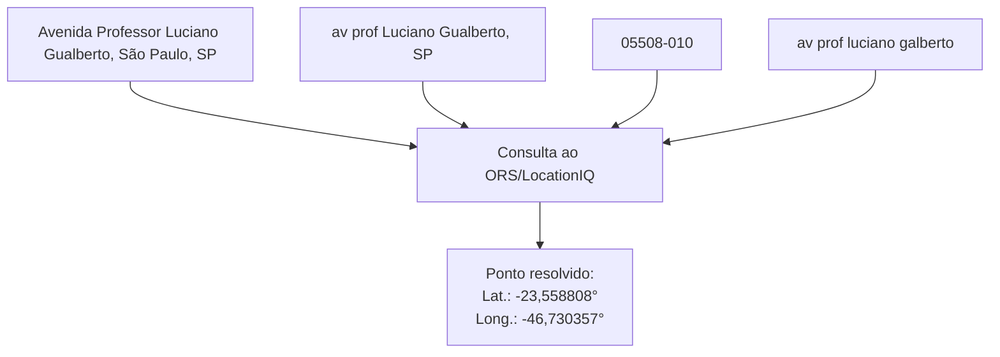

Após a geocodificação de um local, suas coordenadas são armazenadas no banco de dados Supabase/PostgreSQL. Se o mesmo ponto for usado novamente, o sistema reutiliza esse resultado em vez de realizar outra geocodificação.

#### 5.2.5 Validação das coordenadas

Antes de calcular uma rota, é preciso verificar se o endereço foi associado à região correta. Para isso, foi usado o endereço de referência `Avenida Professor Luciano Gualberto, São Paulo, SP`. A consulta independente no Google Maps retornou as coordenadas latitude igual a −23,560017° e longitude igual a −46,727769°, apresentadas na Figura 7. Para o mesmo endereço, o motor de geocodificação retornou as coordenadas (−23,558808°; −46,730357°). A distância em linha reta entre os dois pontos é aproximadamente 296 m.


*Figura 3 — Consulta independente do endereço Avenida Professor Luciano Gualberto, São Paulo, SP, no Google Maps. Fonte: captura de tela do Google Maps realizada em 18 de julho de 2026.*

A Figura 8 mostra a consulta, no Google Maps, das coordenadas devolvidas pelo motor; os dois pontos permanecem na Avenida Professor Luciano Gualberto, na região da Universidade de São Paulo (USP).


*Figura 4 — Consulta no Google Maps das coordenadas retornadas pelo motor de geocodificação para a Avenida Professor Luciano Gualberto. Fonte: captura de tela do Google Maps realizada em 18 de julho de 2026.*

Essa comparação confirma que as coordenadas apontam para a região correta em escala de endereço. Ela não comprova precisão cadastral, como a posição de um portão ou de um número específico do imóvel, mas é suficiente para o propósito deste estudo.

### 4.3 Implementação da alternativa rodoviária

#### 5.3.1 Consulta de rota rodoviária

Com as coordenadas da origem e do destino já definidas, o sistema envia esse par primeiro ao OpenRouteService (ORS). Se o ORS não devolver uma rota utilizável, envia o mesmo par ao LocationIQ. O provedor que responder devolve a distância rodoviária e sua identificação, que ficam associadas ao cenário.

No exemplo São Paulo–Rio Branco, após a geocodificação descrita na Seção 4.2, o ORS recebeu as coordenadas de São Paulo (latitude −23,550520°; longitude −46,633308°) e de Rio Branco (latitude −9,989637°; longitude −67,822462°). A distância rodoviária devolvida foi 3.491,431 km.

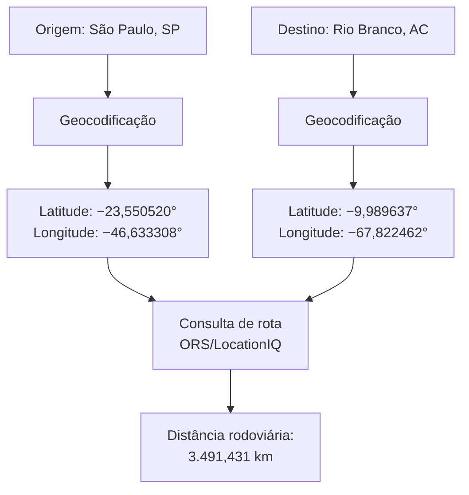

##### 4.3.1.1 Validação da distância rodoviária

A Figura 9 apresenta uma consulta independente no Google Maps para a mesma ligação entre São Paulo e Rio Branco. A rota selecionada pelo Google Maps tem 3.497 km, enquanto o motor do sistema retornou 3.491,431 km. A diferença é de 5,569 km, ou 0,16% da distância exibida no Google Maps.


*Figura 5 — Consulta no Google Maps para São Paulo–Rio Branco: rota selecionada de 3.497 km. Fonte: captura de tela do Google Maps realizada em 15 de julho de 2026.*

Essa proximidade mostra que a distância usada no cálculo representa uma rota pela malha rodoviária, e não a distância geográfica em linha reta entre as cidades. Usar a distância em linha reta reduziria artificialmente os quilômetros percorridos e poderia distorcer as estimativas de consumo, custo e emissões.

#### 5.3.2 Consulta do preço do diesel

Para calcular o custo, a rotina Python busca os preços mais recentes de Diesel S10. Ela baixa a planilha semanal de preços de revenda por estado da Agência Nacional do Petróleo, Gás Natural e Biocombustíveis (ANP), disponibilizada no [site oficial da agência](https://www.gov.br/anp/pt-br/assuntos/precos-e-defesa-da-concorrencia/precos/precos-revenda-e-de-distribuicao-combustiveis/shlp/semanal/).

Após confirmar que o XLSX baixado gerou uma tabela válida de preços por Unidade da Federação (UF), a rotina também salva os dois arquivos no Supabase Storage, o espaço de armazenamento de arquivos do projeto, para garantir rastreabilidade e uma alternativa caso o site da ANP esteja indisponível.

**Tabela 12 — Recorte bruto da planilha semanal da ANP para `OLEO DIESEL S10`.**

| DATA INICIAL | DATA FINAL | REGIÃO | ESTADO | PRODUTO | UNIDADE DE MEDIDA | PREÇO MÉDIO REVENDA |
| :-- | :-- | :-- | :-- | :-- | :-- | --: |
| 07-12-26 | 07-18-26 | SUDESTE | SAO PAULO | OLEO DIESEL S10 | R\$/l | 6.96 |
| 07-12-26 | 07-18-26 | NORTE | ACRE | OLEO DIESEL S10 | R\$/l | 9.27 |
| 07-12-26 | 07-18-26 | NORTE | AMAZONAS | OLEO DIESEL S10 | R\$/l | 7.25 |
| 07-12-26 | 07-18-26 | NORDESTE | PERNAMBUCO | OLEO DIESEL S10 | R\$/l | 6.88 |

*Fonte: planilha semanal de preços de revenda por estado da ANP, aba `ESTADOS - DESDE 30.12.2012`, produto `OLEO DIESEL S10`, período de 12 a 18 de julho de 2026. Valores reproduzidos do arquivo `SEMANAL_ESTADOS-DESDE_2013.xlsx` usado para conferir a rotina de leitura.*

#### 4.3.3 Consumo, custo e emissões rodoviárias

Com a distância disponível, o avaliador aplica as regras das Seções 3.2.1 a 3.2.3. Ele seleciona a configuração rodoviária representativa a partir da massa da remessa, calcula os litros de diesel de cada perna e converte esse consumo em custo e emissões.

Cada perna guarda, além do valor calculado, a distância, o tipo de veículo, o preço de diesel, o fator de emissão e a origem desses insumos. Dessa forma, o total rodoviário pode ser auditado sem misturá-lo com as parcelas portuárias ou marítimas.

#### 5.3.4 Resumo do pipeline da alternativa direta

A alternativa direta é calculada de forma independente da alternativa multimodal. O pipeline recebe origem, destino e carga; transforma os locais em coordenadas; obtém a distância pela malha rodoviária; seleciona o veículo representativo; estima o consumo de diesel; e, por fim, converte esse consumo em custo modelado do combustível e emissões operacionais. O resultado serve como referência para a comparação, sem incluir portos ou navegação.

No exemplo São Paulo–Rio Branco, uma remessa de 14 t percorre 3.491,431 km. O sistema seleciona uma carreta de cinco eixos, com eficiência de 2,3 km/L, e estima 1.518,014 L de Diesel S10. Com o preço e o fator de emissão definidos nas Seções 4.2.2 e 4.2.3, o resultado é R$ 12.318,68 de custo modelado do combustível e 4.068,28 kg CO₂e de emissões operacionais TTW.

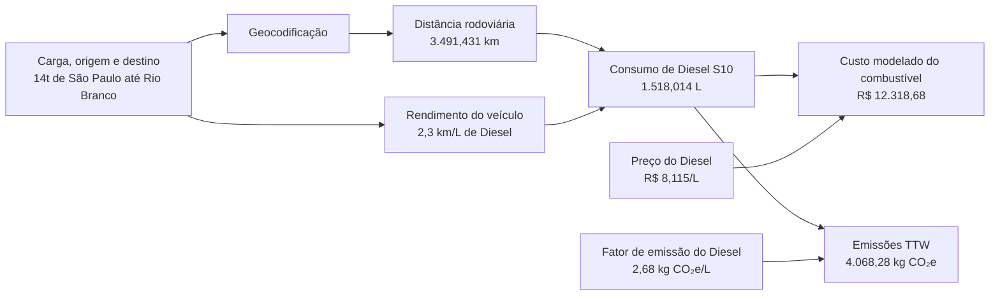

### 5.4 Montagem da alternativa multimodal

Após calcular a rota rodoviária direta, o sistema monta a alternativa multimodal. Essa etapa reutiliza os veículos representativos do transporte rodoviário, os endereços já geocodificados, os preços de diesel por unidade federativa e a cotação do VLSFO.

#### 5.4.1 Consulta e conversão do preço do VLSFO

Antes de avaliar a alternativa multimodal, o pipeline busca a cotação mais recente disponível do VLSFO (*very low sulphur fuel oil*, óleo combustível de baixíssimo teor de enxofre) na [Ship & Bunker](https://shipandbunker.com/prices/br-brazil). A biblioteca Python `requests` acessa a página brasileira do serviço e obtém o preço do VLSFO em dólares por tonelada métrica (US$/mt).

A cotação internacional precisa ser convertida antes de entrar no cálculo de custo. A biblioteca Python [CurrencyConverter](https://pypi.org/project/CurrencyConverter/) obtém a taxa USD/BRL a partir das referências do Banco Central Europeu (BCE).

No exemplo São Paulo–Rio Branco, a conversão é:

$$
\begin{aligned}
P_{\mathrm{VLSFO}}^{\mathrm{R\$/mt}}
&= 741{,}50\ \mathrm{US\$/mt} \times 5{,}141345\ \mathrm{R\$/US\$} \\
&= 3.812{,}31\ \mathrm{R\$/mt}, \\[4pt]
P_{\mathrm{VLSFO}}^{\mathrm{R\$/kg}}
&= \frac{3.812{,}31\ \mathrm{R\$/mt}}{1.000\ \mathrm{kg/mt}} \\
&= 3{,}812\ \mathrm{R\$/kg}.
\end{aligned}
$$

Nas duas linhas, $P_{\mathrm{VLSFO}}$ representa o preço do VLSFO e o sobrescrito informa a unidade em que ele está expresso. Esse é o valor entregue ao avaliador para calcular o custo do combustível marítimo. A fonte, os valores e a regra de custo estão detalhados na Seção 4.3.6 e na Tabela 8.

#### 5.4.2 Matriz marítima

Antes de definir os portos de um novo cenário, o sistema prepara a referência marítima com base em viagens de cabotagem que realmente ocorreram. O produto dessa preparação é uma matriz marítima construída com dados observados.

Quando a matriz não apresenta uma distância entre dois portos, a implementação usa como fallback os dados de distância marítima publicados pelo [Geógrafos](https://www.geografos.com.br/).

##### 5.4.2.1 Dados da ANTAQ

A rotina de atualização acessa o [Painel Estatístico Aquaviário da ANTAQ](https://estatistica.antaq.gov.br/ea/sense/download.html), portal oficial de download das tabelas públicas. A biblioteca Python `requests` realiza as consultas e baixa os arquivos em formato TXT. A biblioteca Python Beautiful Soup lê a página e seus arquivos de apoio para localizar os endereços de download disponibilizados pela ANTAQ. São obtidas as tabelas de Carga, Atracação e Tempos de Atracação. Os campos de Carga e Atracação usados na reconstrução estão detalhados na Seção 4.3.4.1, nas Tabelas 4 e 5.

A atualização também sincroniza os dados necessários e os artefatos gerados para o Supabase Storage, o local de armazenamento de arquivos do projeto. Dessa forma, os arquivos usados na reconstrução e a matriz marítima permanecem disponíveis para reutilização e rastreabilidade, sem depender do acesso imediato ao portal da ANTAQ.

##### 5.4.2.2 Reconstrução das viagens

Para implementar a lógica apresentada na Seção 4.3.4.1.3, a função de reconstrução reúne os registros de cabotagem conteinerizada e relaciona cada movimentação de carga à escala correspondente. A tabela de Atracação fornece o porto, a data e o número da Organização Marítima Internacional (IMO) do navio; a tabela de Carga informa o que foi embarcado e desembarcado.

Em seguida, as escalas do mesmo navio são reunidas em ordem cronológica. A carga a bordo também é reconstruída em cada escala. O sistema calcula o saldo entre o que embarcou e o que desembarcou do navio e aplica esse saldo ao subtrecho seguinte. Quando o recorte de dados começa com o navio já carregado, é calculada a carga inicial mínima necessária para evitar valores negativos. A partir dessa reconstrução, em cada viagem, o sistema identifica os pares de portos em que o navio atracou primeiro na origem e, posteriormente, no destino. A parte da viagem entre essas duas escalas forma um recorte completo, direto ou com escalas intermediárias. Por exemplo, Santos–Suape–Pecém–Manaus contribui para Santos–Manaus com seus três subtrechos; Manaus–Suape–Santos não contribui, pois está no sentido contrário.

O resultado da reconstrução também é gravado em tabelas criadas no banco de dados do projeto no Supabase PostgreSQL, o que permite consultar as viagens já reconstruídas sem repetir o processamento dos arquivos brutos:

- A tabela `antaq_voyages` registra cada viagem reconstruída;
- A tabela `antaq_voyage_stops` armazena suas paradas em ordem;
- A tabela`antaq_voyage_stop_calls` preserva as escalas que formaram cada parada.

##### 5.4.2.3 Dados da EU MRV

Os arquivos anuais da base europeia de Monitoramento, Reporte e Verificação da União Europeia (EU MRV) são obtidos no [THETIS-MRV, da Agência Europeia de Segurança Marítima](https://mrv.emsa.europa.eu/) e armazenados no Supabase Storage. Os campos e o exemplo de correspondência por IMO estão apresentados na Seção 4.3.4.2 e na Tabela 6.

##### 5.4.2.4 Cálculo do trabalho de transporte

Como explicado na Seção 4.3.4.2, o sistema procura primeiro o IMO do navio observado na ANTAQ. Se não houver indicador individual utilizável, ou se ele for classificado como atípico, é aplicada uma referência robusta de navios da mesma classe ou, se necessário, do mesmo tipo. A carga a bordo, a distância e a intensidade permitem calcular o trabalho de transporte e o consumo estimado de cada viagem.

##### 5.4.2.5 Compilação na estrutura matricial

Os resultados são reunidos na estrutura `SeaMatrix`. Para cada par ordenado de portos, ela mantém a distância representativa dos recortes completos após a verificação de P95, ponderada pela carga média a bordo, e a intensidade, ponderada pelo trabalho de transporte de todos os recortes elegíveis. Também registra a quantidade de recortes, o limite P95 quando aplicável e a procedência dos dados. A matriz é direcional: Santos → Manaus e Manaus → Santos são consultas diferentes, pois reúnem viagens, cargas e distâncias observadas diferentes. A `SeaMatrix` também é salva no Supabase Storage como o arquivo JSON `data/sea_matrix.json`.

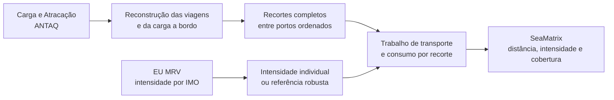

As Tabelas 13 e 14 mostram parte da matriz marítima preparada com dados reais. As linhas indicam o porto de origem e, as colunas, o porto de destino.

A Tabela 13 apresenta a distância representativa de cada sentido. Quando há 20 ou mais recortes, as distâncias acima do P95 são retiradas antes da média ponderada pela carga média a bordo, conforme explicado na Seção 4.3.4.4. Nota-se que a distância de ida pode ser diferente da distância de volta, uma vez que cada sentido reúne seu próprio conjunto de viagens, cargas e distâncias observadas. As duas tabelas incluem recortes diretos e recortes com escalas intermediárias. O travessão indica que origem e destino são o mesmo porto, situação que não forma uma perna marítima.

**Tabela 13 — Distância marítima representativa após a triagem P95, ponderada pela carga média a bordo, na matriz marítima (km).**

| Origem / destino | Santos | Salvador | Suape | Pecém | Manaus |
| :-- | --: | --: | --: | --: | --: |
| Santos | — | 2.516,136 | 2.912,073 | 3.578,767 | 6.094,975 |
| Salvador | 2.867,589 | — | 4.122,437 | 3.475,834 | 3.819,166 |
| Suape | 3.800,410 | 2.801,434 | — | 940,458 | 3.214,997 |
| Pecém | 4.103,118 | 2.437,283 | 5.301,235 | — | 2.195,720 |
| Manaus | 5.867,445 | 6.585,233 | 5.560,801 | 5.768,673 | — |

*Fonte: elaboração própria a partir da matriz marítima direcional preparada com viagens de cabotagem observadas pela ANTAQ, atualizada em 23 de julho de 2026.*

A Tabela 14 apresenta a intensidade média, ponderada pelo trabalho de transporte.

**Tabela 14 — Intensidade média da ligação marítima, ponderada pelo trabalho de transporte [g/(t·nm)].**

| Origem / destino | Santos | Salvador | Suape | Pecém | Manaus |
| :-- | --: | --: | --: | --: | --: |
| Santos | — | 6,152554 | 6,680958 | 7,280740 | 7,006102 |
| Salvador | 6,593389 | — | 6,927173 | 8,379871 | 6,624583 |
| Suape | 6,421161 | 6,294919 | — | 6,546223 | 6,984032 |
| Pecém | 6,852916 | 6,663381 | 7,003180 | — | 6,967572 |
| Manaus | 6,865533 | 6,624583 | 6,955700 | 7,197945 | — |

*Fonte: elaboração própria a partir de viagens de cabotagem observadas pela ANTAQ e das intensidades do EU MRV, consolidadas na matriz marítima direcional atualizada em 23 de julho de 2026.*

O trecho abaixo representa, de forma simplificada, como a matriz pode ser consultada. O porto de origem contém os portos de destino e, para cada ligação, ficam disponíveis a distância representativa e a intensidade média. Foram exibidos apenas três destinos de Santos para manter a visualização curta; o arquivo real também guarda a procedência e os indicadores de cobertura apresentados nas seções anteriores.

**Bloco de código 1 — Representação simplificada do arquivo `sea_matrix.json`.**

```json
{
    "Porto de Santos": {
        "Porto de Salvador": {
            "distancia_km": 2516.136,
            "intensidade_g_por_t_nm": 6.152554,
            ...
        },
    "Porto de Suape": {
        "distancia_km": 2912.073,
        "intensidade_g_por_t_nm": 6.680958,
        ...
    },
    "Porto de Manaus": {
      "distancia_km": 6094.975,
      "intensidade_g_por_t_nm": 7.006102,
      ...
    },
    ...
  },
...
}
```

#### 5.4.3 Escolha dos portos e acessos rodoviários

##### 5.4.3.1 Escolha dos portos

A definição dos portos de embarque e desembarque começa pela função `find_nearest_port`. Ela usa a distância de Haversine, um cálculo geométrico realizado a partir das latitudes e longitudes, que estima a menor distância sobre a superfície da Terra entre dois pontos. Esse cálculo é rápido, executado localmente e não representa uma rota por estrada. A função mede a distância entre o ponto de origem ou destino e cada porto disponível e seleciona o porto com a menor distância. O pipeline executa a função uma vez para as coordenadas da origem, definindo o porto de embarque, e outra vez para as coordenadas do destino, definindo o porto de desembarque.

A distância de Haversine, porém, é usada apenas nessa escolha inicial. Ela não entra nos cálculos de consumo, custo ou emissões.

##### 5.4.3.2 Acessos rodoviários: *first mile* e *last mile*

Após escolher os dois portos e suas respectivas coordenadas, o sistema calcula a distância real dos dois acessos rodoviários — origem → porto de embarque e porto de desembarque → destino — pelo mesmo procedimento exposto na Seção 5.3.1.

Essa sequência reduz consultas desnecessárias aos provedores de rota. Em vez de solicitar uma rota rodoviária para cada porto candidato de uma coordenada, o sistema faz uma única consulta para o acesso do porto já selecionado. Assim, a distância usada no cálculo continua sendo rodoviária, enquanto a distância de Haversine é usada apenas como um filtro rápido para definir qual porto consultar.

##### 5.4.3.3 Resultado consolidado do exemplo São Paulo–Rio Branco

No exemplo São Paulo–Rio Branco, a seleção geográfica indicou o Porto de Santos para o embarque e o Porto de Manaus para o desembarque. A Tabela 15 compara a distância de Haversine usada na seleção com a distância rodoviária calculada após a escolha de cada porto.

**Tabela 15 — Distâncias de seleção e de acesso rodoviário no exemplo São Paulo–Rio Branco.**

| Acesso | Ponto geocodificado | Referência do porto | Haversine: seleção | Distância rodoviária: cálculo |
| :-- | :-- | :-- | --: | --: |
| *First mile*:<br/>São Paulo → Porto de Santos | São Paulo (origem):<br/>[−23,550520°; −46,633308°] | Porto de Santos (embarque):<br/>[−23,987012°; −46,293383°] | 59,601 km | 86,170 km |
| *Last mile*:<br/>Porto de Manaus → Rio Branco | Rio Branco (destino):<br/>[−9,989637°; −67,822462°] | Porto de Manaus (desembarque):<br/>[−3,156700°; −60,007900°] | 1.149,569 km | 1.403,691 km |

*Fonte: elaboração própria com a base de portos do sistema e as rotas rodoviárias obtidas no cenário.*

A diferença entre as duas colunas é esperada: Haversine mede a separação geométrica entre os pontos, enquanto a distância rodoviária acompanha o caminho percorrido pela malha viária. Apenas a última é usada nos cálculos da alternativa multimodal.

#### 5.4.4 Operações portuárias

A rotina de operações portuárias recebe a carga, os dois portos e o número de escalas para realizar o procedimento descrito na Seção 3.3.3. O resultado da execução foi 4,820 L de diesel para as operações quantificadas, equivalentes a R$ 34,25 e 12,92 kg CO₂e.

### 4.5 Consulta da ligação marítima

Com os portos de embarque e desembarque já definidos, o avaliador consulta a matriz preparada na Seção 5.4.2. Nessa etapa, ele não escolhe um novo corredor nem reconstrói as viagens históricas: apenas recupera os valores representativos do par de portos selecionado e os aplica à carga do cenário.

#### 5.5.1 Consulta da ligação marítima no cenário

No exemplo São Paulo–Rio Branco, a escolha dos portos leva à consulta Santos–Manaus na `SeaMatrix`. A Tabela 16 mostra o que a matriz devolve para esse par. Um recorte é a parte de uma viagem observada compreendida entre os dois portos da ligação; ele pode ser direto ou conter escalas intermediárias.

**Tabela 16 — Informações devolvidas pela matriz marítima para a ligação Santos–Manaus.**

| Informação | Valor retornado na execução | Como deve ser lido |
| :-- | :-- | :-- |
| Cobertura observada | 89 recortes em 22 corredores | Todas as viagens em que Santos aparece antes de Manaus são consideradas no mesmo sentido |
| Forma dos recortes | 1 direto e 88 com escalas intermediárias | Não há corredor obrigatório nem seleção do percurso mais curto |
| Amostra da distância | 87 recortes em 20 corredores; P95 de 6.975,000 km | Os 2 recortes acima do P95 permanecem auditáveis, mas não entram na média de distância |
| Distância marítima | 6.094,975 km, ou 3.291,023 nm | Média da distância total, ponderada pela carga média a bordo dos 87 recortes até o P95 |
| Intensidade marítima | 7,006102 g/(t·nm) | Média ponderada pelo trabalho de transporte dos 89 recortes |
| Origem das intensidades | 19 por IMO; 49 por tipo sem IMO utilizável; 21 por tipo após tratamento de valor atípico | A fonte permanece identificada para cada recorte |
| Aviso de distância | 1 subtrecho aproximado por haversine entre 391 subtrechos | A aproximação permanece identificada na amostra de distância usada no cenário |

### 5.6 Resultado final do cenário

Após executar as etapas descritas nas seções anteriores, o pipeline reúne os totais das duas alternativas para a mesma remessa. A Tabela 17 apresenta o resultado final do exemplo São Paulo–Rio Branco, com 14 t de carga.

**Tabela 17 — Resultado final do cenário São Paulo–Rio Branco.**

| Indicador | Rodovia direta | Alternativa multimodal | Diferença da alternativa multimodal |
| :-- | --: | --: | :-- |
| Distância percorrida | 3.491,431 km | 7.584,836 km | 4.093,405 km a mais (117,24%) |
| Custo modelado do combustível | R$ 12.318,68 | R$ 6.566,71 | R$ 5.751,97 a menos (46,69%) |
| Emissões operacionais TTW | 4.068,28 kg CO₂e | 2.754,13 kg CO₂e | 1.314,15 kg CO₂e a menos (32,30%) |

### 5.7 Rastreabilidade, auditoria e versionamento

O resultado não guarda apenas os totais de custo e emissão. A cada execução, o pipeline registra os dados que formaram a rota, as fontes utilizadas e os avisos que afetam a leitura do resultado. A Tabela 18 exemplifica esse registro no cenário São Paulo–Rio Branco.

**Tabela 18 — Informações de rastreabilidade registradas no exemplo São Paulo–Rio Branco.**

| Informação registrada | Exemplo no cenário | Finalidade |
| :-- | :-- | :-- |
| Rota rodoviária direta | 3.491,431 km; resultado originalmente obtido do ORS e reutilizado na execução | Permite conferir a distância usada na alternativa direta |
| Portos selecionados | Santos (SP) e Manaus (AM) | Mostra onde começam e terminam os acessos marítimos e rodoviários |
| Ligação marítima | 89 viagens completas em 22 corredores; 87 recortes até o P95 para a distância | Identifica a base da intensidade e da distância marítimas |
| Intensidade marítima | 7,006102 g/(t·nm); fontes por IMO e por tipo identificadas | Diferencia medição individual de estimativa de grupo |
| Operações portuárias | RTG e caminhão interno do terminal | Identifica os equipamentos considerados no cálculo |
| Preços de combustível | Diesel S10 da ANP e VLSFO da Ship & Bunker, com data e valor usados | Permite atualizar ou repetir o componente de custo |
| Avisos de qualidade | Um subtrecho marítimo aproximado por haversine | Sinaliza a aproximação sem ocultá-la no total |

*Esses são os mesmos dados consolidados na Tabela 9 da Sessão 3.3.7*

#### 4.7.1 Versionamento e reprodução do cálculo

O versionamento é etapa fundamental do desenvolvimento de sistemas. Git é uma ferramenta que registra o histórico das alterações feitas nos arquivos de um projeto. O GitHub é a plataforma on-line em que esse histórico é armazenado e pode ser consultado. O código e os documentos do CabotageLens estão disponíveis [no repositório público do GitHub](https://github.com/pennylanesccp/cabotage-lens). Esse registro permite identificar quais regras e arquivos foram usados em cada versão do estudo, comparar alterações e apoiar a rastreabilidade e a auditoria dos resultados.

### 5.8 Aplicação web

Para disponibilizar o cálculo sem exigir instalação local, o CabotageLens é hospedado gratuitamente no Streamlit Community Cloud. A aplicação reúne duas interfaces diretamente relacionadas às análises deste trabalho: a página Router, voltada à comparação de uma origem com um destino, e a página Mapa de calor, destinada à visualização de resultados para vários destinos. As subseções seguintes apresentam essas duas interfaces.

#### 5.8.1 Página Router

A página Router executa a comparação para a origem, o destino e a carga informados no cenário. A Figura 10 mostra os campos da barra lateral usados nessa definição. No exemplo, a análise parte da Avenida Professor Luciano Gualberto, em São Paulo, segue para Manaus e considera uma carga de 14 t.


*Figura 10 — Campos de definição do cenário na página Router. Fonte: elaboração própria.*

Após a execução, a página apresenta as alternativas calculadas em um mapa, como ilustra a Figura 11. As linhas traçadas servem apenas para representar visualmente as distâncias e a ligação entre os pontos; elas não correspondem às rotas rodoviárias ou marítimas efetivamente utilizadas nos cálculos.

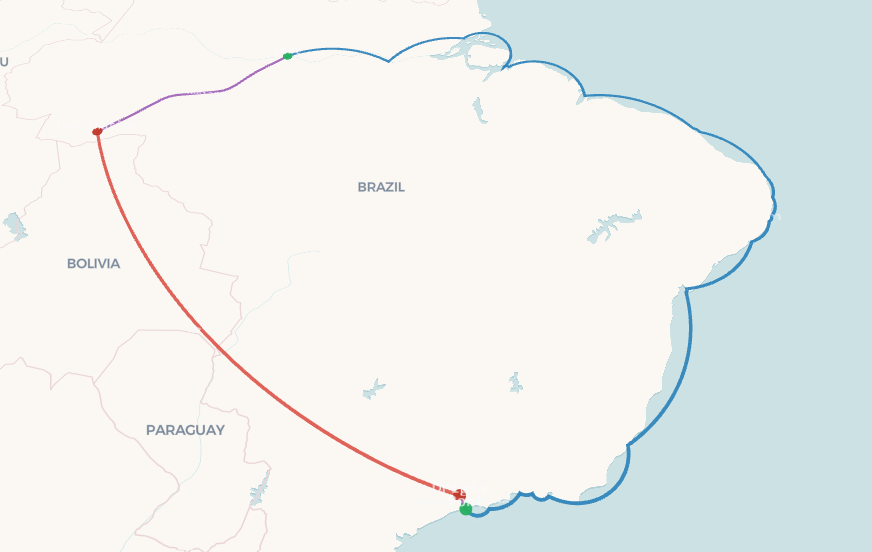

*Figura 11 — Representação visual das alternativas calculadas na página Router. Fonte: elaboração própria.*

Os resultados detalhados, os avisos, os logs e os demais registros gerados durante a execução podem ser consultados na própria página. Assim, o mapa facilita a leitura espacial do cenário, enquanto a conferência do cálculo é feita pelos dados e registros apresentados pelo sistema.

#### 5.8.2 Página Mapa de calor

O Mapa de calor amplia a comparação realizada na página Router. Em vez de avaliar apenas uma ligação entre origem e destino, o usuário informa uma origem e a massa da carga, e o sistema compara esse cenário com 608 municípios brasileiros de população superior a 50 mil habitantes. Para cada município, são calculadas as mesmas duas alternativas descritas na Seção 4: a rodovia direta e a cadeia rodoviária–cabotagem–rodoviária. A Figura 12 mostra os campos usados para definir o cenário. No exemplo, a análise parte da Avenida Professor Luciano Gualberto, em São Paulo, e considera uma carga de 14 t.


*Figura 12 — Campos de definição do cenário na página Mapa de calor. Fonte: elaboração própria.*

O resultado permite visualizar, em diferentes partes do país, onde a alternativa multimodal com cabotagem apresenta vantagem em relação à rodovia direta. O usuário pode escolher se o mapa representa custo modelado do combustível ou emissões operacionais. Em cada destino, um valor positivo indica que a alternativa multimodal teve menor custo ou menor emissão; um valor negativo indica que a rodovia direta apresentou o menor resultado para o indicador selecionado.

As cores e a altura da superfície facilitam a leitura espacial dessas diferenças. Os resultados são calculados para os municípios do conjunto de destinos; as áreas entre eles são uma interpolação visual para tornar o padrão mais legível no mapa. Portanto, cada área colorida não representa uma nova rota calculada, mas a visualização dos resultados obtidos para os destinos próximos. A Figura 13 ilustra essa representação para o cenário informado.

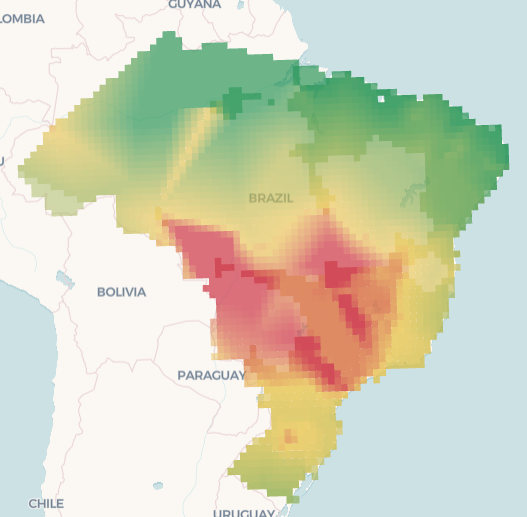

*Figura 13 — Representação espacial dos resultados calculados na página Mapa de calor. Fonte: elaboração própria.*

## 6. Comparações com ferramentas externas

As ferramentas externas permitem confrontar o resultado do CabotageLens com estimativas já disponíveis ao público. Em cada caso, são apresentadas as distâncias, as emissões ou os valores de custo disponíveis na respectiva ferramenta. Quando a rota, o porto ou outro parâmetro difere, a diferença permanece explícita; os resultados não são ajustados para produzir uma equivalência artificial.

### 6.1 [Calculadora de emissões da Aliança](https://www.alianca.com.br/calculadora-de-co2)

Na calculadora da Aliança, o cenário informado foi São Paulo–Abaetetuba, com um contêiner seco de 40 pés e 20 t de carga. O mesmo cenário foi executado no CabotageLens com 20 t e 2 TEU, equivalentes a um contêiner de 40 pés. As duas alternativas multimodais utilizam Santos como porto de embarque e Vila do Conde como porto de desembarque.

A tabela separa as etapas da alternativa multimodal e compara somente as emissões operacionais TTW. Assim, é possível identificar onde os resultados se aproximam ou se afastam, em vez de comparar apenas os totais.

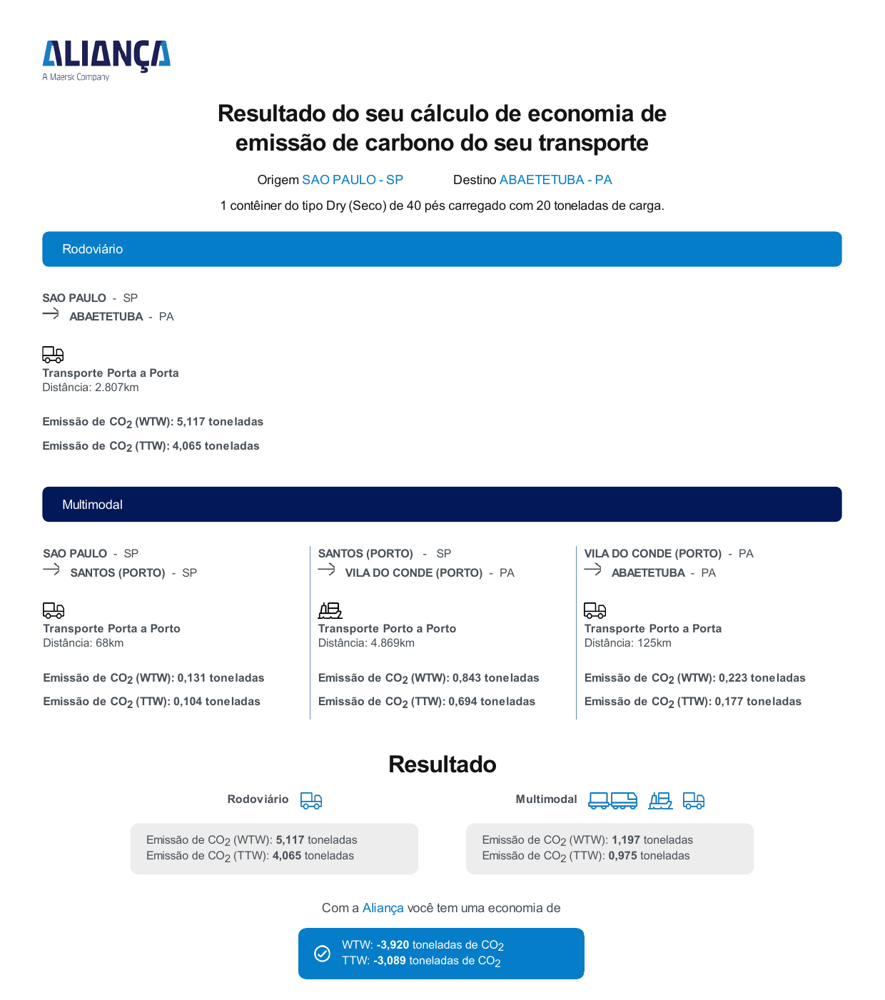

*Figura 14 — Resultado da calculadora da Aliança para São Paulo–Abaetetuba. Fonte: resultado exportado pela ferramenta, fornecido pelo autor.*

**Tabela 19 — Emissões TTW por etapa no cenário São Paulo–Abaetetuba, com 20 t de carga.**

| Etapa | Aliança: distância | Aliança: CO₂ TTW | CabotageLens: distância | CabotageLens: CO₂e TTW |
| :-- | --: | --: | --: | --: |
| Rodovia direta | 2.807 km | 4,065 t | 2.835,762 km | 3,800 t |
| Acesso rodoviário inicial: São Paulo–Santos | 68 km | 0,104 t | 86,170 km | 0,115 t |
| Navegação: Santos–Vila do Conde | 4.869 km | 0,694 t | 4.495,000 km | 0,918 t |
| Operações portuárias: Santos e Vila do Conde | — | Não discriminadas | — | 0,026 t |
| Acesso rodoviário final: Vila do Conde–Abaetetuba | 125 km | 0,177 t | 33,950 km | 0,045 t |
| **Total multimodal** | **5.062 km** | **0,975 t** | **4.615,120 km** | **1,104 t** |
| **Redução em relação à rodovia direta** | — | **3,090 t (76,0%)** | — | **2,696 t (70,9%)** |

Na rodovia direta, as distâncias são próximas: 2.807 km na Aliança e 2.835,762 km no CabotageLens. Na cadeia multimodal, a Aliança informa 4.869 km para a navegação e 125 km para o acesso final, enquanto o CabotageLens usa 4.495 km e 33,950 km, respectivamente. A diferença restante decorre sobretudo do acesso final e da referência de distância adotada para cada porto.

A distância total multimodal soma apenas os dois acessos rodoviários e a etapa marítima; as operações portuárias não acrescentam distância. A Aliança não as separa: os três trechos exibidos pela ferramenta somam exatamente o total multimodal de 0,975 t. No CabotageLens, essas operações aparecem como uma etapa própria, com 0,026 t de CO₂e TTW, e são incluídas no total. A tabela compara apenas TTW, que é o escopo adotado pelo CabotageLens; a calculadora da Aliança também exibe valores WTW, mas eles não são usados nesta comparação.

Há uma inconsistência de sinal no quadro de economia exibido pela Aliança: a diferença entre seus próprios totais TTW é aproximadamente 4,065 − 0,975 = 3,090 t de redução, mas a tela apresenta −3,089 t. Por esse motivo, a última linha da tabela é calculada diretamente a partir dos totais de cada alternativa. O CabotageLens apresenta a redução com sinal coerente com as emissões totais mostradas.

### 6.2 [Calculadora de emissões da Log-In](https://www.loginlogistica.com.br/calculadora-co2/)

A captura da calculadora da Log-In refere-se ao cenário São Paulo–Rio Branco e mostra uma alternativa rodoviária de 3.032 km. A alternativa por cabotagem é composta por três trechos de 89,9 km, 6.112 km e 1.394 km, compatíveis com a estrutura São Paulo–Santos–Manaus–Rio Branco. O mesmo cenário foi executado no CabotageLens com 14 t e 1 TEU.

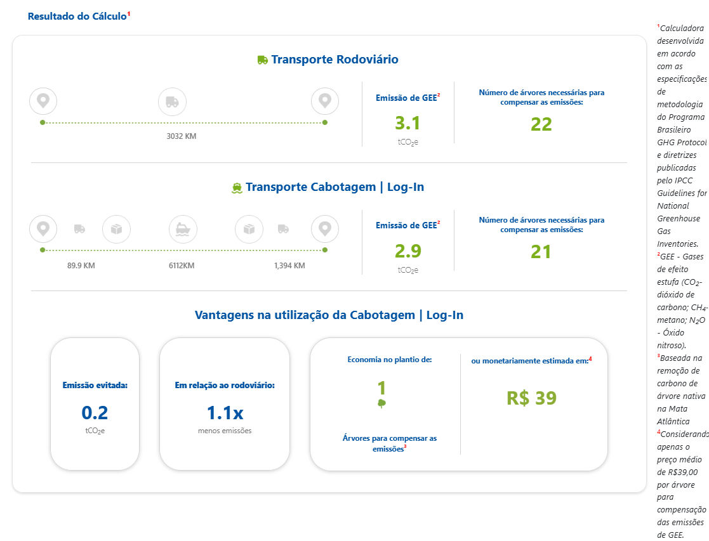

*Figura 15 — Resultado da calculadora de emissões da Log-In. Fonte: captura de tela fornecida pelo autor.*

**Tabela 20 — Emissões no cenário de referência São Paulo–Rio Branco.**

| Alternativa | Log-In: distância | Log-In: emissões de GEE | CabotageLens: distância | CabotageLens: CO₂e TTW |
| :-- | --: | --: | --: | --: |
| Rodovia direta | 3.032 km | 3,1 t | 3.491,431 km | 4,068 t |
| Multimodal | 7.595,9 km | 2,9 t | 7.584,836 km | 2,754 t |
| Redução em relação à rodovia | — | 0,2 t | — | 1,314 t |

No resultado multimodal, as duas ferramentas estão próximas. A distância da Log-In é 11,064 km maior, uma diferença de 0,15%, e a emissão de GEE informada é 0,146 t maior, ou 5,3% em relação ao CabotageLens. Essa proximidade é positiva porque os valores divulgados pelas duas ferramentas são semelhantes, mesmo usando fontes e parâmetros próprios.

Na alternativa rodoviária, porém, a distância da Log-In não corresponde à rota porta a porta São Paulo–Rio Branco previamente calculada. A ferramenta informa 3.032 km, enquanto o CabotageLens obteve 3.491,431 km e a conferência independente no Google Maps indicou 3.497 km, como apresentado na Seção 5.3.1.1. Essa diferença de 459,431 km, ou 13,2%, contribui para que a emissão rodoviária informada pela Log-In seja menor. Por isso, a comparação rodoviária não deve ser interpretada como uma equivalência direta entre os dois sistemas.

### 5.3 [Calculadora de piso mínimo de frete da ANTT](https://calculadorafrete.antt.gov.br/)

Na calculadora da Agência Nacional de Transportes Terrestres (ANTT), o cenário foi informado como carga conteinerizada, cinco eixos e 3.491 km. O resultado oficial exibido foi R$ 21.308,12. Para a mesma ligação São Paulo–Rio Branco, o CabotageLens calculou 3.491,431 km, selecionou cinco eixos para a carga de 14 t e estimou R$ 12.318,68 de custo de combustível.

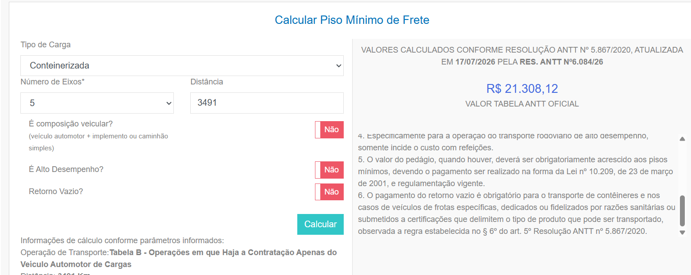

*Figura 16 — Resultado da calculadora de piso mínimo de frete da ANTT para a distância de 3.491 km. Fonte: captura de tela fornecida pelo autor.*

**Tabela 21 — Valores para a ligação São Paulo–Rio Branco.**

| Item | Calculadora da ANTT | CabotageLens |
| :-- | --: | --: |
| Distância | 3.491 km | 3.491,431 km |
| Configuração do veículo | 5 eixos | 5 eixos |
| Valor calculado | R$ 21.308,12 — piso mínimo de frete | R$ 12.318,68 — custo modelado do combustível |

Os dois valores têm finalidades diferentes: o resultado da ANTT é o piso mínimo de frete, enquanto o CabotageLens isola o custo operacional de combustível. Por isso, não se espera que sejam iguais. Ainda assim, o combustível calculado pelo sistema, R$ 12.318,68, representa 57,8% do piso de R$ 21.308,12. Essa proporção é um sinal de coerência de ordem de grandeza, pois o piso mínimo também reúne outras parcelas do frete além do combustível. Assim, os valores são apresentados lado a lado para contextualização, e não como cotações equivalentes.

## 7. Conclusões

### 6.1 Resultados da comparação

Este trabalho apresentou o CabotageLens, uma ferramenta para comparar duas formas de transportar a mesma remessa entre uma origem e um destino: a alternativa rodoviária direta e a alternativa multimodal com acessos rodoviários, operações portuárias e cabotagem. Ao aplicar as duas alternativas à mesma carga, origem e destino, o sistema evita comparar apenas o trecho marítimo com uma viagem rodoviária completa.

No exemplo de uma remessa de 14 t entre São Paulo e Rio Branco, a alternativa multimodal percorre 117,24% mais quilômetros do que a rodoviária direta. Mesmo assim, emite 32,30% menos CO₂e operacional e apresenta custo modelado do combustível 46,69% menor. O resultado mostra que a distância total, isoladamente, não é suficiente para comparar os modais: os acessos rodoviários, as operações portuárias e a navegação precisam ser avaliados na mesma cadeia logística.

### 7.2 Contribuição metodológica

A principal contribuição do CabotageLens está na construção da perna marítima com dados observados. Em vez de fixar um corredor entre dois portos, o sistema reconstrói as viagens registradas pela Agência Nacional de Transportes Aquaviários (ANTAQ), preserva as escalas intermediárias e calcula a carga a bordo em cada subtrecho. Sempre que possível, a intensidade vem do mesmo número IMO na base europeia de Monitoramento, Reporte e Verificação da União Europeia (EU MRV). Quando essa correspondência não está disponível ou é considerada atípica, o cálculo usa uma referência estatística de navios semelhantes e informa a fonte adotada.

A ligação Santos–Manaus demonstra o efeito dessa escolha: os 89 recortes completos formam 22 sequências de portos, com viagens diretas e viagens com escalas intermediárias. Para a distância, os 2 recortes acima do P95 de 6.975,000 km são retirados da média, resultando em 6.094,975 km com 87 recortes; a intensidade de 7,006102 g/(t·nm) continua usando os 89 recortes. Portanto, esses indicadores não descrevem uma rota única nem o desempenho de um único navio; sua procedência permanece registrada para conferência.

Além da contribuição metodológica, o CabotageLens constitui uma contribuição aplicada e acessível: a [aplicação está disponível publicamente](https://cabotagelens.streamlit.app/) e seu [código-fonte, documentação e regras de cálculo podem ser consultados no repositório público do projeto](https://github.com/pennylanesccp/cabotage-lens). Dessa forma, outras pessoas podem executar cenários próprios, conferir as premissas adotadas e reproduzir a lógica de cálculo, dentro dos limites de dados e escopo descritos neste trabalho.

## Referências

AGÊNCIA NACIONAL DO PETRÓLEO, GÁS NATURAL E BIOCOMBUSTÍVEIS (ANP). *Levantamento semanal de preços de combustíveis por estado*. 2026. Disponível em: <https://www.gov.br/anp/pt-br/assuntos/precos-e-defesa-da-concorrencia/precos/levantamento-de-precos-de-combustiveis-ultimas-semanas-pesquisadas>. Acesso em: 19 jul. 2026.

AGÊNCIA NACIONAL DE TRANSPORTES AQUAVIÁRIOS (ANTAQ). *Painel Estatístico Aquaviário: dados de atracação e carga*. 2025. Disponível em: <https://estatistica.antaq.gov.br/ea/sense/download.html>. Acesso em: 19 jul. 2026.

AGÊNCIA NACIONAL DE TRANSPORTES TERRESTRES (ANTT). *Política Nacional de Pisos Mínimos do Transporte Rodoviário de Cargas*. 2025. Disponível em: <https://anttlegis.antt.gov.br/action/UrlPublicasAction.php?acao=abrirAtoPublico&cod_menu=9230&cod_modulo=623&num_ato=00000001&seq_ato=ATT&sgl_orgao=SUROC%2FANTT%2FMT&sgl_tipo=POR&vlr_ano=2025>. Acesso em: 19 jul. 2026.

AGÊNCIA NACIONAL DE TRANSPORTES TERRESTRES (ANTT). *Calculadora de piso mínimo de frete*. 2026. Disponível em: <https://calculadorafrete.antt.gov.br/>. Acesso em: 19 jul. 2026.

ALIANÇA NAVEGAÇÃO E LOGÍSTICA. *Calculadora de CO2*. 2026. Disponível em: <https://www.alianca.com.br/calculadora-de-co2>. Acesso em: 19 jul. 2026.

BANCO CENTRAL EUROPEU. *Euro foreign exchange reference rates*. 2026. Disponível em: <https://www.ecb.europa.eu/stats/policy_and_exchange_rates/euro_reference_exchange_rates/html/index.en.html>. Acesso em: 19 jul. 2026.

CARVALHO, Francielle. *Brazilian coastal shipping: new prospects for growth with decarbonization*. Working Paper n. 2022-24. Washington, DC: International Council on Clean Transportation, 2022. Disponível em: <https://theicct.org/wp-content/uploads/2022/07/brazilmarinebrazil-coastal-shipping-new-prospects-growth-decarbonization-jul22.pdf>. Acesso em: 19 jul. 2026.

COSTA, Gustavo Adolfo Alves da; MENDES, André Bergsten; GOMES DA CRUZ, José Pedro. Brazilian maritime containerized cabotage competitiveness assessment based on a multimodal super network. *Journal of Transport Geography*, v. 122, e104062, 2025. DOI: <https://doi.org/10.1016/j.jtrangeo.2024.104062>.

COSTA, Gustavo Adolfo Alves da; MENDES, André Bergsten; SILVA, Vanina Macowski Durski. Decarbonization pathways in Brazilian maritime cabotage: a comparative analysis of very low sulfur fuel oil, marine diesel oil, and hydrogenated vegetable oil in carbon dioxide equivalent emissions. *Latin American Transport Studies*, v. 2, e100018, 2024. DOI: <https://doi.org/10.1016/j.latran.2024.100018>.

DADOS RELATÓRIO 2. *Parâmetros de operações portuárias*. Planilha de dados não publicada utilizada na parametrização do modelo, 2024.

EUROPEAN COMMISSION. *White Paper: roadmap to a single European transport area — towards a competitive and resource efficient transport system*. COM(2011) 144 final. Brussels, 2011. Disponível em: <https://eur-lex.europa.eu/legal-content/EN/TXT/?uri=CELEX:52011DC0144>. Acesso em: 19 jul. 2026.

EUROPEAN COMMISSION. *The EU ETS and MRV Maritime: general guidance for shipping companies*. Guidance Document n. 1, versão atualizada em 18 nov. 2025. Brussels: Directorate-General for Climate Action, 2025.

EUROPEAN MARITIME SAFETY AGENCY (EMSA). *THETIS-MRV: Publication of Information*. 2026. Disponível em: <https://mrv.emsa.europa.eu/>. Acesso em: 19 jul. 2026.

GEÓGRAFOS. *Distâncias marítimas entre portos*. 2026. Disponível em: <https://www.geografos.com.br/distancias-maritimas-entre-portos>. Acesso em: 19 jul. 2026.

GOOGLE. *Google Maps*. 2026. Disponível em: <https://www.google.com/maps>. Acesso em: 19 jul. 2026.

INTERGOVERNMENTAL PANEL ON CLIMATE CHANGE (IPCC). *2006 IPCC Guidelines for National Greenhouse Gas Inventories: Volume 2 — Energy*. 2006. Disponível em: <https://www.ipcc-nggip.iges.or.jp/public/2006gl/vol2.html>. Acesso em: 19 jul. 2026.

LOG-IN LOGÍSTICA. *Calculadora de CO2*. 2026. Disponível em: <https://www.loginlogistica.com.br/calculadora-co2/>. Acesso em: 19 jul. 2026.

NGUYEN, Phong-Nha; WOO, Su-Han; KIM, Hwayoung. Ship emissions in hotelling phase and loading/unloading in Southeast Asia ports. *Transportation Research Part D: Transport and Environment*, v. 105, e103223, 2022. DOI: <https://doi.org/10.1016/j.trd.2022.103223>.

PAPAIOANNOU, Vicky et al. Analysis of energy usage for RTG cranes. *Energy*, v. 125, p. 337–344, 2017. DOI: <https://doi.org/10.1016/j.energy.2017.02.122>.

RAZA, Zeeshan; SVANBERG, Martin; WIEGMANS, Bart. Modal shift from road haulage to short sea shipping: a systematic literature review and research directions. *Transport Reviews*, v. 40, n. 3, p. 382–406, 2020. DOI: <https://doi.org/10.1080/01441647.2020.1714789>.

ROUX, M.; LODATO, C.; LAURENT, A.; ASTRUP, T. F. A review of life cycle assessment studies of maritime fuels: critical insights, gaps, and recommendations. *Sustainable Production and Consumption*, v. 50, p. 69–86, 2024. DOI: <https://doi.org/10.1016/j.spc.2024.07.016>.

SHIP AND BUNKER. *Brazil bunker prices*. 2026. Disponível em: <https://shipandbunker.com/prices/br-brazil>. Acesso em: 19 jul. 2026.

SINDICATO DOS BANCÁRIOS DE SÃO PAULO, OSASCO E REGIÃO. *Brasil é dependente do transporte rodoviário de cargas*. 2018. Disponível em: <https://spbancarios.com.br/05/2018/brasil-e-dependente-do-transporte-rodoviario-de-cargas>. Acesso em: 19 jul. 2026.

SVINDLAND, Morten; HJELLE, Harald M. The comparative CO2 efficiency of short sea container transport. *Transportation Research Part D: Transport and Environment*, v. 77, p. 11–20, 2019. DOI: <https://doi.org/10.1016/j.trd.2019.08.025>.
